# 1.1 Configure a Switch with Initial Settings

---

## Switch Boot Sequence

When a Cisco switch powers on, it follows this order:

1. **POST (ROM):** Power-On Self-Test checks CPU, RAM, and Flash.  
2. **Boot Loader (ROM):** Runs after POST.  
3. **CPU Init:** Sets up memory and CPU registers.  
4. **Flash Init:** Mounts the Flash file system.  
5. **Load IOS:** Loads the operating system (IOS) into RAM → switch is operational.  

---

## Boot System Command

* **Default Boot:** Uses the file in the **`BOOT` environment variable**.  
* **Fallback:** If none set, loads the **first IOS file in Flash**.  
* **Config File:** Saved config is **`config.text`** in Flash.  
* **Manually Set:** `boot system flash:<path>/<IOS file>`  
* **Check Boot File:** `show boot`  

---

## Switch LED Indicators

Switch LEDs + Mode button help monitor status:

| LED | Mode | Meaning |
|-----|------|---------|
| **SYST** | N/A | Power/system status. |
| **RPS** | N/A | Redundant Power Supply status. |
| **STAT** | Default (Port Status) | **Green:** Link active. **Off:** No link. **Blinking:** Activity. |
| **DUPLX** | Duplex Mode | **Green:** Full-duplex. **Amber/Off:** Half-duplex. |
| **SPEED** | Speed Mode | Shows port speed (green patterns). |
| **PoE** | PoE Mode | **Green:** Power OK. **Amber/Alt:** Fault or denied. |

---

## Recovery from System Crash (Password Recovery)

The **Boot Loader** is used if IOS is missing/damaged or for **password recovery**.  

**Steps:**
1. Connect PC to **console port**.  
2. Power off switch.  
3. Power on + hold **Mode** button.  
4. Release when **System LED = solid green**.  
5. You get the `switch:` prompt.  
6. From here you can format Flash, reinstall IOS, or bypass password.  

---

## Switch Management Access (SVI) 

A **Switched Virtual Interface (SVI)** provides management (Layer 3) access.  

* Needs **IP address + subnet mask** (local access).  
* Needs a **default gateway** (remote access).  
* Best practice: Use a **dedicated VLAN** (not VLAN 1).  

---

### SVI Configuration Steps

1. Enter management VLAN interface config.  
2. Assign IP (IPv4/IPv6).  
3. Enable with `no shutdown`.  
   * VLAN must exist + have at least one active port.  

**Example (VLAN 99 SVI):**
```cli
S1# configure terminal
S1(config)# interface vlan 99
S1(config-if)# ip address 172.17.99.11 255.255.255.0
S1(config-if)# ipv6 address 2001:db8:acad:99::1/64
S1(config-if)# no shutdown
S1(config-if)# end
S1# copy running-config startup-config
```

# 1.2 Configure Switch Ports

---

## Duplex Communication 

| Duplex Mode | Characteristics | Performance | Requirement |
|-------------|-----------------|-------------|-------------|
| **Full-Duplex** | Can **send & receive** at the same time. | **Doubles bandwidth** (no collisions). 100% efficiency. | Needs **microsegmentation** (1 device per port). Required for Gigabit/10 Gb NICs. |
| **Half-Duplex** | Can **send OR receive**, not both. | Lower performance. **Collisions possible**. | Old tech, mainly with **hubs**. |

---

## Configure Switch Ports (Physical Layer)

### Speed & Duplex Settings

* **Default (2960/3560):**  
  * `duplex auto` + `speed auto`  
  * Auto-negotiates the best settings.  
* **10/100 Mbps links:** Support **half or full-duplex**.  
* **1000 Mbps (Gigabit):** **Full-duplex only**.  
* **Best Practice:** Manually set **speed & duplex** for important devices (servers, PCs, routers, switches) → avoids mismatches.  
* **Fiber Ports (1000BASE-SX etc.):** Usually fixed **full-duplex**.  

---

### Example: Set Duplex and Speed
```cli
S1# configure terminal
S1(config)# interface FastEthernet0/1
S1(config-if)# duplex full
S1(config-if)# speed 100
S1(config-if)# end
S1# copy running-config startup-config
```

# 1.3 Secure Remote Access

## Telnet (Insecure)

* **Port:** TCP 23  
* **Security Risk:** Sends username, password, and data in **plaintext** (unencrypted). Credentials can be easily captured (e.g., using Wireshark).  
* **Recommendation:** **Avoid Telnet**. Use SSH instead for secure remote access.  

---

## SSH (Secure Shell)

* **Port:** TCP 22  
* **Security Benefit:** **Encrypts** username, password, and all data. While an attacker can see the IP, they **cannot read the credentials** or data.  
* **Recommendation:** **Always use SSH** for remote management.  

### Verify SSH Support

* The switch must run an IOS with **cryptographic features**.  
* Use the `show version` command to check the IOS file.  
* An IOS filename including **k9** (e.g., `C2960-LANBASEK9-M`) supports SSH.  
* **Prerequisite:** Ensure the switch has a **unique hostname** and **network connectivity** before configuring SSH.  

---

## Configure SSH Steps

| Step | Command / Mode | Purpose |
| :--- | :--- | :--- |
| **1. Verify Status** | `show ip ssh` | Checks the current SSH status. |
| **2. Set Domain Name** | `ip domain-name <domain-name>` | Required for key generation (e.g., `ip domain-name cisco.com`). |
| **3. Generate RSA Keys** | `crypto key generate rsa` | **Enables SSH** by creating the encryption key pair. |
| **4. Create Local User** | `username <username> secret <password>` | Creates a local account for authentication (e.g., `username admin secret ccna`). |
| **5. Configure VTY Lines** | `line vty 0 15`<br>`login local`<br>`transport input ssh` | Restricts remote access to only use SSH (not Telnet) and forces authentication using local accounts. |
| **6. Enable SSHv2** | `ip ssh version 2` | Ensures the most secure SSH protocol version is used. |

**Disable SSH / Delete Keys:**  
```cli
crypto key zeroize rsa
```
## Verify SSH Connectivity

**Goal:** Access the switch CLI securely from a PC using an SSH client (like PuTTY).

**Process:**
1. Open the SSH client on the PC.
2. Connect to the Switch's SVI IP address (e.g., `172.17.99.11`).
3. The client prompts for the local **username** and **password** (`admin` / `ccna`).
4. The connection is established, and all subsequent data is **encrypted**.

**Note:** SSH encrypts both the login credentials and all subsequent data transmitted, providing superior security compared to Telnet.


# 1.4 Basic Router Configuration

## Basic Router Setup

* Cisco routers and switches are similar in OS, commands, and configuration steps.
* Always perform initial configuration to **name the device** and **set passwords**.

### Steps to Configure a Router

| Step | Command Sequence | Purpose |
| :--- | :--- | :--- |
| **1. Access Config** | `Router> enable`<br>`Router# configure terminal` | Enters **Global Configuration Mode**. |
| **2. Hostname** | `Router(config)# hostname R1` | Sets the router's name. |
| **3. Enable Secret** | `R1(config)# enable secret class` | Configures the **most secure password** for Privileged EXEC Mode (`#`). |
| **4. Console Password** | `R1(config)# line console 0`<br>`password cisco`<br>`login`<br>`exit` | Secures the **direct console connection**. |
| **5. VTY Password** | `R1(config)# line vty 0 4`<br>`password cisco`<br>`login`<br>`exit` | Secures **remote access** (Telnet/SSH) for VTY lines 0 through 4. |
| **6. Encrypt Passwords**| `R1(config)# service password-encryption` | Encrypts all **plain-text** passwords in the running configuration. |
| **7. Exit Config** | `R1(config)# end` | Exits configuration mode (or use **`CTRL+Z`**). |
| **8. Save Config** | `R1# copy running-config startup-config` | Saves the active configuration to NVRAM to persist after reboot. |

**Notes:**
* Setting passwords and hostname ensures security and easy identification.
* Use `CTRL+Z` to exit configuration mode quickly.

---

## Basic Router Configuration (Cont.)

### Configure a Banner

* A **banner** displays a legal or security message when someone accesses the router.
* **Example command:** `R1(config)# banner motd $ Authorized Access Only $`

### Save Configuration

* Always save changes to **startup configuration** (`startup-config`) to retain settings after a reboot.
* **Command:** `R1# copy running-config startup-config`

**Notes:**
* `banner motd` can use any delimiter (here `$`) to enclose the message.
* Saving the configuration ensures all changes persist after reboot.

---

## Dual Stack Topology ()

* **Routers vs Switches:** Routers support **both IPv4 and IPv6** interfaces, while Switches (Layer 2) primarily handle LANs.
* **Dual Stack Topology:** Demonstrates configuration of **IPv4 and IPv6** on router interfaces simultaneously.
* **Key Point:** Useful for networks transitioning from IPv4 to IPv6, leveraging the router's inter-network routing capability.

---

## Configure Router Interfaces – Example

The interface configuration involves assigning both IPv4 and IPv6 addresses (Dual Stack) and enabling the port.

### Interface Details

| Interface | IPv4 Address/Mask | IPv6 Address/Prefix | Description |
| :--- | :--- | :--- | :--- |
| **G0/0/0** | `192.168.10.1 255.255.255.0` | `2001:db8:acad:1::1/64` | Link to LAN 1 |
| **G0/0/1** | `192.168.11.1 255.255.255.0` | `2001:db8:acad:2::1/64` | Link to LAN 2 |
| **S0/0/0** | `209.165.200.225 255.255.255.252` | `2001:db8:acad:12::1/64` | Link to R2 |

**Commands Example (Interface G0/0/0)**
```cli
R1(config)# interface gigabitethernet 0/0/0
R1(config-if)# ip address 192.168.10.1 255.255.255.0
R1(config-if)# ipv6 address 2001:db8:acad:1::1/64
R1(config-if)# description Link to LAN 1
R1(config-if)# no shutdown
R1(config-if)# exit
```

## Interface Verification Commands

## Show Interface Summaries

* **`show ip interface brief` / `show ipv6 interface brief`**: Summary of all interfaces with **IP addresses** and **operational status**.
* **`show running-config interface [interface-id]`**: Displays configuration applied to a specific interface.
* **`show ip route` / `show ipv6 route`**: Displays the **routing table** in RAM.

**Notes:**
* **Modern IOS (15+)**: Active interfaces show **'C' (Connected)** and **'L' (Local)** entries.
* **Older IOS**: Only a single **'C' (Connected)** entry appears.

---

## Verify Interface Status

| Column | Desired State | Meaning |
| :--- | :--- | :--- |
| **Status (Layer 1)** | up | Interface is physically active. |
| **Protocol (Layer 2)** | up | Data link layer is operational. |

**Operational Example:** `up/up` indicates fully functional interface.

### Common Issues

| Status Output | Indication |
| :--- | :--- |
| up/down | Layer 2 problem (e.g., encapsulation mismatch). |
| down/down | Layer 1 problem (e.g., cable disconnected). |
| administratively down/down | Interface was shutdown. |

---

## Verify IPv6 Link-Local and Multicast Addresses

### Link-Local Addresses

* Starts with **FE80**, automatically added when a global address is configured.
* Required for all IPv6 interfaces.
* Check with **`show ipv6 interface brief`**.

### Multicast Addresses

* Use **`show ipv6 interface [interface-id]`** to view all assigned multicast addresses, starting with **FF02**.

---

## Verify Interface Configuration

* **`show running-config interface [interface-id]`**: Confirm applied configuration.
* **`show interfaces`**: Comprehensive interface info (status, link type, speed, duplex, errors).
* **`show ip interface` / `show ipv6 interface`**: IPv4/IPv6 details for all interfaces.

---

## Verify Routes

* **`show ip route` / `show ipv6 route`**: Displays routing table.
* Active interfaces produce:
  1. **Connected Network Route (C)** – subnet of interface.
  2. **Local Host Route (L)** – exact interface IP.

### Connected Routes

* **'C'** indicates a directly connected network.
* IPv6 connected route is added when interface has **global unicast** and is **up/up**.

### Local Routes

* Router's own IP (IPv4/IPv6) appears as **local route**.
* IPv6 local route uses **/128** prefix.
* Local routes allow the router to **process packets destined to its own IP efficiently**.


# 1.5 Verify Directly Connected Networks (Router Verification)

## Interface Verification Commands

Use these commands to quickly check configuration and status:

| Command | Purpose |
| :--- | :--- |
| **`show ip interface brief`** / **`show ipv6 interface brief`** | Shows a **summary** of all interfaces, including their **IP address** and **operational status** (`up/down`). |
| **`show running-config interface [id]`** | Displays **only the configuration** commands applied to the specified interface. |
| **`show interfaces`** | Shows **comprehensive details** including link type, speed, duplex, and **packet flow/error counts**. |
| **`show ip route`** / **`show ipv6 route`** | Displays the **routing table** in RAM, including connected networks. |

---

## Verify Interface Operational Status

The **`show ip interface brief`** command is used to confirm the interface's two main status indicators.

### Status Interpretation

To be **fully operational** (`up/up`), both the Status and Protocol columns must be `up`.

| Status Output | Interpretation | Indication/Layer |
| :--- | :--- | :--- |
| **`up/up`** | **Fully functional.** | Layer 1 and Layer 2 are active. |
| **`up/down`** | **Layer 2 Problem.** | Physical link is up, but protocol (e.g., keepalives) failed (e.g., encapsulation mismatch). |
| **`down/down`** | **Layer 1 Problem.** | Cable disconnected, power off, or hardware fault. |
| **`administratively down/down`**| **Manual Shutdown.** | The interface has the **`shutdown`** command applied. |

---

## Verify IPv6 Addresses

Use **`show ipv6 interface [id]`** for detailed IPv6 information.

### Link-Local Addresses (FE80)

* **Identification:** Starts with **FE80** (e.g., `FE80::...`).
* **Requirement:** An IPv6 interface **must** have a link-local address.
* **Assignment:** Automatically added when a global unicast address is configured.
* **Visibility:** Check with **`show ipv6 interface brief`**.

### Multicast Addresses (FF02)

* **Identification:** Starts with **FF02** (link-local multicast prefix).
* **Visibility:** Listed under "Joined group address(es)" in the detailed output of **`show ipv6 interface [id]`**.

---

## Verify Routes (Routing Table Entries)

The **`show ip route`** / **`show ipv6 route`** output includes two key entries for every active, directly connected network:

| Route Type | Code | Purpose | Mask/Prefix |
| :--- | :--- | :--- | :--- |
| **Connected Network** | **'C'** | Represents the **entire subnet** directly attached to the interface. | Network subnet mask (e.g., `/24`). |
| **Local Host** | **'L'** | Represents the router's **own IP address** on that interface. | **IPv4:** /32, **IPv6:** /128. |

### Local Host Route Details

* **Purpose:** Allows the router to **efficiently process packets** destined to its own interface IP.
* **Administrative Distance (AD):** Local routes have AD **0**, the most trusted.

*Note: Modern Cisco IOS (15+) shows both 'C' and 'L' entries. Older IOS typically shows only 'C'.*

# 2.1 Frame Forwarding

---

## Switching in Networking 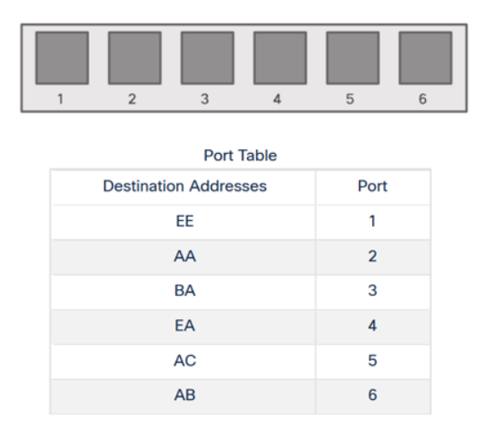

* **Ingress:** Frame **entering** a switch.  
* **Egress:** Frame **exiting** a switch.  
* Forwarding decision: Based on **Ingress Interface** + **Destination MAC Address**.  
* Switch uses the **MAC Address Table (CAM table)** to find the correct egress port.  
* **Golden Rule:** A frame is **never forwarded back out** the same interface it came in on.  

---

## The Switch MAC Address Table

Switches use the **destination MAC address** to select the correct **egress interface**.  

To do this, the switch must **learn device locations** by building the MAC address table dynamically:  

* Each incoming frame provides:  
  - **Source MAC Address**  
  - **Ingress Port**  

---

## The Switch Learn and Forward Method

Switches operate in a **two-step process**:

### Step 1: Learn (Source Address)
* **New Source:** Add MAC + port mapping to the table.  
* **Existing Source:** Refresh/update its entry (reset the **aging timer**, ~5 minutes).  

### Step 2: Forward (Destination Address)
* **Known Unicast:** Forward to the specific egress port.  
* **Unknown Unicast, Broadcast, or Multicast:** **Flood** the frame to all ports **except ingress**.  

---

## Video: MAC Address Tables on Connected Switches

* **Building:** Switches **construct tables dynamically** from source MACs.  
* **Using:** Switches forward based on **destination MAC lookups**.  

---

## Switch Forwarding Methods

Switches use **ASIC hardware** for high-speed forwarding. Two main methods:

---

### 1. Store-and-Forward Switching (Cisco Preferred) 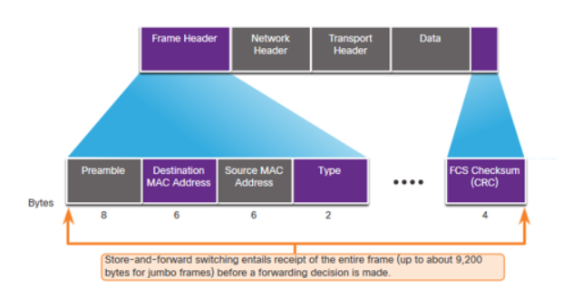

* **Receives the full frame** before forwarding.  
* Performs **error checking** (Frame Check Sequence).  
* **Slower latency**, but ensures **reliable, error-free forwarding**.  

---

### 2. Cut-Through Switching (Low Latency) 

* Forwards frame **as soon as destination MAC is read**.  
* **Does not wait** for the full frame.  
* **Very low latency**, but may forward **corrupted frames**.  

---

## Store-and-Forward Switching – Reliability Focus

1. **Error Checking:** Validates **FCS/CRC** before forwarding; discards bad frames.  
2. **Buffering:** Temporarily stores frame in memory, allowing support for **different port speeds**.  

---

## Cut-Through Switching – Speed Focus

* **Immediate Forwarding:** Only waits until **destination MAC** is known.  
* **Latency:** Typically under **10 microseconds**.  
* **Error Propagation:** May forward bad frames (no FCS check).  
* **Port Speeds:** Requires **same speed** on all ports.  

---

### Fragment-Free Method (Modified Cut-Through)

* Switch verifies frame is at least **64 bytes long** before forwarding.  
* Prevents forwarding of **collision fragments ("runts")**.  

# 2.2 Switching Domains

---

## Collision Domains 

* **Switch Role:** Breaks up collision domains, reducing **network congestion**.  
* **Full-Duplex:** Each port is its **own collision domain** → no collisions.  
* **Half-Duplex:** Ports share the medium → **collisions possible**.  
* **Default Today:** Most devices use **auto-negotiation**, usually full-duplex.  

---

## Broadcast Domains 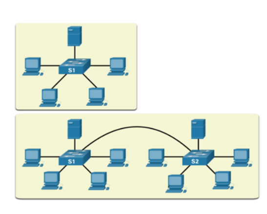

* **Definition:** All devices that receive the **same broadcast traffic**.  
* **Scope:** Extends across **hubs (L1)** and **switches (L2)**.  
* **Boundary:** A **router (L3)** breaks broadcast domains.  
* **Switch Behavior:** Broadcasts are **flooded out all ports** except ingress.  
* **Risk:** Too many devices = **broadcast storms** → congestion + poor performance.  

---

## Alleviated Network Congestion

Switches improve performance with:  

| Feature | Function / Benefit |
|---------|--------------------|
| **Fast Port Speeds** | Ports support very high speeds (up to 100 Gbps). |
| **Fast Internal Switching** | Uses **ASICs + internal bus/memory** for rapid transfers. |
| **Large Frame Buffers** | Stores frames temporarily, handles bursts + speed mismatches. |
| **High Port Density** | Keeps local traffic local, reduces pressure on uplinks. |

# 3.1 Overview of VLANs

**VLANs (Virtual Local Area Networks)** are **logical groups** of devices (PCs, servers, phones, etc.) that communicate as if they are on the same network, even if physically separated.

---

## VLAN Definitions

VLANs segment devices into logical groups with several benefits:

- **Segmentation & Isolation:** Traffic stays within the VLAN. Communication between VLANs requires a **Layer 3 device** (router or SVI).  
- **IP Addressing:** Each VLAN has its **own unique subnet**.  
- **Broadcast Domains:** Each VLAN is a separate broadcast domain, reducing congestion.  
- **Organization:** Devices are easier to group, manage, and administer.

---

## Benefits of VLAN Design

| Benefit | Explanation |
|---------|-------------|
| **Smaller Broadcast Domains** | Reduces unnecessary broadcast traffic. |
| **Improved Security** | Devices in different VLANs are isolated by default. |
| **Improved IT Efficiency** | Group similar devices together for easier management and rule application. |
| **Reduced Cost** | One physical switch can support multiple VLANs. |
| **Better Performance** | Less broadcast traffic = more available bandwidth. |
| **Simpler Management** | Easier to monitor, troubleshoot, and manage devices. |

---

## Types of VLANs

### Default VLAN
- **VLAN 1** is permanent on all Cisco switches and cannot be deleted or renamed.  
- Roles:  
  - **Default Membership:** All ports start in VLAN 1.  
  - **Default Native VLAN:** Handles untagged traffic on trunk links.  
  - **Default Management VLAN:** Used for switch management (e.g., assigning IP).  
- **Best Practice:** Avoid using VLAN 1 for Native or Management; use another VLAN (e.g., VLAN 99).

---

### Data VLAN
- **Purpose:** Carries normal user traffic (web, email, file transfers).  
- **Default:** VLAN 1 is the default Data VLAN.

---

### Native VLAN
- **Purpose:** Used only on trunk links (802.1Q).  
- **Function:** Only untagged traffic crosses the trunk; all other VLANs are tagged.

---

### Management VLAN
- **Purpose:** For remote management of switches (SSH/Telnet).  
- **Configuration:** Hosts the switch’s **SVI (Switched Virtual Interface)** with an IP address.  
- **Security Tip:** Keep separate from user traffic.

---

### Voice VLAN
- **Purpose:** Dedicated for IP phones and voice traffic.  
- **Requirements:**  
  - **High QoS Priority:** Voice traffic is prioritized over data.  
  - **Low Delay:** End-to-end delay <150 ms.  
  - **Assured Bandwidth:** Prevents dropped calls.  
- **Note:** QoS and bandwidth configuration must be applied across the network to support Voice VLAN.

---

**Summary:** VLANs improve network efficiency, security, and management by logically grouping devices, reducing broadcast domains, and enabling traffic prioritization for data and voice.

# 3.2 VLANs in a Multi-Switched Environment

---

## Defining VLAN Trunks

A **trunk** is a high-bandwidth **point-to-point link** between two network devices (usually switches or a switch and a router).

**Functions of a Cisco Trunk:**
- **Allow Multiple VLANs:** Multiple VLANs can share a single physical link.  
- **Extend VLANs:** A VLAN can span across multiple switches.  
- **Default Behavior:** Carries traffic for all VLANs by default.  
- **Protocol:** Uses **802.1Q** for VLAN tagging.

---

## Networks Without VLANs

In a **flat network** (no VLANs):
- All devices are in one large **broadcast domain**.  
- Every device receives all unicast, multicast, and broadcast traffic.  
- Leads to unnecessary traffic, reduced bandwidth, and poor performance.

---

## Networks With VLANs

In a network **with VLANs**:
- **Traffic Confinement:** Traffic stays within its VLAN.  
- **No Direct Communication:** Devices in different VLANs cannot communicate directly.  
- **Inter-VLAN Routing:** A **Layer 3 device** (router or SVI) is needed for VLAN-to-VLAN communication.

---

## VLAN Identification with a Tag

- Follows **IEEE 802.1Q standard** to identify VLANs across a trunk.  
- **802.1Q Tag:** 4 bytes inserted in Ethernet frame header.  
- **FCS Recalculation:** Adding/removing tag recalculates Frame Check Sequence (FCS).  
- **Tag Removal:** Tag is removed before reaching end device.

### 802.1Q VLAN Tag Field Breakdown

| Field | Function | Size |
|-------|----------|------|
| **Type (TPID)** | Marks frame as 802.1Q tagged (value = 0x8100). | 2 bytes |
| **User Priority** | 3-bit field for **QoS priority**. | 3 bits |
| **Canonical Format Identifier (CFI)** | 1-bit field, originally for token ring. | 1 bit |
| **VLAN ID (VID)** | VLAN Identifier. 12-bit field supporting up to **4096 VLANs**. | 12 bits |

---

## Native VLANs and 802.1Q Tagging

**802.1Q Trunk Basics:**
- Frames for most VLANs are tagged.  
- **Native VLAN:** For older devices that cannot handle tags.  
- **Default:** Native VLAN = VLAN 1 (can be changed).  
- Both ends of a trunk **must use the same Native VLAN ID** to avoid errors or security issues.  
- Different trunks can use **different Native VLANs**.

---

## Voice VLAN Tagging

Voice traffic requires a **dedicated VLAN** with QoS priority.

### VoIP Phone as a Mini Switch
- 1 port connects to the wall (switch).  
- 1 port connects to the PC.  
- 1 internal port for the phone itself.  

**Key Points:**
- Switch uses **CDP (Cisco Discovery Protocol)** to tell the phone which VLAN ID to use for voice.  
- Phone **tags its own traffic** with Voice VLAN ID + CoS priority.  
- PC traffic can be tagged or untagged depending on configuration.

### Traffic Handling on the Phone Port

| Traffic Type | Destination VLAN | Tagging Function |
|--------------|-----------------|-----------------|
| **Voice** | Voice VLAN | Tagged with VLAN ID + CoS (priority) |
| **Data (from PC)** | Access VLAN | Tagged with VLAN ID + optional CoS |
| **Data (from PC)** | Access VLAN | Untagged (no VLAN ID or CoS) |

---

## Voice VLAN Verification

**Command Example:** Check VLAN and Voice VLAN configuration on a switch interface:

```bash
show running-config
show vlan brief
show interfaces <interface> switchport
```

# 3.3 VLAN Configuration (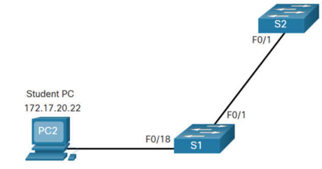)

---

## VLAN Ranges on Catalyst Switches

Cisco Catalyst switches (like the 2960 and 3650) can support over **4000 VLANs**. These are divided into two ranges:

| Feature | Normal Range VLANs | Extended Range VLANs |
|---------|------------------|--------------------|
| **VLAN IDs** | 1 to 1005 | 1006 to 4095 |
| **Typical Use** | Small to medium-sized businesses | Large enterprises and Service Providers |
| **Storage** | Stored in the **`vlan.dat`** file in Flash memory | Stored in the **`running-config`** file |
| **Reserved IDs** | 1002 - 1005 reserved for legacy networks (Token Ring/FDDI) | None |
| **Deletion Status** | 1 and 1002-1005 are auto-created and cannot be deleted | Can be created and deleted |
| **VTP Support** | Fully supported. **VTP** (VLAN Trunking Protocol) can synchronize these VLANs between switches | Requires specific VTP settings (VTP V3) and supports fewer VLAN features |

---

## VLAN Creation Commands

VLAN details are stored in the **`vlan.dat`** file in Flash memory. VLANs are created in **Global Configuration Mode**.

| Task | IOS Command Sequence | Notes |
|------|--------------------|-------|
| Enter Global Configuration Mode | `Switch# configure terminal` | Starts configuration session |
| Create VLAN | `Switch(config)# vlan [vlan-id]` | Creates VLAN (e.g., `vlan 20`) and enters VLAN Configuration Mode |
| Specify Name | `Switch(config-vlan)# name [vlan-name]` | Assigns a descriptive name (e.g., `name Faculty`) |
| Return to Privileged EXEC Mode | `Switch(config-vlan)# end` | Exit configuration mode |

---

## LAN Port Assignment Commands

Once a VLAN is created, assign it to specific switch interfaces (**access ports**) for end devices.

| Task | IOS Command | Purpose |
|------|------------|--------|
| Enter Global Configuration Mode | `Switch# configure terminal` | Start configuration |
| Enter Interface Configuration Mode | `Switch(config)# interface [interface-id]` | Select port (e.g., `fa0/1`) |
| Set Port Mode | `Switch(config-if)# switchport mode access` | Make port an access port |
| Assign Port to VLAN | `Switch(config-if)# switchport access vlan [vlan-id]` | Assign to Data VLAN (e.g., VLAN 20) |
| Return to Privileged EXEC Mode | `Switch(config-if)# end` | Exit configuration mode |

---

## VLAN Port Assignment Example

Assign access port **FastEthernet 0/18** to **VLAN 20**:

| Prompt | Command | Purpose |
|--------|---------|--------|
| `S1#` | `configure terminal` | Enter Global Configuration mode |
| `S1(config)#` | `interface fa0/18` | Select interface |
| `S1(config-if)#` | `switchport mode access` | Set port as access port |
| `S1(config-if)#` | `switchport access vlan 20` | Assign port to VLAN 20 |
| `S1(config-if)#` | `end` | Exit to privileged EXEC mode |

> **Note:** End device must use an IP address in VLAN 20’s subnet (e.g., `172.17.20.x`).

---

## Data and Voice VLANs (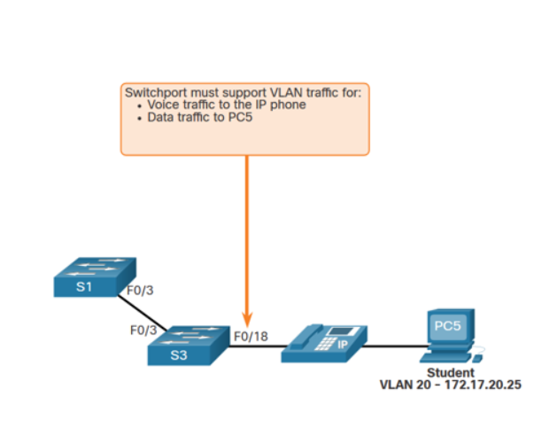)

* An access port can have **only one Data VLAN**.  
* The same port can also have **one Voice VLAN** for IP phones.  
* This is used when a **PC and an IP phone** share the same port (PC plugs into the phone).  
* The switch treats the port as a **trunk**, carrying:  
  - Tagged **Voice VLAN** traffic  
  - Untagged **Data VLAN** traffic

---

## Data and Voice VLAN Example

Steps to configure a port for both a PC (Data) and an IP phone (Voice):

1. Create and name both **Data VLAN** and **Voice VLAN** (if not already present).  
2. Assign the port to the **Data VLAN**.  
3. Assign the **Voice VLAN** explicitly.  
4. Enable **QoS trust** for voice frames to ensure low latency.

### Example Commands (Conceptual)

| Task | IOS Command | Notes |
|------|------------|-------|
| Assign Voice VLAN | `Switch(config-if)# switchport voice vlan [vlan-id]` | Dedicated Voice VLAN |
| Enable QoS Trust | `Switch(config-if)# mls qos trust [option]` | Trust CoS markings from phone |

> *(Note: Full `mls qos` details are beyond basic CCNA scope.)*

---

## Verify VLAN Information

Command: `show vlan`  

**Syntax:**  
`show vlan [brief | id vlan-id | name vlan-name | summary]`

| Task | Option | Purpose |
|------|--------|--------|
| Display basic status | `brief` | Shows VLAN name, status, and associated ports |
| Filter by VLAN ID | `id [vlan-id]` | Displays info for specific VLAN ID |
| Filter by VLAN Name | `name [vlan-name]` | Displays info for specific VLAN name |
| Display summary | `summary` | Shows active VLAN count and total VLANs configured |

---

## Change VLAN Port Membership

Two methods to change the Data VLAN of an access port:

1. **Reassign VLAN:**  
   `switchport access vlan [new-vlan-id]`  
   Example: Move port from VLAN 20 → VLAN 30

2. **Return to Default VLAN (VLAN 1):**  
   `no switchport access vlan`  
   (Removes VLAN assignment, returns to default)

### Verification Commands
* `show vlan brief`  
* `show interface [interface-id] switchport`

---

## Delete VLANs

### Deleting Specific VLANs
* Command: `no vlan [vlan-id]` (Global Config Mode)  
* **Caution:** Reassign all member ports before deletion to prevent them from going inactive.

### Deleting All VLANs (Restoring Defaults)
* Command: `delete flash:vlan.dat` or `delete vlan.dat`  
* Deletes all **Normal Range VLANs** (2-1001)  
* Must **reload switch** (`reload`) for changes to take effect

#### Factory Reset Steps
1. Unplug all data cables  
2. Erase startup configuration: `erase startup-config`  
3. Delete `vlan.dat` file  
4. Reload the switch: `reload`

# 3.4 VLAN Trunks

---

## Trunk Configuration Commands

Trunks are **Layer 2 links** designed to carry traffic for **multiple VLANs** over a single cable.

| Task | IOS Command | Purpose |
|------|------------|--------|
| Enter Global Configuration Mode | `Switch# configure terminal` | Start configuration session |
| Enter Interface Configuration Mode | `Switch(config)# interface [interface-id]` | Select the port to be configured as a trunk |
| Set Trunk Mode | `Switch(config-if)# switchport mode trunk` | Permanently enable the link as an 802.1Q trunk |
| Set Native VLAN | `Switch(config-if)# switchport trunk native vlan [vlan-id]` | Set Native VLAN to a number other than VLAN 1 (best practice) |
| Filter Allowed VLANs | `Switch(config-if)# switchport trunk allowed vlan [vlan-list]` | Security measure: Specify which VLANs can traverse the trunk |
| Return to Privileged EXEC Mode | `Switch(config-if)# end` | Save and exit configuration mode |

---

## Trunk Configuration Example (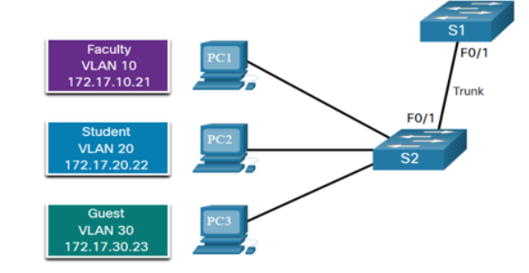)

This example configures port **Fa0/1** on switch S1 as a trunk link using 802.1Q tagging.

**VLAN Subnets:**
* VLAN 10: Faculty/Staff - 172.17.10.0/24  
* VLAN 20: Students - 172.17.20.0/24  
* VLAN 30: Guests - 172.17.30.0/24  
* VLAN 99: Native - 172.17.99.0/24  

| Prompt | Command | Purpose |
|--------|---------|--------|
| `S1(config)#` | `interface fa0/1` | Select FastEthernet 0/1 interface |
| `S1(config-if)#` | `switchport mode trunk` | Set port as trunk (802.1Q) |
| `S1(config-if)#` | `switchport trunk native vlan 99` | Set VLAN 99 as Native VLAN (untagged traffic) |
| `S1(config-if)#` | `switchport trunk allowed vlan 10,20,30,99` | Filter trunk to allow only these VLANs |
| `S1(config-if)#` | `end` | Exit and apply configuration |

> **Note:** On Layer 3 switches, the command `switchport trunk encapsulation dot1q` may be required.

---

## Verify Trunk Configuration

Primary command:  
`show interfaces [interface-id] switchport`

Checks:

* **Trunk Status:**
  * Port is **trunk administratively** (configured).  
  * Port is **trunk operationally** (functioning).  
* **Encapsulation:** Confirmed as **dot1q (802.1Q)**.  
* **Native VLAN:** Correctly set (e.g., VLAN 99).  
* **VLAN Allowed List:** By default, all VLANs are allowed unless filtered with `switchport trunk allowed vlan`.

---

## Reset the Trunk to the Default State

Restore trunk settings to factory defaults using the `no` form of the commands.

| Default Setting | Result |
|----------------|--------|
| Allowed VLANs | All VLANs on the switch are allowed to pass traffic |
| Native VLAN | Reverts to VLAN 1 |

### Verification

Use:  
`show interfaces [interface-id] switchport`

Example: `show int fa0/1 switchport`  

* Confirms **Native VLAN = 1**  
* Confirms **Allowed VLANs = 1-4094**

---

## Change Trunk Back to Access Port

To convert a trunk port to a standard access port:

* **Command:** `switchport mode access` (interface configuration mode)  
* **Result:**
  * Port is **access interface administratively**.  
  * Port is **access interface operationally**.  
* **Verification:** Use `show interfaces [interface-id] switchport` to confirm both modes show `access`.

# 3.5 Introduction to DTP

**Dynamic Trunking Protocol (DTP)** is a Cisco-proprietary protocol used to automatically negotiate the trunking state of a link.

---

## DTP Characteristics

* **Default Status:** Enabled by default on Cisco Catalyst switches (e.g., 2960/2950).  
* **Default Mode:** `dynamic auto` (passive).  
* **Disable DTP:** `switchport nonegotiate` (stops sending DTP frames).  
* **Re-enable DTP:** `switchport mode dynamic auto`.  
* **Best Practice:** Use static configuration (`switchport mode trunk` or `switchport mode access`) to avoid negotiation issues.

| Command | Purpose |
|---------|---------|
| `switchport mode trunk` | Forces permanent trunk mode (static trunk). |
| `switchport nonegotiate` | Disables DTP on the port. |
| `switchport mode dynamic auto` | Passive mode; waits for remote side to initiate trunking. |

---

## Negotiated Interface Modes

The **`switchport mode`** setting determines how an interface behaves with DTP.

| Mode | Description | Result |
|------|-------------|--------|
| **access** | Always access mode; negotiates neighbor to access | **Access** |
| **dynamic auto** | Passive; waits for remote to initiate trunk | **Trunk** (if remote = `trunk` or `desirable`), else **Access** |
| **dynamic desirable** | Active; sends DTP frames to request trunking | **Trunk** (with `trunk`, `desirable`, or `auto`), else **Access** |
| **trunk** | Always trunk mode; negotiates neighbor into trunk | **Trunk** |

> **Tip:** Use `switchport nonegotiate` with static trunk mode for predictable, stable links.

---

## DTP Negotiation Results

Resulting link states when two switch ports with DTP connect:

| Local Mode | Remote Access | Remote Auto | Remote Desirable | Remote Trunk |
|------------|---------------|-------------|------------------|--------------|
| **Access** | Access | Access | Access | Limited Connectivity |
| **Dynamic Auto** | Access | Access | Trunk | Trunk |
| **Dynamic Desirable** | Access | Trunk | Trunk | Trunk |
| **Trunk** | Limited Connectivity | Trunk | Trunk | Trunk |

---

## Key Takeaways

* **Access ↔ Trunk** → Causes **Limited Connectivity**.  
* **Dynamic Auto (Passive)** → Becomes trunk only if the other side is **trunk** or **desirable**.  
* **Dynamic Desirable (Active)** → Trunks with anything except a permanent **Access** port.  

# 4.1 Inter-VLAN Routing Operation ()

---

## What is Inter-VLAN Routing?
- **VLAN Segmentation:** Divides a Layer 2 network into separate broadcast domains  
- **Communication Barrier:** Hosts in different VLANs **cannot communicate directly**  
- **Definition:** Forwarding traffic **between VLANs** using a router or Layer 3 switch

---

## Inter-VLAN Routing Methods

1. **Legacy Inter-VLAN Routing**
   - **Uses:** One physical router interface per VLAN  
   - **Scaling:** Not scalable, uses many ports, high cost

2. **Router-on-a-Stick**
   - **Uses:** Single router interface with **subinterfaces** per VLAN  
   - **Connection:** Router connects to a switch trunk port  
   - **Scaling:** Suitable for small/medium networks

3. **Layer 3 Switch with SVIs**
   - **Uses:** Layer 3 switch with **Switched Virtual Interfaces (SVIs)** per VLAN  
   - **Routing:** Switch routes internally between VLANs  
   - **Scaling:** Best for medium/large networks

---

## Legacy Inter-VLAN Routing Details
- **Method:** Router with multiple physical Ethernet interfaces  
- **Connection:** Each router interface links to one VLAN via switch port  
- **Role:** Acts as **default gateway** for VLAN subnet  

---

## Limitations of Legacy Method
- **Not Scalable:** One interface per VLAN quickly exhausts router ports  
- **Obsolete:** Modern networks prefer **Router-on-a-Stick** or **Layer 3 Switch SVIs**

# 4.2 Router-on-a-Stick Inter-VLAN Routing ()

---

## Overview
- **Router-on-a-Stick:** Routes multiple VLANs using **one physical router interface**  
- **Purpose:** Overcomes port limitations of legacy inter-VLAN routing  
- **Connection:** Router interface → switch **trunk port**  
- **Subinterfaces:** Logical divisions of physical interface, one per VLAN  
  - Each subinterface has **VLAN ID** and **IP address** (default gateway)  
  - Use command: `encapsulation dot1q [vlan-id]` to assign VLAN tag  

---

## How Traffic is Routed
1. **Ingress:** VLAN-tagged frames arrive on router's physical interface  
2. **Mapping:** Router forwards traffic to the correct **subinterface** based on VLAN tag  
3. **Routing Decision:** Router checks **destination IP**  
4. **Egress:** Router **re-tags frame** with destination VLAN ID if sending back to switch  

> **Note:** Efficient for small/medium networks; **high CPU overhead** limits scaling beyond ~50 VLANs

# 4.3 Inter-VLAN Routing on a Layer 3 Switch ()

# 4.4 Troubleshoot Inter-VLAN Routing

## Common Inter-VLAN Issues

Inter-VLAN connectivity problems are usually caused by network **connectivity issues**. Always start troubleshooting by checking the **physical layer** (cables, connections, ports).

If physical connections are correct, check these common issues:

| Issue Type | How to Fix | How to Verify |
|-----------|------------|---------------|
| **Missing VLANs** | Create or recreate the VLAN if it doesn’t exist. Assign host ports to the correct VLAN. Ensure trunk ports allow the VLAN. | `show vlan [brief]`<br>`show interfaces switchport` |
| **Switch Trunk Port Issues** | Make sure the port is a **trunk port** and enabled. Verify allowed VLANs on the trunk. | `show interface trunk`<br>`show running-config` |
| **Switch Access Port Issues** | Ensure the port is an **access port** and enabled. Verify the host is in the correct subnet. | `show interfaces switchport`<br>`ipconfig` |
| **Router Configuration Issues** | Verify router subinterfaces are assigned to correct VLANs with correct IPv4 addresses. | `show running-config interface`<br>`show ip interface brief`<br>`ping` |

---

## Troubleshooting Tips

* Start from the **physical layer** and move upward.
* Verify **VLAN assignments** on switches and hosts.
* Check **router subinterfaces** and IP addresses.
* Use verification commands from the table to confirm configuration and connectivity.

---

## Example Scenario ()

We will use this topology to demonstrate inter-VLAN routing problems.

### Router RI Subinterfaces

| Subinterface   | VLAN | IP Address        |
|----------------|------|-----------------|
| G0/0/0.10      | 10   | 192.168.10.1/24 |
| G0/0/0.20      | 20   | 192.168.20.1/24 |
| G0/0/0.30      | 99   | 192.168.99.1/24 |

---

## Missing VLANs

**Causes:**  

* VLAN not created  
* VLAN accidentally deleted  
* VLAN not allowed on the trunk  

**Important:** Deleted VLANs make associated ports **inactive**. To fix:

* Assign ports to a **new VLAN**, or  
* **Recreate the missing VLAN** (automatically reassigns hosts).

**Verification Command:**

```bash
show interface [interface-id] switchport
```

## Switch Trunk Port Issues

**Problem:** Misconfigured switch ports can prevent inter-VLAN routing.

**Legacy Solution:** Router port may be assigned to the wrong VLAN.

**Router-on-a-Stick:** Trunk port misconfiguration is the most common cause.

**Verification Steps:**

```bash
show interface trunk
show running-config interface [interface-id]
```

# 5.1 Purpose of STP

## Redundancy in Layer 2 Networks
- **Goal:** Backup paths to prevent **single points of failure**  
- Ensures access to resources even if a path fails  
- **Types of redundancy:**  
  - Physical: Extra cables/links  
  - Logical: Smart design to prevent loops  

- **Problem:** Extra paths create **Layer 2 loops**  
  - Loops = frames circulate endlessly → network disruption  

- **Solution:** **STP (Spanning Tree Protocol)** → loop-free logical network with redundancy

## Spanning Tree Protocol (STP) (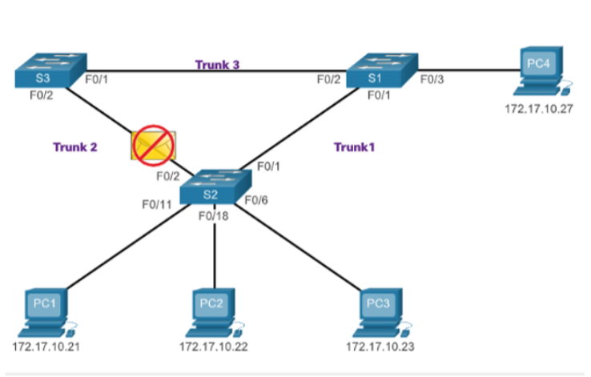)
- **STP:** Loop-prevention for Layer 2  
- **Purpose:** Keep network **loop-free** while allowing redundancy  
- **Function:**  
  - Blocks loops logically  
  - Prevents endless frame circulation  

## STP Recalculation (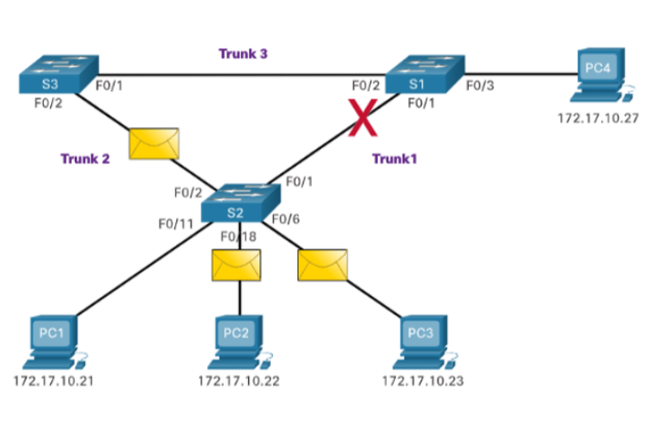)
- **On failure:** STP recalculates topology  
- Previously blocked ports may **open** to restore connectivity  
- Maintains **loop-free operation** and redundancy  

## Issues Without STP
- Multiple paths → **Layer 2 loops**  
- Effects:  
  - MAC table instability  
  - Link saturation  
  - High CPU usage  
  - Network unusable  

- **Reason:**  
  - Ethernet cannot stop looping frames  
  - Layer 3 uses TTL/Hop Limit, but Layer 2 cannot  

- **Prevention:** **Enable STP**

## Layer 2 Loops & Broadcast Storms
- **Loops:** Broadcast, multicast, unknown unicast frames circulate endlessly  
- **Effects:** MAC table instability, CPU overload, forwarding fails  
- **Broadcast storm causes:** Faulty NIC, Layer 2 loops  
- **Traffic examples:** ARP Requests, Layer 2 multicasts, IPv6 neighbor discovery  
- **Solution:** **STP enabled by default**

## Spanning Tree Algorithm (STA)
- Invented by **Radia Perlman (1985)**  
- **Purpose:** Create loop-free Layer 2 topology  

### STA Steps
1. **Select Root Bridge:** One switch = reference, others build spanning tree  
2. **Block Redundant Paths:** Blocked ports do not forward traffic  
3. **Create Loop-Free Topology:** One logical path per switch → tree topology  
4. **Recalculate on Failure:** Backup paths unblocked if primary fails or new switch/link added

# 5.2 STP Operations (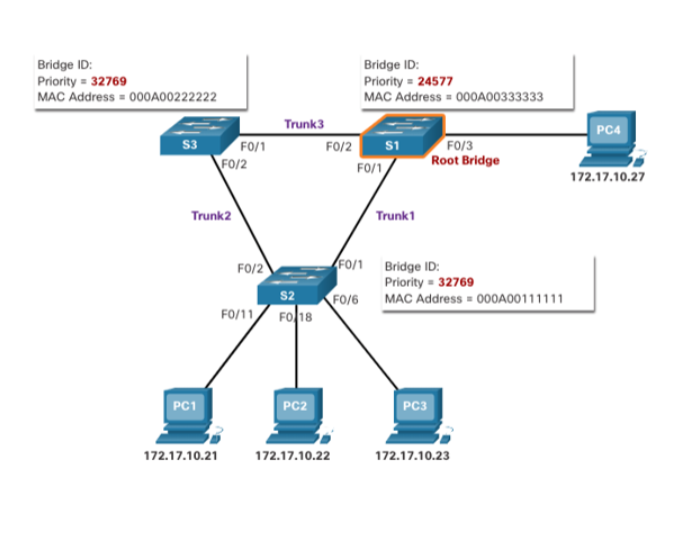)

## Steps to a Loop-Free Topology
STP uses **Spanning Tree Algorithm (STA)** to prevent loops in 4 main steps:

1. **Elect Root Bridge** – Switch that becomes **network reference point**  
2. **Elect Root Ports** – Closest port to root bridge on non-root switches  (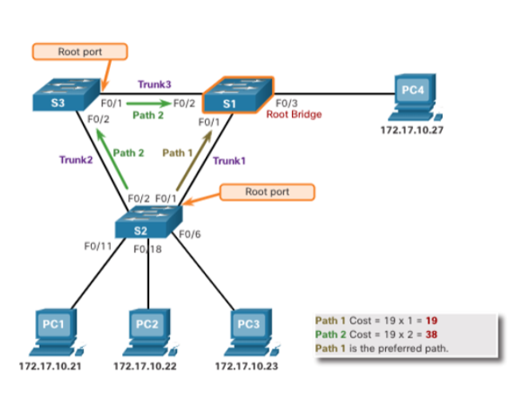)
3. **Elect Designated Ports** – Ports that **forward traffic toward root**  (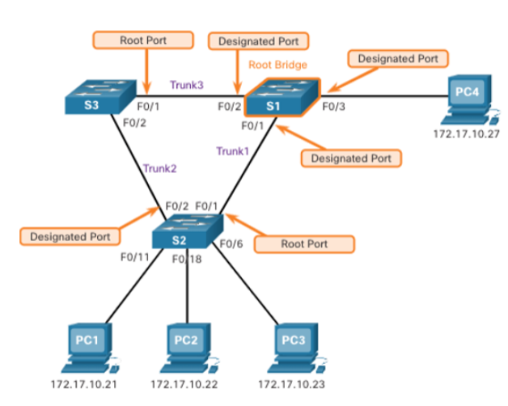)
4. **Elect Alternate (Blocked) Ports** – Remaining ports blocked as **backup paths** (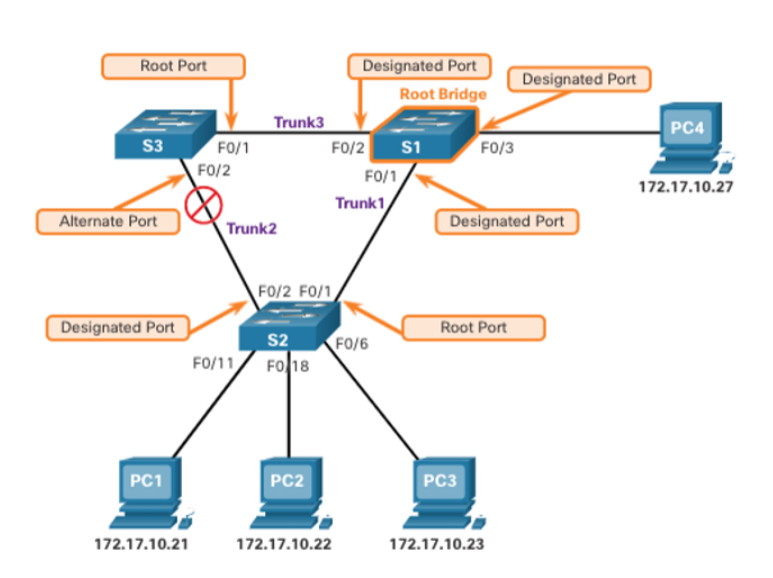)

## Role of BPDUs
- **BPDUs (Bridge Protocol Data Units):** Share network topology info  
- Used to elect: Root bridge, Root ports, Designated ports, Alternate ports

## Bridge ID (BID)
- Identifies a switch in BPDU  
- Components: Priority, MAC address, Extended system ID  
- **Lowest BID** wins → becomes root and determines port roles

### Bridge Priority & MAC
- Priority default: 32768 (range 0–61440, increments 4096)  
- Lower = better  
- Extended System ID identifies VLAN  
- If priority & system ID equal → **lowest MAC wins**

## Root Bridge Election
- Switches exchange **BPDUs every 2 sec**  
- Initially, all consider themselves root  
- **Lowest BID** becomes root bridge  
- Admin tip: Set desired root with **lower priority**

## Root Path Cost
- Path cost = sum of all port costs along path to root  
- Switch adds **its segment port cost** when receiving BPDU

### Default Port Costs
| Link Speed | STP Cost | RSTP Cost |
|-----------|----------|-----------|
| 10 Gbps  | 2        | 2000      |
| 1 Gbps   | 4        | 20,000    |
| 100 Mbps | 19       | 200,000   |
| 10 Mbps  | 100      | 2,000,000 |

- Port costs are **configurable** for preferred paths

## Root Ports
- **Root port:** Closest port to root bridge on a non-root switch  
- Selected based on **lowest path cost**  
- Redundant paths **blocked**

### Example
- S2 → root S1  
  - Path 1 cost = 19 → chosen  
  - Path 2 cost = 38 → blocked

## Designated Ports
- **Designated port:** Best port on segment forwarding to root  
- Rules:  
  - All ports on root = designated  
  - Segment between switches → port with **lowest cost**  
  - End-device ports automatically designated

## Alternate (Blocked) Ports
- Ports **not root or designated**  
- **Blocking state** prevents loops  
- Example: Port F0/2 blocked, others forwarding

## Elect Root Port from Equal-Cost Paths (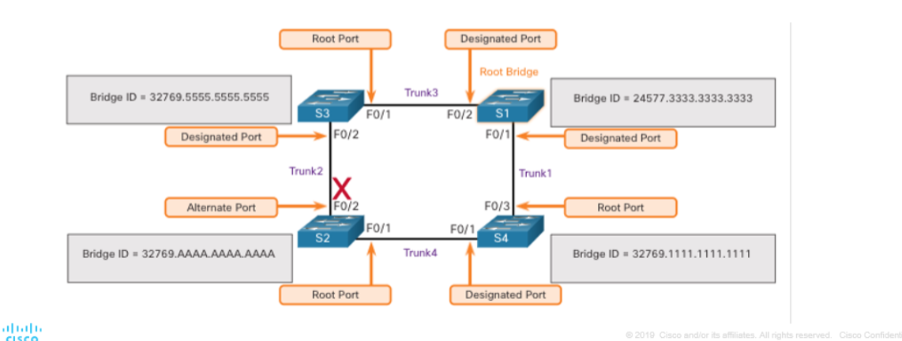) (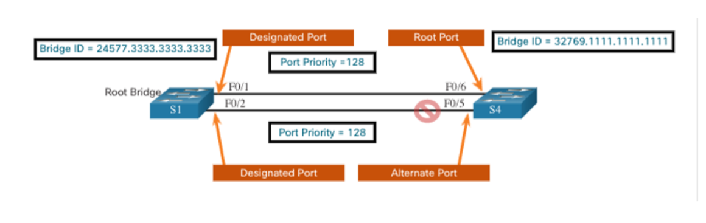)
1. Lowest sender BID  
2. Lowest sender port priority  
3. Lowest sender port ID

## STP Timers
- **Hello Timer:** BPDU interval (default 2s)  
- **Forward Delay:** Time in listening/learning before forwarding (default 15s)  
- **Max Age:** Max time before topology change (default 20s)  
> Timers set by root bridge

## STP Port States
- **Blocking:** Prevent loops, receive BPDU only  
- **Listening:** Learns topology, does not forward  
- **Learning:** Updates MAC table, no forwarding  
- **Forwarding:** Forwards frames, learns MAC  
- **Disabled:** Admin down, non-operational

| Port State | BPDU | MAC Table | Forwarding |
|------------|------|-----------|------------|
| Blocking   | Receive | No update | No |
| Listening  | Send/Receive | No update | No |
| Learning   | Send/Receive | Updating | No |
| Forwarding | Send/Receive | Updating | Yes |
| Disabled   | None | No update | No |

## Per-VLAN Spanning Tree (PVST)
- Separate STP instance for each VLAN  
- Example: VLAN 1 → 1 root bridge, 1 spanning tree instance

# 5.3 Evolution of STP

## STP Versions
- **STP (802.1D)** – Original IEEE standard, one spanning tree for all VLANs  
- **RSTP (802.1w)** – Faster convergence, backward compatible with STP  
- **PVST+** – Cisco STP per VLAN, supports PortFast, BPDU Guard, Loop Guard  
- **Rapid PVST** – Cisco RSTP per VLAN, fast per-VLAN convergence  
- **MSTP (802.1s)** – Maps multiple VLANs to same spanning tree  
- **Cisco MST** – Up to 16 RSTP instances, VLANs combined per topology  

## Cisco Implementations
- Default: **PVST+** on IOS 15+  
- Supports **alternate ports** instead of old non-designated ports  
- **Rapid PVST+** runs RSTP per VLAN → fast convergence  
- RSTP must be explicitly enabled

## RSTP Concepts (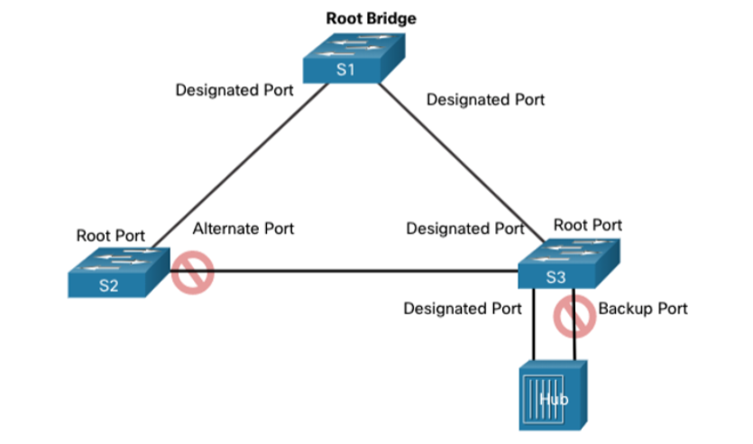)
- Replaces STP, faster convergence  
- Maintains **port roles** and **algorithm similar to STP**  
- Converges in **hundreds of milliseconds** if network configured well

### Port States
- **Discarding** → combines disabled, blocking, listening  
- **Learning** → learns MAC addresses, no forwarding  
- **Forwarding** → forwards frames, learns MAC addresses

### Port Roles
- **Root Port** – Closest port to root  
- **Designated Port** – Best port to forward toward root  
- **Alternate Port** – Backup path to root, can immediately forward  
- **Backup Port** – Rare, used for shared medium (legacy hubs)

## PortFast and BPDU Guard
### PortFast
- Skips **Listening + Learning**, goes **directly to Forwarding**  
- Use only on **access ports**, not switch-to-switch  
- Prevents DHCP delays

### BPDU Guard
- Protects **PortFast ports** from loops  
- If BPDU received → port goes **err-disabled**  
- Admin must manually re-enable

## Alternatives to STP
- Large Layer 2 networks → **hundreds of switches/VLANs**  
- **RSTP & MSTP** handle redundancy and complexity  
- Convergence slower than Layer 3 routing  
- Layer 3 routing between access/distribution → redundant paths without blocked ports  
- Only **access layer** remains pure Layer 2

# 6.1 EtherChannel Operation ()

## Link Aggregation
- **Problem:** Single link may not provide enough **bandwidth or redundancy**; STP **blocks redundant links**.
- **Solution:** Use multiple links grouped into **one logical link** with EtherChannel.

## EtherChannel Overview
- Cisco technology for **switch-to-switch LAN connections**.
- Groups multiple **Fast/Gigabit Ethernet ports** into a **port channel** (logical interface).
- **Port channel:** Virtual interface representing bundled physical links.

## Benefits
- **Fault Tolerance:** Backup links remain active if one fails.
- **Load Balancing:** Traffic shared across all links.
- **Increased Bandwidth:** Combined speed of all links.
- **Redundancy:** Prevents STP from blocking needed links.

## Advantages
- **Simplified configuration:** Configure the EtherChannel interface, not each port.
- **Cost-effective:** Uses existing ports, no need for expensive upgrades.
- **Logical aggregation:** STP sees multiple links as one.
- **Topology stability:** Physical link failure does not change logical topology.

## Restrictions
- **No mixed interface types:** Fast Ethernet + Gigabit Ethernet cannot mix.
- **Max 8 ports per channel:** Fast = 800 Mbps, Gigabit = 8 Gbps.
- **Switch limits:** E.g., Cisco Catalyst 2960 supports up to 6 EtherChannels.
- **Consistent configuration:** Speed, duplex, VLAN, and trunking must match.
- **Port channel config overrides member ports:** Direct changes to members may cause issues.

## Negotiation Protocols
- **PAgP:** Cisco proprietary.
- **LACP:** IEEE 802.3ad, multi-vendor compatible.
- **Static EtherChannel:** Can configure manually without negotiation.

## PAgP Overview ()
- **Auto-negotiation protocol** for automatic EtherChannel creation.
- Sends **packets every 30 sec** to manage links.
- Ensures **configuration consistency**.
- **All ports must match:** Speed, duplex, VLAN.

### PAgP Modes
| Mode       | Function |
|------------|---------|
| On         | Forces channel without PAgP; only works if both sides On |
| Desirable  | Actively initiates negotiation |
| Auto       | Passively responds; does not initiate |

### PAgP Mode Compatibility
- **Auto + Desirable** → channel forms  
- **Auto + Auto** → no channel  
- **On + On** → forms without negotiation  
- **No mode/unconfigured** → disabled  

### PAgP Example
| Local | Remote | Channel? |
|-------|--------|----------|
| On    | On     | Yes      |
| Desirable | Desirable | No |
| Auto  | Auto   | No       |
| Desirable | Auto | Yes    |
| Auto  | Desirable | Yes  |
| Desirable | Desirable/Auto | Yes |

## LACP Overview ()
- IEEE standard for bundling physical ports into a **logical channel**.
- Works with **multi-vendor switches**.
- Cisco supports **PAgP and LACP**.

### LACP Modes
| Mode   | Function |
|--------|---------|
| On     | Forces channel without LACP, no packets sent |
| Active | Actively initiates LACP negotiation |
| Passive| Responds to LACP packets but does not initiate |

### LACP Example
| Local | Remote | Channel? |
|-------|--------|----------|
| On    | On     | Yes      |
| Active | Active | Yes      |
| Passive | Passive | Yes    |
| Active | Passive | Yes    |

# 6.2 Configure EtherChannel

## Guidelines

- **EtherChannel Support:** All Ethernet interfaces must support EtherChannel; no need to be physically contiguous.
- **Speed & Duplex:** All member interfaces must have the same speed and duplex mode.
- **VLAN Match:** All interfaces must be in the same VLAN or configured as a trunk.
- **VLAN Range (Trunks):** All ports must allow the same VLAN range; mismatch prevents EtherChannel formation even in auto/desirable mode.

## Port Channel Configuration

- **Port Channel Interface Mode:**  
  - Make changes in port channel interface mode.  
  - Config on port channel **applies to all members**.  
  - Config on individual ports **does not affect** port channel and may cause issues.
- **Port Channel Modes:** Access, Trunk (most common), Routed port.

## LACP Configuration Steps

1. **Specify Interfaces**  
   - Use `interface range` in global config to select multiple interfaces.

2. **Create Port Channel Interface**  
   - Command: `channel-group <identifier> mode active`  
   - `<identifier>` = group number, `mode active` = LACP

3. **Configure Port Channel Settings**  
   - Enter: `interface port-channel <number>`  
   - Configure trunk mode, allowed VLANs, etc.  
   - Changes automatically apply to all member ports.

### Example Commands

```text
interface <type> <number> - <number>
 channel-group 1 mode active
 Creating a port-channel interface 1
 exit
interface port-channel 1
 (configure trunk, allowed VLANs, etc.)
```

# 6.3 Verify & Troubleshoot EtherChannel (Simplified Notes)

## Verification Commands

- `show interfaces port-channel` → General status of port channel
- `show etherchannel summary` → One-line summary per port channel
- `show etherchannel port-channel` → Detailed info for a specific port channel
- `show interfaces etherchannel` → Role of each physical member port

## Common Issues

### Configuration Consistency Required
- All member ports must have:
  - Same **speed and duplex**
  - Same **native/allowed VLANs** on trunks
  - Same **access VLAN** on access ports

### Typical Problems

1. **VLAN Mismatch**  
   - Ports in different VLANs or trunks with different native VLANs  
   - Result: EtherChannel **cannot form**

2. **Trunk Misconfiguration**  
   - Trunking applied to some ports but not all  
   - Solution: Configure trunking **on the EtherChannel**, not individual ports

3. **Allowed VLAN Range Mismatch**  
   - VLAN ranges differ across member ports  
   - EtherChannel fails even if PAgP/LACP = auto/desirable

4. **Incompatible Negotiation Modes**  
   - PAgP/LACP modes not compatible on both ends  
   - EtherChannel **will not form**

# 7.1 DHCPv4 Concepts

## DHCPv4 Server and Client

* **Dynamic Host Configuration Protocol v4 (DHCPv4)** automatically assigns **IPv4 addresses** and other network configuration info to devices.
* Commonly used for **desktop clients** as they form the majority of network nodes.
* **Benefit:** Saves time and reduces errors compared to manual (static) IP configuration.

---

## DHCPv4 Server Options

* **Dedicated DHCPv4 Server:** More **scalable** and easier to manage in larger networks.
* **Cisco Router as DHCPv4 Server:** Useful in **Small Office/Home Office (SOHO)** or branch networks; Cisco IOS supports a full-featured DHCPv4 server.

---

## DHCPv4 Lease Process (Client/Server Model)

* **Leasing:** The DHCPv4 server **leases an IPv4 address** from an address pool for a limited time (e.g., 24 hours to a week or more).
* **Renewal:** The client must **periodically contact the server** to renew/extend the lease.
* **Expiration:** If the lease **expires**, the DHCP server **reclaims the address** and returns it to the available pool.
* **Efficiency:** The lease system keeps IP address usage **efficient** by preventing permanently held or wasted addresses.

---

## Steps to Obtain a DHCPv4 Lease (DORA) (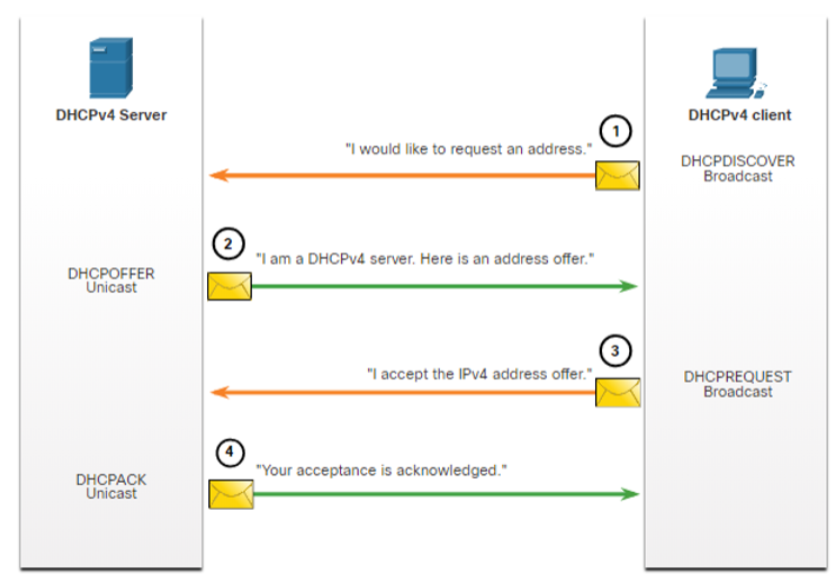)

When a client boots, it follows the four-step **DORA** process:

| Step | Message | Action | Purpose |
| :---: | :--- | :--- | :--- |
| **1** | **D**iscover (`DHCPDISCOVER`) | Client **broadcasts** a message. | Locate available DHCPv4 servers. |
| **2** | **O**ffer (`DHCPOFFER`) | Server replies with an **offer** (suggested IP, mask, gateway, DNS, etc.). | Inform the client of available configuration. |
| **3** | **R**equest (`DHCPREQUEST`) | Client **broadcasts** a request to accept the offered IP and configuration. | Formally ask for the offered IP. |
| **4** | **A**cknowledgment (`DHCPACK`) | Server confirms with an **acknowledgment**. | Grant the lease; client now has a valid IP configuration. |

---

## Steps to Renew a DHCPv4 Lease (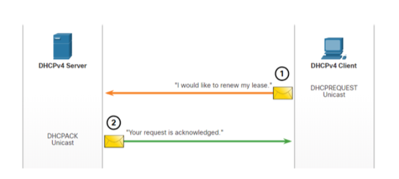)

Before a lease expires, the client attempts to renew it:

1.  **DHCP Request (`DHCPREQUEST`):** Client sends the request **directly** (unicast) to the original DHCP server.
2.  **Backup Request:** If no `DHCPACK` is received, the client **broadcasts** a `DHCPREQUEST` to allow other servers to respond.
3.  **DHCP Acknowledgment (`DHCPACK`):** Server responds, confirming the **lease renewal** and allowing the client to continue using the IP address.

***

# 7.2 Configure a Cisco IOS DHCPv4 Server (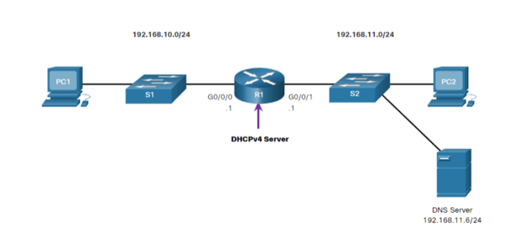)

A **Cisco IOS router** can be configured as a DHCPv4 server to assign IPv4 addresses dynamically from managed **address pools**.

## Steps to Configure a Cisco IOS DHCPv4 Server

| Step | Command Syntax | Mode | Description |
| :---: | :--- | :--- | :--- |
| **1** | `ip dhcp excluded-address <low-address> [high-address]` | Global Config | **Excludes reserved addresses** (e.g., for routers, servers, printers) from the pool. |
| **2** | `ip dhcp pool POOL-NAME` | Global Config | **Defines a DHCP pool** and enters DHCP configuration mode. |
| **3** | `network network-number mask` | DHCP Config | Defines the **range of available addresses** for the pool. |
| **4** | `default-router address` | DHCP Config | Specifies the client's **default gateway**. |
| **5** | `dns-server address` (Optional) | DHCP Config | Provides the **DNS server** IP address(es). |
| **6** | `domain-name domain` (Optional) | DHCP Config | Specifies the network **domain name**. |

---

## DHCPv4 Pool Configuration Commands

| Task | Command Syntax |
| :--- | :--- |
| Define the address pool | `network network-number [mask | /prefix-length]` |
| Define the default gateway | `default-router address [address2 ...]` |
| Define a DNS server | `dns-server address [address2 ...]` |
| Define the domain name | `domain-name domain` |
| Define the duration of the lease | `lease {days [hours [minutes]]}` |

---

## DHCPv4 Verification and Management

| Command | Purpose |
| :--- | :--- |
| `show running-config | section dhcp` | Displays the configured DHCPv4 pool(s) and excluded addresses. |
| `show ip dhcp binding` | Shows a list of **assigned IPv4 addresses** (bindings) to MAC addresses. |
| `show ip dhcp server statistics` | Displays the count of DHCPv4 messages (Discover, Offer, Request, ACK) sent and received. |
| `no service dhcp` | **Disables** the global DHCPv4 server process (use `service dhcp` to re-enable). |

---

## DHCPv4 Relay Agent (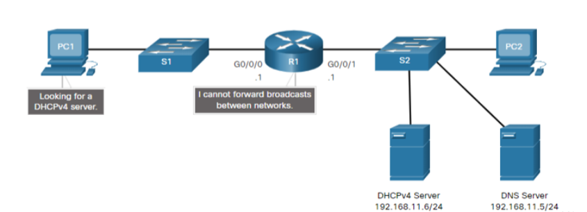)

A router is configured as a **DHCPv4 relay agent** when the DHCPv4 server is on a **different subnet** than the clients (since routers don't forward broadcast messages).

* **Solution:** Use the `ip helper-address` command.
* **Command:** `ip helper-address <server-address>`
* **Mode:** Interface configuration mode (on the interface facing the clients).
* **Action:** The router accepts client **broadcast requests** and forwards them as **unicast messages** to the DHCPv4 server.
* **Note:** The `ip helper-address` command also forwards seven other UDP services by default (including DNS, TFTP, and NetBIOS).

***

# 7.3 Configure a DHCPv4 Client

## Cisco Router as a DHCPv4 Client (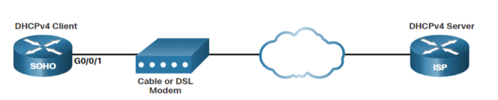)

A Cisco router can be configured to obtain an IP address from an external DHCP server (like an ISP) for its WAN interface, commonly used in **SOHO** environments.

* **Configuration Command:**
    ```cli
    R1(config-if)# ip address dhcp
    ```
* **Action:** The router interface acts as a DHCPv4 client, requesting an IPv4 address, mask, and other configuration details from the server.
* **Verification:** Use the `show ip interface [interface-id]` command to confirm the allocated IP address and status.

---

## Home Router as a DHCPv4 Client

* Home routers are usually preconfigured to act as a DHCPv4 client on their **WAN port**.
* The default Internet connection type is typically set to **Automatic Configuration - DHCP** to quickly connect to the ISP's cable or DSL modem.

# 8.1 IPv6 GUA Assignment ()

## IPv6 Host Configuration

* **Manual Configuration (Router):** An **IPv6 Global Unicast Address (GUA)** is manually configured on a router interface using:
    ```cli
    ipv6 address ipv6-address/prefix-length
    ```
* **Dynamic Configuration (Host):** Manually configuring a GUA on a host is **time-consuming and error-prone**. Most hosts are configured to **dynamically acquire an IPv6 GUA**.

---

## IPv6 Host Link-Local Address (LLA)

* The **IPv6 Link-Local Address (LLA)** is **automatically created** by the host when the interface is active, even without a GUA.
* The host uses an **ICMPv6 Router Advertisement (RA)** message if **automatic IPv6 addressing** is selected.
* **Note:** The **Zone ID** or **Scope ID** (e.g., "%1") at the end of an LLA is used by the OS to associate the address with a specific interface.
* **DHCPv6** is defined in [RFC 3315](https://www.rfc-editor.org/rfc/rfc3315).

---

## IPv6 GUA Assignment Methods

* An **IPv6-enabled router** periodically sends **ICMPv6 Router Advertisements (RAs)** to suggest dynamic configuration.
* A host can dynamically acquire a **GUA** using **stateless** (SLAAC) or **stateful** (DHCPv6) methods.
* All methods rely on **RA messages** to communicate the configuration options, though the **host ultimately makes the final decision**.

---

## Three RA Message Flags ()

The combination of flags in the **ICMPv6 Router Advertisement (RA) message** determines the host configuration process:

| Flag | Name | Value = 1 Action |
| :---: | :--- | :--- |
| **A flag** | **Address Autoconfiguration** | Use **Stateless Address Autoconfiguration (SLAAC)** to create a GUA. |
| **O flag** | **Other Configuration** | Obtain additional information (e.g., DNS) from a **stateless DHCPv6 server**. |
| **M flag** | **Managed Address Configuration** | Must obtain a GUA and other info from a **stateful DHCPv6 server**. |

---
---

# 8.2 SLAAC

## SLAAC Overview 

**Stateless Address Autoconfiguration (SLAAC)** allows hosts to create their own unique **Global Unicast Address (GUA)** **without a DHCPv6 server**.

* **Stateless:** No server is required to maintain address state information (leases).
* **RA Messages:** Routers send periodic RA messages (default 200 seconds) with the network prefix. Hosts can request an immediate RA using a **Router Solicitation (RS)** message.
* **Deployment:** Can be used as **SLAAC only** or **SLAAC with stateless DHCPv6**.

---

## Enabling SLAAC (Router) ()

* A router (R1) configured with a GUA and LLA automatically begins sending **Router Advertisement (RA) messages** to the **IPv6 all-nodes multicast group (`ff02::1`)**.
* The router also joins the **IPv6 all-routers multicast group (`ff02::2`)**.
* **Verification:** Use the `show ipv6 interface` command to confirm the router has joined the multicast group.

---

## SLAAC-Only Method

* **RA Flags:** `A = 1`, `O = 0`, `M = 0`.
* **Process:** Client uses the IPv6 GUA prefix from the RA and dynamically creates its **Interface ID** via SLAAC.
* **Default Gateway:** The client uses the router's **Link-Local Address (LLA)** as the default gateway.

---

## ICMPv6 Router Solicitation (RS) Messages

1.  **Host Sends RS:** After booting, the host sends an **RS message** to the IPv6 **all-routers multicast address (`ff02::2`)**.
2.  **Router Responds with RA:** The router (R1) immediately generates an **RA message** and sends it to the IPv6 **all-nodes multicast address (`ff02::1`)**.
3.  **Outcome:** The host uses the RA information to create its GUA.

---

## Host Process to Generate Interface ID (SLAAC)

The host acquires the **64-bit prefix** from the RA and generates the remaining **64-bit interface identifier (ID)** using:

1.  **Randomly Generated:**
    * The host OS generates a **random 64-bit ID**.
    * This is the default for modern OSs (**Windows 10/11**) for privacy.
2.  **EUI-64 Method:**
    * The host uses its **48-bit MAC address**, inserting the hex value `fffe` in the middle to create the 64-bit ID.
    * Note: Many OSs avoid EUI-64 by default due to privacy concerns.

---

## Duplicate Address Detection (DAD)

A SLAAC host uses the **Duplicate Address Detection (DAD)** process to ensure its generated IPv6 GUA is unique.

1.  **NS Message:** The host sends an **ICMPv6 Neighbor Solicitation (NS)** message to a **solicited-node multicast address** containing the last 24 bits of its proposed GUA.
2.  **Uniqueness:** If **no Neighbor Advertisement (NA)** messages are received in response, the address is unique. If an **NA is received**, the address is a duplicate, and a new ID must be generated.
3.  **Note:** DAD is technically optional but **IETF recommended**, so most OSs perform DAD for all unicast addresses.

---
---

# 8.3 DHCPv6 Operation Steps ()

When an RA indicates that DHCPv6 should be used (stateful or stateless), the host follows these steps (**Stateless DHCPv6 requires SLAAC; Stateful DHCPv6 does not**):

1.  Host sends a **Router Solicitation (RS)** message.
2.  Router responds with a **Router Advertisement (RA)** message.
3.  Host sends a **DHCPv6 SOLICIT** message to locate DHCPv6 servers.
4.  DHCPv6 server responds with an **ADVERTISE** message.
5.  Host sends a **REQUEST** message to the server.
6.  DHCPv6 server sends a **REPLY** message with configuration information.

* **Note:** DHCPv6 messages use **UDP destination port 546** (server-to-client) and **UDP destination port 547** (client-to-server).

---

## Stateless DHCPv6 Operation ()

* **RA Flags:** `A = 1`, `O = 1`, `M = 0`.
* **Process:** The host uses **SLAAC** (A=1) for its GUA and contacts the **stateless DHCPv6 server** (O=1) for **additional configuration** (like DNS).
* **Note:** Stateless DHCPv6 servers **do not maintain IPv6 address bindings**.
* **Router Command to Enable O flag:**
    ```cli
    R1(config-if)# ipv6 nd other-config-flag
    ```

---

## Stateful DHCPv6 Operation

* **RA Flags:** `A = 0`, `O = 0`, `M = 1`.
* **Process:** The host contacts the **stateful DHCPv6 server** (M=1) for **all configuration information**, including the GUA.
* **Note:** The stateful DHCPv6 server **maintains a list of IPv6 address bindings**.
* **Router Command to Enable M flag:**
    ```cli
    R1(config-if)# ipv6 nd managed-config-flag
    ```

---
---

# 8.4 Configure DHCPv6 Server

## DHCPv6 Router Roles

A Cisco IOS router can function as a:
* **DHCPv6 Server:** Provides stateless or stateful services.
* **DHCPv6 Client:** Acquires an IPv6 configuration on an interface.
* **DHCPv6 Relay Agent:** Forwards messages between clients and servers on different networks.

---

## Configure a Stateless DHCPv6 Server

The stateless server advertises configuration details via RA messages and a DHCPv6 pool.

| Step | Command | Mode | Description |
| :---: | :--- | :--- | :--- |
| **1** | `ipv6 unicast-routing` | Global Config | Enable IPv6 routing. |
| **2** | `ipv6 dhcp pool POOL-NAME` | Global Config | Define the DHCPv6 pool. |
| **3** | `dns-server 2001:db8::1`<br>`domain-name example.com` | DHCPv6 Config | Configure non-address options (DNS, domain name). |
| **4** | `ipv6 dhcp server POOL-NAME` | Interface Config | Bind the interface to the pool. |
| **5** | `ipv6 nd other-config-flag` | Interface Config | Enable the **O flag** (O=1) in RAs, instructing clients to contact the server for non-address options. (A flag is 1 by default). |
| **6** | `ipconfig /all` (on client) | Verification | Verify the host received configuration. |

---

## Configure a Stateful DHCPv6 Server

The stateful server instructs hosts to obtain **all** necessary configuration, including the GUA, from the server.

| Step | Command | Mode | Description |
| :---: | :--- | :--- | :--- |
| **1** | `ipv6 unicast-routing` | Global Config | Enable IPv6 routing. |
| **2** | `ipv6 dhcp pool POOL-NAME` | Global Config | Define the DHCPv6 pool. |
| **3** | Configure pool options (e.g., `address prefix`). | DHCPv6 Config | Configure address prefix and other options. |
| **4** | `ipv6 dhcp server POOL-NAME` | Interface Config | Bind the interface to the pool. |
| **5a** | `ipv6 nd managed-config-flag` | Interface Config | Set the **M flag** to **1** (M=1), instructing clients to use the server for address assignment. |
| **5b** | `ipv6 nd prefix default no-autoconfig` | Interface Config | Set the **O flag** to **0** and disable SLAAC, ensuring full stateful assignment. |
| **6** | `ipconfig /all` (on client) | Verification | Verify the host received its GUA and options from the server. |

---

## Configure a Stateless DHCPv6 Client

A router obtains non-address configuration details from a server while using **SLAAC** for its GUA.

| Step | Command/Action | Mode | Description |
| :---: | :--- | :--- | :--- |
| **1** | `ipv6 unicast-routing` | Global Config | Enables IPv6 routing. |
| **2** | `ipv6 enable` | Interface Config | Creates the LLA on the interface. |
| **3** | `ipv6 address autoconfig` | Interface Config | Enables the client to use **SLAAC** for GUA. |
| **4** | `show ipv6 interface brief` | Verification | Verify the client has been assigned a GUA via SLAAC. |
| **5** | `show ipv6 dhcp interface [interface-id]` | Verification | Verify the client received non-address options (DNS, domain name). |

---

## Configure a Stateful DHCPv6 Client

A router obtains **both** its **GUA** and other configuration details from a stateful server.

| Step | Command/Action | Mode | Description |
| :---: | :--- | :--- | :--- |
| **1** | `ipv6 unicast-routing` | Global Config | Enables IPv6 routing. |
| **2** | `ipv6 enable` | Interface Config | Creates the LLA on the interface. |
| **3** | `ipv6 address dhcp` | Interface Config | **Enables the client to use DHCPv6** for all configuration. |
| **4** | `show ipv6 interface brief` | Verification | Verify the client has been assigned a GUA from the DHCPv6 server. |
| **5** | `show ipv6 dhcp interface [interface-id]` | Verification | Verify the client received its GUA lease and other necessary options. |

---

## Configure a DHCPv6 Relay Agent ()

The router forwards DHCPv6 messages when the server and clients are on different networks.

| Step | Command Syntax | Mode | Description |
| :---: | :--- | :--- | :--- |
| **1** | `ipv6 dhcp relay destination [server-ipv6-address] [egress-interface]` | Interface Config | Configures the relay agent on the interface **facing the clients**. `egress-interface` is only required if the server address is a **LLA**. |

**Example (GUA server address):**
```cli
Router(config-if)# ipv6 dhcp relay destination 2001:DB8:FACE:1::1
```

# 9.1 First Hop Redundancy Protocols

## Default Gateway Limitations (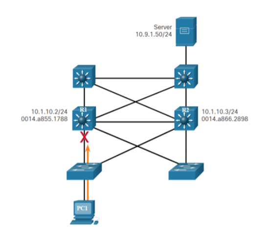)
- Devices usually have **one default gateway** (a router IP).  
- If that gateway fails → devices **cannot access networks outside the LAN**.  
- Even if another router is available, devices **won’t switch automatically**.  

## First Hop Redundancy Protocols (FHRPs)
- FHRPs solve this problem by creating a **virtual gateway** shared by multiple routers.  
- If the active router fails → another router **automatically takes over**.  
- Ensures **continuous network access** without manual changes.  

## Router Redundancy

### Why Router Redundancy?
- Prevents LAN-wide connectivity loss if the default gateway fails.  
- Achieved using a **virtual router** (multiple routers acting as one).  

### How It Works
- Routers share:
  - **One IP address** (default gateway for hosts).  
  - **One MAC address** (hosts always know where to send traffic).  
- Hosts send traffic to the **virtual IP/MAC**, and the **active router forwards it**.  

### What Hosts See
- Hosts only see the **virtual router**.  
- Frames are sent to the virtual MAC; the **active router handles them**.  

### Behind the Scenes
- A **protocol decides which router is active**.  
- If active router fails, a standby router **takes over instantly**.  
- **No disruption** is visible to hosts.  

### Role of a Redundancy Protocol
- Determines:
  - Which router is **active** (forwards traffic).  
  - Which routers are **standby** (ready to take over).  

### Smooth Transition
- If active router fails → **standby router automatically takes over**.  
- **Transparent to end devices**.  

### Key Term
- **First-Hop Redundancy**: Ability of the network to **recover automatically** when the default gateway fails.  

## Steps for Router Failover (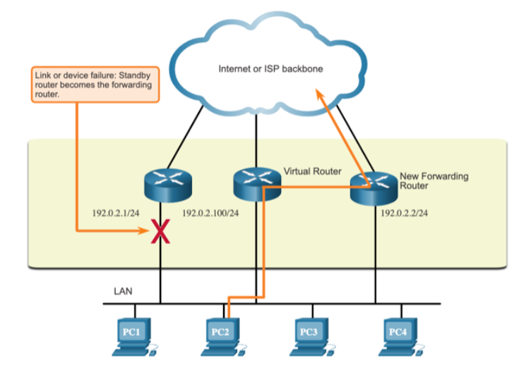)
1. **Standby router notices** it is no longer receiving "Hello" messages from active router.  
2. **Standby router takes over** as the new active router.  
3. New active router uses **same IP and MAC** → hosts see **no change**.  

Result: Traffic continues **without disruption**.  

## FHRP Options

| Protocol | Type | IPv4 / IPv6 | Key Features |
|----------|------|-------------|--------------|
| **HSRP** | Cisco proprietary | IPv4 | Failover. One active router forwards traffic; standby takes over if active fails. |
| **HSRP for IPv6** | Cisco proprietary | IPv6 | Same as HSRP, but for IPv6. Uses virtual MAC + IPv6 link-local address. Sends RAs when active. |
| **VRRPv2** | Open standard | IPv4 | Multi-vendor support. One master; backups take over if master fails. |
| **VRRPv3** | Open standard | IPv4 & IPv6 | Supports IPv4 & IPv6. More scalable; works in multi-vendor environments. |
| **GLBP** | Cisco proprietary | IPv4 | Redundancy + load balancing. Multiple routers can share traffic. |
| **GLBP for IPv6** | Cisco proprietary | IPv6 | Same as GLBP but for IPv6. Supports backup and load sharing. |
| **IRDP** | Open standard (RFC 1256) | IPv4 | Legacy. Hosts can discover routers for remote networks. Rarely used. |


# 9.2 HSRP

## HSRP Overview (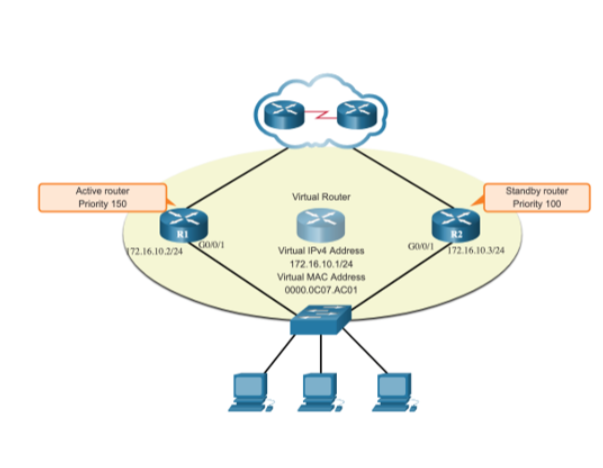)
- **HSRP (Hot Standby Router Protocol)** is Cisco proprietary.  
- Prevents loss of outside network access if default router fails.  
- Provides **transparent failover** → hosts don’t notice.  
- Ensures **high availability** with a backup gateway.  

## How It Works
- Routers form an **HSRP group**.  
- Roles:
  - **Active router** = forwards packets.  
  - **Standby router** = monitors active router and takes over if needed.  

## Key Point
- **Standby router watches active router** and **takes over immediately** if active fails.  

## HSRP Priority and Preemption

### Election Process
- Active vs standby chosen based on:
  1. **HSRP Priority** (higher wins).  
  2. If equal → router with **highest IPv4 address** wins.  

### Default Settings
- Default **priority** = 100.  
- Range: 0–255.  

### Configuring Priority
- Command: `standby priority <value>`  
- Set higher priority for the router you want as **active**.  

### Why It Matters
- Lets you **control which router becomes active**.  

### Default Behavior
- Active router **remains active** even if a higher-priority router comes online.  

### Preemption
- Allows **higher-priority router to take over**.  
- Enable: `standby preempt`  
- Rules:
  - Only routers with **higher priority** can preempt.  
  - Equal priority + higher IP **does not preempt**.  

### Without Preemption
- **First router to boot** becomes active if no other routers are online.  
- Higher-priority routers **won’t take over** unless preemption is enabled.  

## HSRP States and Timers

### HSRP States

| State   | Description |
|---------|-------------|
| **Initial** | Router just started or interface up. **Does not know virtual IP**; listens for hello messages. |
| **Learn**   | Knows virtual IP, but not active/standby. Listens for hello messages. |
| **Listen**  | Listens and participates in HSRP election. |
| **Speak**   | Sends hello messages; can become active/standby. |
| **Standby** | Ready to take over if active fails. |

### HSRP Timers
- **Hello Timer**: Send hello every 3 sec (default).  
- **Hold Timer**: Standby becomes active if no hello for 10 sec (default).  

#### Notes
- Adjust timers for faster failover:
  - Min hello timer: 1 sec  
  - Min hold timer: 4 sec  
- Too low → higher CPU usage & unnecessary state changes.  

# 10.1 Endpoint Security

## Network Attacks Today

Modern enterprise networks face many types of attacks.

### 1. Distributed Denial of Service (DDoS)
* **Description:** A **coordinated attack** using many compromised devices (called **zombies**).
* **Goal:** To **overwhelm** a website or service with traffic.
* **Effect:** The service slows down or completely **shuts down** public access.

### 2. Data Breach
* **Description:** Attackers **break into servers or hosts** to steal sensitive information.
* **Risk:** Exposure of confidential data (customer records, passwords, financial details).

### 3. Malware (Malicious Software)
* **Description:** **Malicious software** that infects systems and causes harm.
* **Example (Ransomware):** Encrypts files (like **WannaCry**) and locks access until a ransom is paid.
* **Other Risks:** Stealing data, spying on users, or damaging system files.

---

## Network Security Devices

These devices protect the network perimeter from unauthorized access.

### 1. Virtual Private Network (VPN) Enabled Router
* **Function:** Creates a **secure, encrypted connection** for remote users over public networks.
* **Benefit:** Allows safe access to the enterprise network. (VPN services can often be built into a firewall.)

### 2. Next-Generation Firewall (NGFW)
* **Function:** Provides **advanced protection** beyond traditional firewalls.
* **Key Features:**
    * **Stateful packet inspection:** Monitors the state of active connections.
    * **Application visibility and control:** Manages access based on the application, not just the port.
    * **Next-Generation Intrusion Prevention System (NGIPS):** Proactively blocks threats.
    * **Advanced Malware Protection (AMP):** Fights sophisticated malware.
    * **URL filtering:** Secures web traffic by blocking dangerous links.

### 3. Network Access Control (NAC)
* **Function:** Manages **who** can access the network and **what** they can do.
* **Uses the AAA Model:**
    * **Authentication:** Verifies user identity (Who are you?).
    * **Authorization:** Defines what users are allowed to access (What can you do?).
    * **Accounting:** Tracks user activities (What did you do?).
* **Enterprise Example:** **Cisco Identity Services Engine (ISE)**.

---

## Endpoint Protection (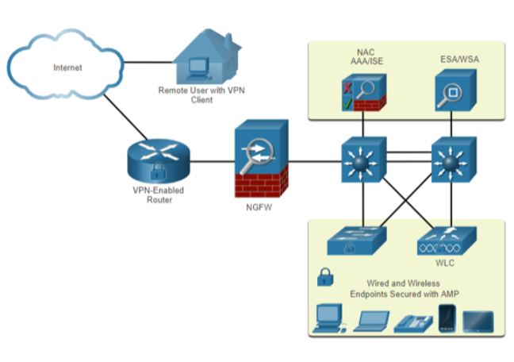)

### What Are Endpoints?
* **Definition:** Devices that **connect to the network**.
* **Examples:** Laptops, desktops, servers, IP phones, and employee-owned (**BYOD**) devices.
* **Risk:** They are **common targets** for attacks, especially via email or web browsing.

### Traditional Endpoint Security
These tools run directly on the device (host-based):
* **Antivirus/Antimalware:** Detects and removes malicious software.
* **Host-Based Firewall:** Filters traffic going to and from the endpoint.
* **Host-Based Intrusion Prevention System (HIPS):** Blocks suspicious activities on the device.

### Modern Endpoint Protection
This is a layered security approach using multiple tools:
* **Network Access Control (NAC):** Controls which devices are allowed to connect.
* **Advanced Malware Protection (AMP):** Detects and responds to malware threats in real-time.
* **Email Security Appliance (ESA):** Blocks phishing and email-based attacks.
* **Web Security Appliance (WSA):** Protects against malicious websites and downloads.

---

## Cisco Email Security Appliance (ESA)

### Overview
* **Role:** Monitors **Simple Mail Transfer Protocol (SMTP)** traffic to protect email.
* **Intelligence:** Receives **real-time threat intelligence** updates (every 3–5 minutes) from **Cisco Talos**.

### Key Functions
* **Block Known Threats:** Stops malicious emails before they reach users.
* **Remediate Stealth Malware:** Finds and fixes malware that bypassed initial checks.
* **Discard Emails:** Removes emails containing malicious or suspicious links.
* **Block Access:** Prevents users from accessing newly infected or dangerous websites.
* **Encrypt Outgoing Emails:** Ensures confidentiality and prevents data leaks.

---

## Cisco Web Security Appliance (WSA)

### Overview
* **Role:** Protects against **web-based threats** and controls user web traffic.
* **Integrates** multiple security features for comprehensive protection.

### Key Features
* **Advanced Malware Protection (AMP):** Detects and blocks malicious software.
* **Application Visibility and Control:** Monitors and manages web applications in use.
* **Acceptable Use Policy Controls:** Enforces company rules for web access.
* **Detailed Reporting:** Provides insights into user web activity and threat events.

### Web Access Management
* Gives administrators **complete control** over user internet access.
* Specific activities (e.g., chat, messaging, video, audio) can be:
    * **Allowed**
    * **Restricted** (by time or bandwidth)
    * **Completely Blocked**

### Security Functions
* **Blacklist and URL Filtering:** Blocks access to unsafe or inappropriate websites.
* **Malware Scanning:** Detects malicious content within web traffic.
* **URL Categorization:** Sorts websites by type or risk level.
* **Web Application Filtering:** Controls access to specific web-based applications.
* **Encryption/Decryption of Web Traffic:** Inspects secure **HTTPS** traffic safely while maintaining privacy.

# 10.2 Access Control

---

## Authentication with a Local Password

### Overview
* **Authentication** verifies a user's identity to grant access.
* The **simplest method** is using a **local username and password** configured directly on a device's **console**, **VTY**, or **AUX** lines.

### SSH (Secure Shell)
* **SSH** is the **secure replacement for Telnet**.
* It provides **encrypted remote access** and requires a **username and password**.
* Credentials are **verified locally** against the device's internal user database.

### Limitations of Local Authentication
* **Not scalable:** User accounts must be **manually configured** on *every* device.
* **No central management:** No easy way to manage hundreds of users or devices.
* **No fallback:** If the local database fails, nobody can log in.
* **Best for:** **Small networks** or lab environments.

---

## AAA Components (The Access Control Framework)

### Overview
* **AAA** stands for **Authentication, Authorization, and Accounting**.
* It is the core framework for **secure, controlled, and traceable access** to network devices and resources.

### Components of AAA
1.  **Authentication (Who are you?)**
    * Verifies **who** the user is before access is granted.
    * *Example:* Checking a username and password.

2.  **Authorization (What can you do?)**
    * Determines **what** the authenticated user is allowed to access or perform.
    * *Example:* Granting access to specific configuration commands or network areas.

3.  **Accounting (What did you do?)**
    * Tracks and **records user activities** on the network.
    * *Example:* Logging session times, executed commands, or data usage for audit purposes.

---

## Authentication Methods

### Overview
AAA Authentication can use two main methods: **Local** or **Server-Based**.

### 1. Local AAA Authentication
* **How it works:** Usernames and passwords are **stored locally** on the network device (e.g., the router or switch).
* **Benefit:** Simple and quick to configure.
* **Best for:** **Small networks** with few users or devices.

### 2. Server-Based AAA Authentication
* **How it works:** Devices connect to a **central AAA server** (like Cisco ISE) for all authentication.
* **Server Protocols:** The device communicates with the server using **RADIUS** or **TACACS+**.
* **Benefit:** **Centralized management** and **greater scalability** for large enterprises.

---

## Authorization

### Overview
* **Authorization** happens automatically **after** a user is successfully authenticated.
* The user **does not perform any extra steps** for this process.

### How It Works
* The **AAA server** evaluates attributes (privileges and restrictions) associated with the user's identity.
* It then determines the **exact commands and resources** the user is permitted to use.
* **Goal:** Ensures users **only access functions** they are specifically allowed to use.

---

## Accounting

### Overview
* **Accounting** tracks and reports all user activity on the network.
* **Purpose:** Provides data for **auditing, troubleshooting, and billing** (if needed).

### Data Collected
* **Connection Times:** Start and stop times of user sessions.
* **Commands Executed:** Logs every configuration or EXEC command used.
* **Traffic Info:** Records the number of packets and bytes transmitted.
* **User Details:** Timestamped logs of who did what.
* **Goal:** Provides **accountability** and evidence for security investigations.

---

## 802.1X (Port-Based Access Control) (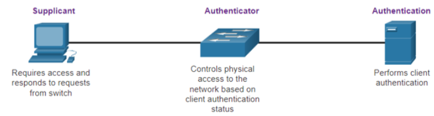)

### Overview
* **IEEE 802.1X** is a **port-based access control protocol**.
* **Function:** Restricts **unauthorized devices** from connecting to a LAN via public switch ports or wireless access points until they are authenticated.

### Roles in 802.1X

1.  **Client (Supplicant)**
    * The end device (wired or wireless) requesting network access.
    * Runs the 802.1X client software.

2.  **Switch (Authenticator)**
    * Acts as a **middleman** between the client and the server.
    * Requests the client's identifying information.
    * Forwards the information to the server and relays the server's access decision back to the client. (A wireless access point can also be the authenticator).

3.  **Authentication Server**
    * The central server that **validates the client's identity**.
    * Notifies the Switch/Access Point whether the client is **Authorized** or **Denied** access to the network services.

# 10.3 Layer 2 Security Threats

---

## Layer 2 Vulnerabilities (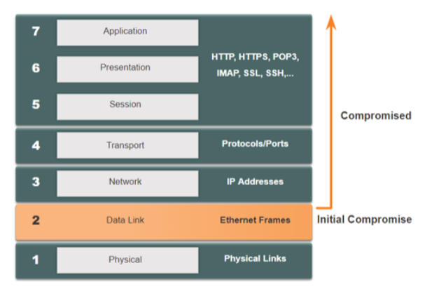)

### Overview
* The **OSI model** has seven layers. Security solutions like **VPNs, firewalls, and IPS** typically protect the **upper layers (3 through 7)**.
* **Layer 2 (Data Link Layer)** is often overlooked but is a critical point of failure.

### Why Layer 2 Security Matters
* If **Layer 2 is compromised**, all higher layers (3–7) become vulnerable.
* **Example:** An attacker gaining access to the internal network can **capture all Layer 2 frames**, making high-layer encryption (like VPNs) ineffective.
* Attackers can cause significant damage to the **LAN infrastructure** by exploiting Layer 2.

---

## Switch Attack Categories

### Overview
* **Layer 2 is considered the weakest link** because traditional LANs were built on **trusting all connected devices**.
* Modern attacks target **switches and LAN infrastructure** directly.
* **Internal threats** are a major concern at this layer.

### Attack Categories and Examples

| Category | Description of Attack Type |
| :--- | :--- |
| **MAC Table Attacks** | Overloading the switch's MAC address table (**MAC address flooding**). |
| **VLAN Attacks** | Bypassing VLAN isolation (**VLAN hopping** or **VLAN double-tagging**). |
| **DHCP Attacks** | Overloading the DHCP server (**DHCP starvation**) or faking a DHCP server (**DHCP spoofing**). |
| **ARP Attacks** | Faking MAC-to-IP relationships (**ARP spoofing** or **ARP poisoning**). |
| **Address Spoofing** | Using a fake MAC address or IP address to hide identity. |
| **STP Attacks** | Manipulating the Spanning Tree Protocol (STP) to redirect traffic. |

---

## Switch Attack Mitigation Techniques

### Key Layer 2 Security Solutions
These solutions run on the switch to protect against the specific threats listed above:

| Solution | Threat Protection |
| :--- | :--- |
| **Port Security** | Prevents the switch's MAC table from being flooded. Also helps prevent DHCP starvation. |
| **DHCP Snooping** | **Blocks** fake (spoofed) DHCP servers and prevents resource-draining DHCP starvation attacks. |
| **Dynamic ARP Inspection (DAI)** | **Blocks** fake ARP messages, preventing ARP spoofing and poisoning. |
| **IP Source Guard (IPSG)** | **Blocks** unauthorized MAC and IP addresses, preventing address spoofing attacks. |

### Additional Security Recommendations
These practices secure the management access to the switches themselves:

* **Secure Management Protocols:** Use **SSH, SCP, SFTP, and SSL/TLS** instead of insecure protocols (like Telnet).
* **Out-of-Band Management (OOB):** Use a **separate network** for device management to isolate it from user traffic.
* **Dedicated Management VLAN:** Isolate management traffic by placing it on its own **VLAN**.
* **Access Control Lists (ACLs):** Filter unwanted or unauthorized management access to the network devices.


## MAC Address Table Attack

### Switch Operation Review
- **Layer 2 LAN switches** forward frames using a **MAC address table**.  
- The table is built from the **source MAC addresses** in received frames.  
- MAC address tables are **stored in memory** to enable **efficient frame switching**.

# 10.4 MAC Address Table Attack

---

## MAC Address Table Flooding (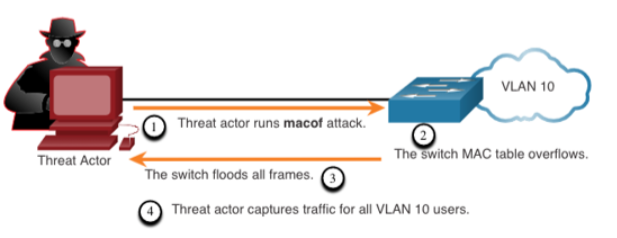)

### Overview
* Switches use the **source MAC addresses** of incoming frames to build a **MAC address table**.
* This MAC table has a **fixed size** due to limited memory.

### The Attack (How it Works)
* An attacker sends a massive flood of frames, each with a **fake (spoofed) source MAC address**.
* This flood quickly **fills the MAC table** with invalid entries until the table is full.

### Result
* Once the table is full, the switch can no longer learn legitimate MAC addresses.
* The switch then defaults to treating all unknown unicast frames as if their destination is unknown.
* This forces the switch to **flood** those frames out **all ports on the same VLAN**.
* The attacker can now **capture (eavesdrop on) all traffic** flowing through that local LAN/VLAN.

### Scope & Danger
* **Scope:** The attack and traffic capture are limited to the **local LAN or VLAN** where the attacker is connected.
* **Danger:** It bypasses normal switching isolation, allowing **eavesdropping** and degrading switch performance.

---

## MAC Address Table Attack Mitigation

### Why Mitigation is Crucial
* Tools like **macof** can quickly send **thousands of bogus frames per second**.
* Even high-end switches can be **overflowed in seconds** (e.g., a 132,000-entry table).
* An overflowed switch port will **flood traffic out all connected ports**, potentially affecting **other Layer 2 switches**.

### Mitigation Solution: Port Security
* **Implement Port Security** on all access switch ports.
* **Port Security** limits the **number of learned source MAC addresses** allowed on a single port.
* **Benefit:** It prevents the MAC address table from overflowing by strictly **controlling which devices can connect** and how many MACs are learned per port.

# 10.5 LAN Attacks

---

## VLAN Hopping Attacks (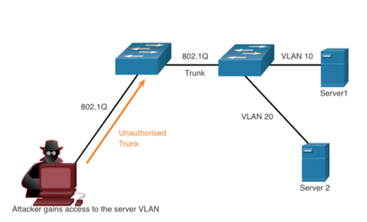)

### Overview
* **VLAN hopping** allows an attacker on one VLAN to **access traffic on other VLANs** without a router.
* This bypasses VLAN isolation, allowing traffic viewing or manipulation across VLANs.

### How it Works (Basic Method)
1.  Attacker's host spoofs itself as a switch by sending **DTP (Dynamic Trunking Protocol)** signals.
2.  If successful (e.g., if the port is set to 'dynamic desirable'), the switch establishes a **trunk link** with the attacker's host.
3.  The attacker can now **send and receive traffic on any VLAN** configured on that trunk.

---

## VLAN Double-Tagging Attacks

### Overview
* This attack allows an attacker to send a frame to a **target VLAN** that is different from the frame's initial VLAN tag.
* The attack uses a frame with **two VLAN tags**.

### Steps of the Attack
1.  **Attacker Sends Frame:** The attacker sends a frame with:
    * **Outer Tag:** Matches the **native VLAN** of the trunk port.
    * **Inner Tag:** Is the **target VLAN** the attacker wants to reach.
2.  **First Switch Processing:**
    * The switch sees the **outer tag** matches its native VLAN.
    * It **strips the outer tag** and forwards the frame as untagged traffic on the native VLAN.
    * The **inner tag** remains intact and is ignored by the first switch.
3.  **Second Switch Processing (Target Switch):**
    * The second switch receives the frame, which still has the attacker's inner tag.
    * The switch reads the **inner tag** and forwards the frame to the **target VLAN**.

### Key Points & Mitigation
* **Unidirectional:** The attack only works if the attacker is on the **same VLAN as the native VLAN** of a trunk port.
* **Mitigation (Prevention):**
    1.  **Disable trunking** on all access ports.
    2.  **Manually enable** trunking (do not use auto-trunking/DTP).
    3.  **Change the native VLAN** used for trunks to an unused VLAN ID.

---

## DHCP Attacks

### Overview
* **DHCP (Dynamic Host Configuration Protocol)** servers assign crucial network settings to clients, including: IP address, subnet mask, default gateway, and DNS servers.

### DHCP Message Exchange (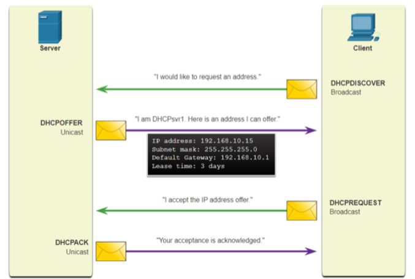)
Clients and servers use a four-step process:
1.  **DHCP Discover:** Client broadcasts to find servers.
2.  **DHCP Offer:** Server offers an IP address.
3.  **DHCP Request:** Client requests the offered IP.
4.  **DHCP Acknowledge (ACK):** Server confirms and assigns the configuration.

### Types of DHCP Attacks

| Attack Type | Goal | Method |
| :--- | :--- | :--- |
| **DHCP Starvation** | Cause a **Denial of Service (DoS)** for legitimate clients. | Attacker uses a tool (like Gobbler) to flood the server with requests using **bogus MAC addresses**, leasing the entire pool of available IPs. |
| **DHCP Spoofing** | Provide clients with **false IP configuration**. | A rogue DHCP server connects to the network and assigns bad information (e.g., its own IP as the **Default Gateway** for a Man-in-the-Middle attack, or a malicious **DNS Server**). |

* **Mitigation:** Implement **DHCP Snooping** on switches.

---

## ARP Attacks

### Overview
* **ARP (Address Resolution Protocol)** maps an **IP address to a MAC address**.
* A host broadcasts an ARP Request, and the host with the matching IP responds with its MAC in an ARP Reply.
* **Gratuitous ARP:** An unsolicited ARP Reply used to update ARP tables without a request.

### ARP Spoofing / ARP Poisoning
* **Method:** Attacker sends a **gratuitous ARP** with a fake MAC address to a switch or multiple hosts.
* **Result:** Hosts or the switch update their ARP/MAC tables with the fake information.
* **Common Goal:** Attacker maps their own MAC address to the **Default Gateway's IP address** to enable a **Man-in-the-Middle (MITM)** attack.

* **IPv6 Note:** Uses ICMPv6 **Neighbor Discovery Protocol** for resolution, which has built-in spoofing protection.
* **Mitigation:** Implement **Dynamic ARP Inspection (DAI)** on switches.

---

## Address Spoofing Attacks

### IP Address Spoofing
* Attacker hijacks a valid IP or uses a random IP on the subnet.
* Difficult to mitigate, especially within the local subnet.

### MAC Address Spoofing
* Attacker changes their device's MAC address to match a **target host**.
* The switch updates its MAC table, forwarding the target's traffic to the attacker.
* Since Layer 2 has no built-in verification, the attacker can continuously send frames to maintain the fake MAC-to-port mapping.

* **Mitigation:** Implement **IP Source Guard (IPSG)** to protect against both IP and MAC spoofing.

---

## STP Attack

### Overview
* Attackers manipulate the **Spanning Tree Protocol (STP)** to change the network topology.
* **Goal:** Force all traffic to pass through the attacker's machine to capture it.

### How it Works
* Attacker broadcasts **STP Bridge Protocol Data Units (BPDUs)**.
* The BPDUs contain a fake, very low **Bridge Priority**, tricking the network into electing the attacker's machine as the new **Root Bridge**.
* This forces the switched domain to recalculate the spanning tree, redirecting traffic toward the attacker.

* **Mitigation:** Enable **BPDU Guard** on all user-facing access ports.

---

## CDP Reconnaissance

### What is CDP?
* **Cisco Discovery Protocol (CDP)** is a proprietary Layer 2 protocol enabled by default on Cisco devices.
* Used by administrators for device discovery and troubleshooting.

### The Risk
* CDP sends periodic, **unencrypted, unauthenticated** broadcasts.
* These broadcasts contain sensitive device information: **IP address, IOS version, platform, capabilities, and native VLAN.**
* Attackers on the same Layer 2 segment can easily gather this data for **reconnaissance** before launching a targeted attack.

### Mitigation (Prevention)
* **Limit or disable CDP** on all ports that connect to untrusted devices (edge ports).
* **Disable CDP Globally:**
    ```
    no cdp run
    ```
* **Disable CDP on an Interface:**
    ```
    interface <type/number>
      no cdp enable
    ```
* **LLDP Note:** Link Layer Discovery Protocol (LLDP) is the vendor-neutral alternative, and it carries the same reconnaissance risks.

# 11.1 Implement Port Security

---

## Basic Defense: Securing Unused Ports

### Why Secure Layer 2?
* **Layer 2 attacks** (like **MAC flooding**) are easy for hackers.
* Basic security easily stops these threats.
* **All switch ports** must be secured **before use**.

### Disabling Unused Ports (Basic Security)
* The **simplest security** is to **disable all unused ports** to block unauthorized physical access.

| Action | Command | Purpose |
| :--- | :--- | :--- |
| **Disable Port** | `Switch(config-if)# shutdown` | Immediately turns off a port. |
| **Re-Enable Port** | `Switch(config-if)# no shutdown` | Turns a disabled port back on. |
| **Config Many Ports** | `Switch(config)# interface range type module/first-number - last-number` | Apply one command to a group of ports. |

---

## Mitigating MAC Address Table Attacks

### Port Security Overview
* **Port Security** is the best defense against **MAC address table overflow attacks**.
* It strictly **limits the number of MAC addresses** allowed on a single switch port.

### How Port Security Works
1. **Limit:** An admin sets the **maximum** number of allowed MAC addresses (default is **1**).
2. **Learning:** Secure MACs are added either **Manually** (static) or **Dynamically** (learned).
3. **Control:** Limiting the MAC count blocks unauthorized devices and prevents the MAC table from being filled with fake addresses.

---

## Configuration and Enablement

### Requirements for Port Security
* The Port Security command is **rejected** if the port is in its default dynamic trunking state.
* **Port Security ONLY works** if the port is manually set as an **Access Port** or a **Trunk Port**.

### Cisco IOS Enablement Steps
| Step | Command |
| :--- | :--- |
| 1. **Set Port Mode** (Required) | `Switch(config-if)# switchport mode access` |
| 2. **Enable Port Security** | `Switch(config-if)# switchport port-security` |

### Default Settings
When enabled, the switch automatically uses these settings:

| Setting | Default Value | Violation Result |
| :--- | :--- | :--- |
| **Maximum MACs** | **1** | Only one device is allowed. |
| **Violation Mode** | **Shutdown** | Port enters **error-disabled** state (shuts down). |

### Important Note
* If a single device is connected, the switch learns its MAC and secures it (since the limit is 1).
* **Warning:** If multiple devices are active on the port when you enable Port Security, the port will immediately shut down (enter the **error-disabled** state).

---

## Limiting and Learning MAC Addresses

### Setting the Maximum Limit
* Use the **`maximum`** command to control the total number of allowed secure MAC addresses.
```
Switch(config-if)# switchport port-security maximum [value]
```

### Three MAC Address Learning Methods

| Method | Command | Persistence (After Reboot) | Keyword |
| :--- | :--- | :--- | :--- |
| 1. **Manually Configured** (Static) | `switchport port-security mac-address [mac-address]` | **Permanent** (saved in running-config). | **Static** |
| 2. **Dynamically Learned** | (Default - no command) | **Lost**; must be re-learned. | **Dynamic** |
| 3. **Dynamically Learned — Sticky** | `switchport port-security mac-address sticky` | Learned MACs are saved to the running-config. **Persists** across reboots *if* you save the running-config. | **Sticky** |

### Complete Configuration Example
Sets the max limit to 4, adds one permanent MAC, and enables sticky learning for the remaining 3 slots:
```
Switch(config-if)# switchport port-security maximum 4
Switch(config-if)# switchport port-security mac-address AAAA.BBBB.CCCC
Switch(config-if)# switchport port-security mac-address sticky
```

---

## Port Security Aging

### Overview
* **Aging** automatically **removes secure MAC addresses** after a set time.
* This is more flexible than manual deletion.
* It works for static (if enabled) and dynamic addresses.

### Two Types of Aging
| Aging Type | Action | Keyword |
| :--- | :--- | :--- |
| **Absolute** | MAC is deleted after a **fixed time**, *regardless* of traffic. | **Fixed time** |
| **Inactivity** | MAC is deleted *only if* **no traffic** is seen for the set time. | **No traffic** |

### Cisco IOS Aging Commands
```
Switch(config-if)# switchport port-security aging time [value]
Switch(config-if)# switchport port-security aging type {absolute | inactivity}
```

* **Example:** Set inactivity aging for 10 minutes:
* `Switch(config-if)# switchport port-security aging time 10`
* `Switch(config-if)# switchport port-security aging type inactivity`

---

## Port Security Violation Modes

### Overview
A violation occurs when an unauthorized MAC tries to connect. The mode sets the switch's immediate response.

### Configuration Command
```
Switch(config-if)# switchport port-security violation {shutdown | restrict | protect}
```

### Violation Modes Explained
| Mode | Security Level | Action and Result | Keyword |
| :--- | :--- | :--- | :--- |
| **Shutdown (Default)** | **Highest** | **Shuts down** the port (**error-disabled** state). Needs manual recovery (`shutdown`/`no shutdown`). Sends a log message. | **Shutdown** |
| **Restrict** | **Medium** | **Drops** unauthorized packets. Port stays up. Sends a log message and counts the violation. | **Restrict** |
| **Protect** | **Lowest** | **Drops** unauthorized packets. Port stays up. **DOES NOT** send a log message or count the violation (**silent blocking**). | **Protect** |

### Ports in Error-Disabled State
* An **error-disabled** port is fully shut down and cannot pass traffic.
* **Manual Recovery:** An admin must re-enable it with:
```
Switch(config-if)# shutdown
Switch(config-if)# no shutdown
```

---

## Verification Commands

| Command | Purpose | Key Details Displayed | Keyword |
| :--- | :--- | :--- | :--- |
| `Switch# show port-security` | **Global Summary:** Quick overview of all ports. | Max Addr, Current Addr, Violation Mode, Security Status. | **Summary** |
| `Switch# show port-security interface [id]` | **Detailed View:** Specific configuration and status for one port. | Violation Count, Aging Type/Time, Sticky status. | **Interface** |
| `Switch# show port-security address` | **Secure MAC Address List:** Shows all secure MACs. | MAC Address, Learning Type (Static/Dynamic/Sticky), VLAN, and Port. | **MAC Address** |

# 11.2 Mitigate VLAN Attacks

---

## VLAN Hopping Attacks: Methods and Review

**VLAN Hopping** is an attack where an attacker on one VLAN can **access traffic on other VLANs** without a router. It is a way to bypass Layer 2 security.

### Attack Methods

| Attack Method | Simple Explanation | Defense Keyword |
| :--- | :--- | :--- |
| **DTP Spoofing** | Attacker fakes **DTP (Dynamic Trunking Protocol)** messages to trick the switch into creating an unauthorized **trunk link**. | **DTP** |
| **Rogue Switch** | Attacker connects their own **rogue switch** and enables trunking, giving them access to **all VLANs** on the victim switch. | **Trunking** |
| **Double-Tagging** | Attacker sends a frame with **two VLAN tags** to sneak traffic past the switch and into a restricted **target VLAN**. | **Native VLAN** |

---

## Steps to Stop VLAN Hopping Attacks

VLAN hopping is prevented by manually securing the switch's **trunking** configuration.

| Step | Action and Purpose | Cisco IOS Command | Key Defense Principle |
| :--- | :--- | :--- | :--- |
| **1. Secure User Ports** | **Disable DTP** on all ports connected to end-user devices (non-trunk ports). This prevents **DTP Spoofing**. | `switchport mode access` | **Force access mode.** |
| **2. Secure Unused Ports** | **Shut down** unused ports and move them to an **unused VLAN**. This reduces the attack surface. | `shutdown` and `switchport access vlan [unused_vlan_id]` | **Isolate and disable.** |
| **3. Manually Enable Trunk** | **Explicitly set** ports that *must* be trunks to trunk mode. Trunk links should be created by design, not by negotiation. | `switchport mode trunk` | **No negotiation for trunks.** |
| **4. Disable DTP on Trunk** | **Completely disable DTP negotiation** even on designated trunk ports. This provides maximum security. | `switchport nonegotiate` | **Disable DTP entirely.** |
| **5. Change Native VLAN** | Set the **Native VLAN** on trunks to an unused VLAN ID **other than the default VLAN 1**. This stops **Double-Tagging Attacks**. | `switchport trunk native vlan [vlan_number]` | **Move Native VLAN.** |

# 11.3 Mitigate DHCP Attacks

---

## DHCP Attacks Review and Defense

### DHCP Starvation Attack
* **Goal:** Create a **Denial of Service (DoS)** by taking all available IP addresses in the pool.
* **Method:** Attacker sends thousands of rapid **DHCP requests** using fake MAC addresses, leasing every IP.
* **Defense Keyword:** **Port Security** can help by limiting the total number of MAC addresses allowed per port.

### DHCP Spoofing Attack
* **Goal:** Set up a **rogue DHCP server** to give clients false network settings (like a malicious default gateway).
* **Problem:** Attackers can bypass Port Security by using a legitimate MAC address on the frame but a **bogus MAC address** inside the DHCP data.
* **Primary Defense:** **DHCP Snooping** on trusted ports is the only effective solution.

---

## DHCP Snooping: The Core Defense (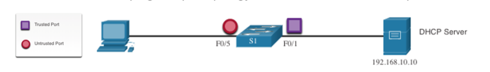)

### Function and Goals
* **DHCP Snooping** is a Layer 2 security feature that filters DHCP messages.
* It is the primary defense against **rogue DHCP servers** (spoofing) and also helps against **DHCP starvation attacks** (via rate limiting).

### Trusted vs. Untrusted Ports
DHCP Snooping works by creating a clear security boundary:

| Port Type | Definition | Configuration | What the Switch Does | Keyword |
| :--- | :--- | :--- | :--- | :--- |
| **Trusted** | Ports connected to **legitimate DHCP servers** or other trusted switches/routers. | **Must be explicitly configured** as trusted. | Allows **all** DHCP messages (including Server Replies). | **Server** |
| **Untrusted** | All other ports, typically connected to **client devices**. | Default setting. | **Blocks** DHCP Server messages (Offers/ACKs) to stop rogue servers. | **Client** |

### The DHCP Snooping Binding Table
* When a client gets a valid IP from the legitimate DHCP server, Snooping records: the client's **MAC address**, the **assigned IP address**, and the **switch port**.
* This **Binding Table** ensures the client can only use that specific IP/MAC combination on that port.
* The table is critical for other security features like **Dynamic ARP Inspection (DAI)**.

---

## Steps to Implement DHCP Snooping

| Step | Location | Goal | Command |
| :--- | :--- | :--- | :--- |
| **1** | Global Config | Enable DHCP Snooping globally. | `ip dhcp snooping` |
| **2** | Global Config | Enable for specific VLANs to process traffic. | `ip dhcp snooping vlan [vlan-ID/range]` |
| **3** | Interface Config | Identify the **trusted** port (connected to the DHCP server). | `ip dhcp snooping trust` |
| **4** | Interface Config | Limit DHCP traffic rate on **untrusted** ports (to fight starvation). | `ip dhcp snooping limit rate [pps]` |

### CLI Example
```text
S1(config)# ip dhcp snooping
S1(config)# ip dhcp snooping vlan 5,10
S1(config)# interface [Upstream Interface]
S1(config-if)# ip dhcp snooping trust
S1(config-if)# exit
S1(config)# interface range F0/15-24
S1(config-if-range)# ip dhcp snooping limit rate 6
```


## Verification Commands

| Command | Goal | What it Shows | Keyword |
| :--- | :--- | :--- | :--- |
| `show ip dhcp snooping` | Verify settings | Global status, active VLANs, and trusted/untrusted ports. | **Status** |
| `show ip dhcp snooping binding` | Verify clients | Lists the **MAC/IP** bindings, lease time, and port. | **Binding Table** |

---

## Relationship with DAI

* **DHCP Snooping is required for Dynamic ARP Inspection (DAI).**
* DAI uses the **DHCP Snooping Binding Table** to confirm that the IP and MAC addresses in an **ARP packet** are valid.
* If the IP/MAC addresses don't match the table, the ARP packet is **dropped**.

# 11.4 Mitigate ARP Attacks

---

## Dynamic ARP Inspection (DAI)

In a typical **ARP attack** (like **ARP spoofing** or **ARP poisoning**), an attacker sends fake ARP replies, often using the **attacker's MAC address** with the **IP address of the default gateway**.

**Dynamic ARP Inspection (DAI)** is the switch feature that prevents these attacks by ensuring only valid ARP messages are relayed.

### How DAI Prevents ARP Attacks
* **Requires DHCP Snooping** to work, as it uses the **DHCP Snooping Binding Table** to verify IP-to-MAC pairings.
* **Intercepts all ARP Requests and Replies** on untrusted ports.
* **Verifies** each packet against a valid **IP-to-MAC binding**.
* **Drops and logs** invalid ARP Replies.
* **Does not relay** invalid or gratuitous ARP Replies.
* **Error-disables the interface** if the rate limit for ARP packets is exceeded.

---

## DAI Implementation Guidelines (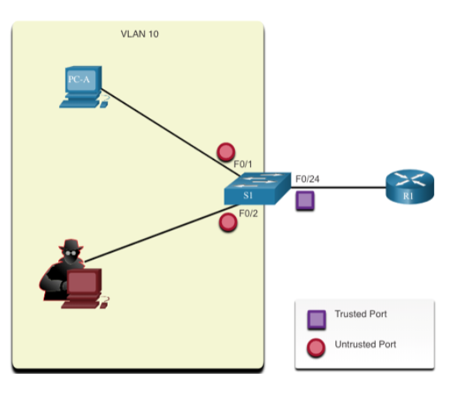)

To reduce the risk of **ARP spoofing** and **ARP poisoning**, follow these DAI implementation guidelines:

1.  **Enable DHCP Snooping** globally (`ip dhcp snooping`).
2.  **Enable DHCP Snooping** on selected VLANs (`ip dhcp snooping vlan [vlan-ID]`).
3.  **Enable DAI** on selected VLANs (`ip arp inspection vlan [vlan-ID]`).
4.  **Configure trusted interfaces** for both DHCP Snooping and DAI (e.g., uplink ports connected to routers or other secure switches).

### Best Practice for Ports
* Configure all **access switch ports** (client-facing) as **untrusted**.
* Configure all **uplink ports** (switch-to-switch/router) as **trusted**.

---

## DAI Configuration and Validation

### DAI Validation Checks
DAI can be configured to check three parts of an ARP packet for validity:

| Check | Focus | Validation Detail |
| :--- | :--- | :--- |
| **Destination MAC** | Ethernet Header | Checks the **destination MAC** in the Ethernet header against the **target MAC** in the ARP body. |
| **Source MAC** | Ethernet Header | Checks the **source MAC** in the Ethernet header against the **sender MAC** in the ARP body. |
| **IP Address** | ARP Body | Checks the ARP body for **invalid or unexpected IP addresses**, like `0.0.0.0`, `255.255.255.255`, and **IP multicast addresses**. |

### DAI Validation Command

The command used to configure DAI to drop ARP packets based on these checks is:

```text
ip arp inspection validate {src-mac | dst-mac | ip}
```


* This command is used to drop ARP packets when **IP addresses are invalid** or when **MAC addresses** in the ARP body do not match the Ethernet header.
* **Crucial Note:** To include **more than one validation method** (e.g., both source MAC and IP), specify all options on the **same command line**. Entering the command multiple times **overwrites** the previous configuration.

# 11.5 Mitigate STP Attacks

---

## PortFast and BPDU Guard: The Defense

Network attackers can manipulate the **Spanning Tree Protocol (STP)** to spoof the root bridge and change the network topology. To stop this, use **PortFast** and **BPDU Guard**.

| Feature | Primary Purpose | Action | Where to Use | Keyword |
| :--- | :--- | :--- | :--- | :--- |
| **PortFast** | Speeds up port access. | Immediately moves the port to the **forwarding state**, skipping the listening and learning states. | **All end-user access ports**. | **Speed** |
| **BPDU Guard** | Prevents rogue switches. | Immediately puts the port into the **error-disabled state** if it receives a **BPDU**. | **Only end-user access ports**. | **Stop BPDUs** |

---

## Configure PortFast

### Key Function
* **PortFast** minimizes the time access ports wait for STP to converge, improving user access speed.
* **Only enable PortFast on access ports.**
* **Warning:** Enabling PortFast on inter-switch links (trunk ports) can create a **spanning-tree loop**.

### How to Enable PortFast
* **On a specific interface:**
  ```text
  Switch(config-if)# spanning-tree portfast enable
  ```

  ### How to Enable PortFast (Continued)

* **Globally (for all access ports that are not trunking):**
    ```text
    Switch(config)# spanning-tree portfast default
    ```

---

### Verify PortFast Configuration

| Command | Goal | Keyword |
| :--- | :--- | :--- |
| `show running-config | begin spanning-tree` | Verify global settings in the running config. | **Global Config** |
| `show spanning-tree summary` | Verify global PortFast status. | **Summary Status** |
| `show running-config interface [type/number]` | Verify PortFast status on a specific interface. | **Interface Config** |
| `show spanning-tree interface [type/number] detail` | Verify detailed STP status for a specific interface. | **Interface Detail** |

---

## Configure BPDU Guard

### Key Function
* An access port should **never receive a BPDU**. Receiving one means a user either **accidentally** or **maliciously** connected an unauthorized switch.
* If a **BPDU** is received on a BPDU Guard-enabled port, the port immediately enters the **error-disabled state** (shut down).

### Recovery
* A port in the **error-disabled state** must be **manually re-enabled** (using `shutdown` then `no shutdown`) unless automatic recovery is configured:
    ```text
    errdisable recovery cause psecure-violation
    ```

### How to Enable BPDU Guard
* **On a specific interface:**
    ```text
    Switch(config-if)# spanning-tree bpduguard enable
    ```
* **Globally (on all ports where PortFast is enabled):**
    ```text
    Switch(config)# spanning-tree portfast bpduguard default
    ```

    # 12.1 Introduction to Wireless

## Benefits of Wireless
- WLANs (Wireless Local Area Networks) are used in:
  - Homes
  - Offices
  - Campus environments
- Enable mobility within home and business environments
- Wireless networks adapt to changing needs and technologies

## Types of Wireless Networks

### Wireless Personal-Area Network (WPAN)
- Short-range (20–30 ft / 6–9 m), low power
- IEEE 802.15 standard, 2.4 GHz frequency
- Examples: Bluetooth, Zigbee

### Wireless LAN (WLAN)
- Medium-sized networks, up to ~300 ft
- IEEE 802.11 standard, 2.4 or 5 GHz frequency

### Wireless MAN (WMAN)
- Covers large areas like cities or districts
- Uses licensed frequencies

### Wireless WAN (WWAN)
- Covers national or global areas
- Uses licensed frequencies

## Wireless Technologies

### Bluetooth
- IEEE WPAN standard for device pairing (up to 300 ft / 100 m)
- **Bluetooth Low Energy (BLE):** Supports mesh networks for large-scale devices
- **BR/EDR (Basic Rate / Enhanced Data Rate):** Optimized for point-to-point audio streaming

### WiMAX
- Alternative to broadband wired connections
- IEEE 802.16 standard, range up to 30 miles (50 km)

### Cellular Broadband
- Carries voice and data
- Used in phones, cars, tablets, laptops
- Types:
  - **GSM (Global System for Mobile):** Internationally recognized
  - **CDMA (Code Division Multiple Access):** Mainly used in the US

### Satellite Broadband
- Uses a directional satellite dish aligned with geostationary satellites
- Requires clear line of sight
- Common in rural areas without cable or DSL

## 802.11 Standards
- Defines how radio frequencies are used for WLAN links

| IEEE Standard | Frequency      | Description |
|---------------|---------------|-------------|
| 802.11        | 2.4 GHz       | Data rates up to 2 Mb/s |
| 802.11a       | 5 GHz         | Data rates up to 54 Mb/s |
| 802.11b       | 2.4 GHz       | Data rates up to 11 Mb/s; longer range than 802.11a; better penetration of buildings |
| 802.11g       | 2.4 GHz       | Data rates up to 54 Mb/s; backward compatible with 802.11b |
| 802.11n       | 2.4 & 5 GHz   | Data rates 150–600 Mb/s; uses MIMO (multiple antennas) |
| 802.11ac      | 5 GHz         | Data rates 450 Mb/s – 1.3 Gb/s; supports up to 8 antennas |
| 802.11ax      | 2.4 & 5 GHz   | High-Efficiency Wireless (HEW); supports 1–7 GHz frequencies |

## Radio Frequencies (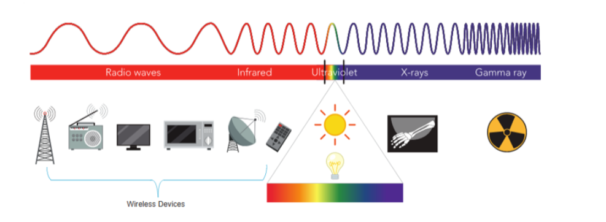)
- WLAN devices operate within the electromagnetic spectrum
- Main WLAN bands:
  - **2.4 GHz**
  - **5 GHz (SHE)**

## Wireless Standards Organizations
- Ensure devices from different manufacturers work together

### International Telecommunication Union (ITU)
- Regulates radio spectrum and satellite orbits

### Institute of Electrical and Electronics Engineers (IEEE)
- Defines radio frequency modulation
- Maintains LAN/MAN standards with IEEE 802 family

### Wi-Fi Alliance
- Promotes WLAN growth and adoption
- Ensures interoperability of 802.11-based products

# 12.2 WLAN Components (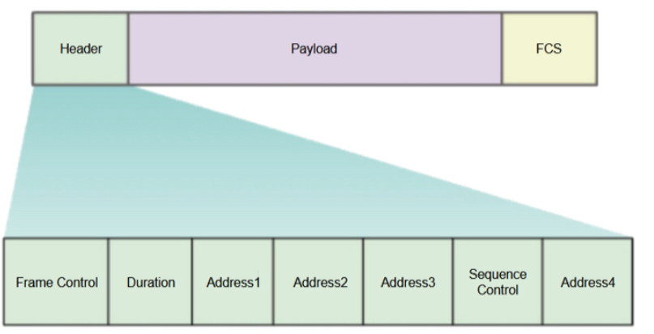)

## Wireless NICs
- Devices like laptops, tablets, smartphones, and some automobiles have **integrated wireless NICs** (Network Interface Cards) with a radio transmitter/receiver.
- If a device lacks an integrated NIC, a **USB wireless adapter** can be used.

## Wireless Home Router
- Home users connect wireless devices using a **wireless router**.
- Roles of a wireless router:
  - **Access Point:** Provides wireless access
  - **Switch:** Connects wired devices
  - **Router:** Provides a default gateway to other networks and the Internet

## Wireless Access Point (AP)
- Wireless clients use their **NIC** to discover nearby APs.
- Clients **associate** and **authenticate** with an AP.
- Once authenticated, users can access network resources.

## AP Categories (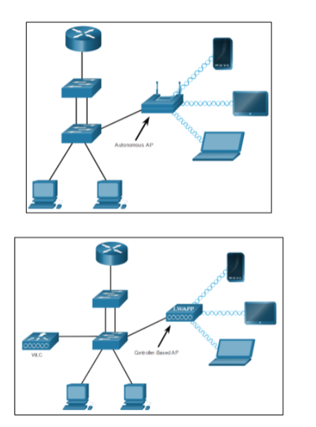)
- APs can be **autonomous** or **controller-based**.

### Autonomous APs
- Standalone devices configured via **CLI** or **GUI**
- Operate independently
- Managed manually by an administrator

### Controller-Based APs (Lightweight APs / LAPs)
- Communicate with a **WLAN Controller (WLC)** using **LWAPP**
- Automatically configured and managed by the WLC

## Wireless Antennas
- **Types of external antennas:**

### Omnidirectional
- Provides 360° coverage
- Ideal for homes and office areas

### Directional
- Focuses the radio signal in a specific direction
- Examples: Yagi, parabolic dish

### Multiple Input Multiple Output (MIMO)
- Uses multiple antennas (up to 8) to increase bandwidth

# 12.3 WLAN Operation

## 802.11 Wireless Topology Modes (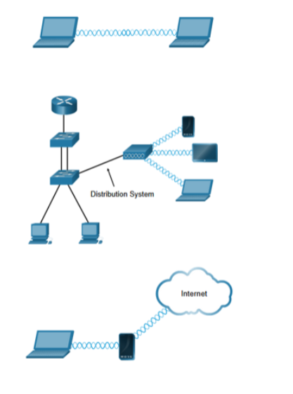)
- **Ad hoc mode:**  
  - Connects clients in a peer-to-peer manner without an AP
- **Infrastructure mode:**  
  - Connects clients to the network using an AP
- **Tethering:**  
  - Variation of ad hoc mode  
  - A smartphone or tablet with cellular data creates a personal hotspot

## BSS and ESS (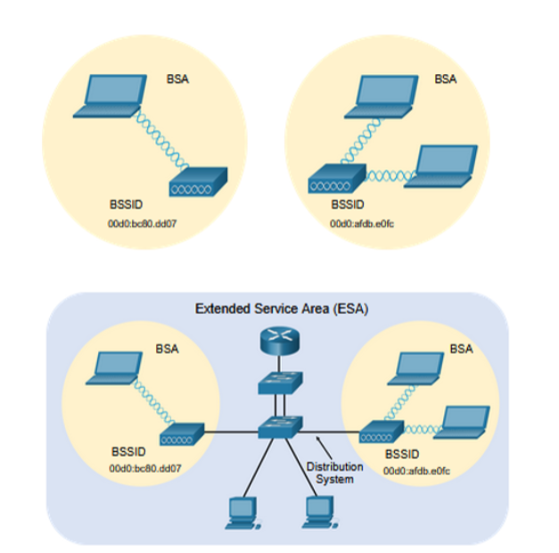)
- **Infrastructure mode** defines two topology blocks:

### Basic Service Set (BSS)
- Uses a single AP to connect all associated wireless clients
- Clients in different BSSs **cannot communicate** directly

### Extended Service Set (ESS)
- Union of two or more BSSs connected via a wired distribution system
- Clients in each BSS **can communicate** through the ESS

## CSMA/CA
- WLANs are **half-duplex**; a client cannot "hear" while sending, so collisions are possible
- WLANs use **Carrier Sense Multiple Access with Collision Avoidance (CSMA/CA)** to manage transmissions

**Client transmission process:**
1. **Listen** to the channel to check if it is idle  
2. **Send RTS (Ready to Send)** message to the AP  
3. **Receive CTS (Clear to Send)** message from the AP  
4. If no CTS is received, **wait a random time** and retry  
5. **Transmit the data** once access is granted  
6. **Acknowledge transmissions**; if no acknowledgment is received, assume a collision and restart

## Wireless Client and AP Association (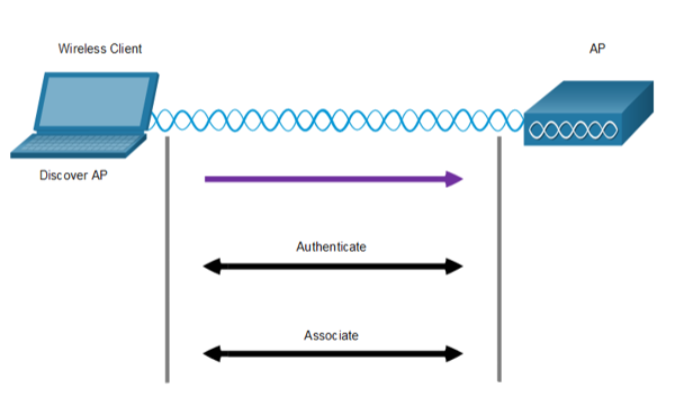)
- Wireless devices must **associate with an AP or wireless router** to communicate  
- **Three-stage process:**
1. **Discover** a wireless AP  
2. **Authenticate** with the AP  
3. **Associate** with the AP

### Association Parameters
- For successful association, a client and AP must agree on:
  1. **SSID:** Network name  
  2. **Password:** Required for authentication  
  3. **Network Mode:** 802.11 standard in use  
  4. **Security Mode:** WEP, WPA, or WPA2  
  5. **Channel Settings:** Frequency bands in use

## Passive and Active Discover Mode (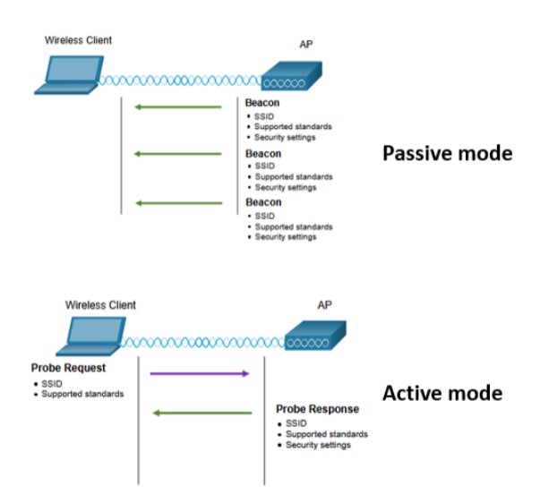)
- Wireless clients connect to an AP using **passive** or **active scanning**

### Passive Mode
- AP **advertises its service** by sending **beacon frames** periodically  
- Beacons include:
  - SSID
  - Supported standards
  - Security settings

### Active Mode
- Clients **must know the SSID**  
- Client **broadcasts a probe request** on multiple channels to discover the AP

# 12.4 CAPWAP Operation

## Introduction to CAPWAP (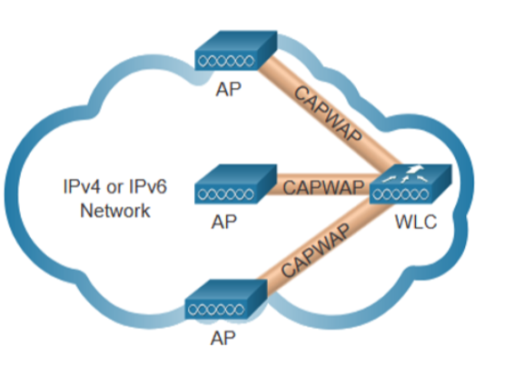)
- **CAPWAP** is an IEEE standard protocol that allows a **WLAN Controller (WLC)** to manage multiple APs and WLANs.
- Based on **LWAPP**, but adds **Datagram Transport Layer Security (DTLS)** for additional security.
- **Encapsulates and forwards** WLAN client traffic between an AP and WLC over tunnels using **UDP ports 5246 and 5247**.
- Operates over **IPv4** and **IPv6**:
  - IPv4 uses **IP protocol 17**
  - IPv6 uses **IP protocol 136**

## Split MAC Architecture
- CAPWAP **Split MAC** divides AP functions between the **AP** and the **WLC**.

| AP MAC Functions                          | WLC MAC Functions                                |
|------------------------------------------|-------------------------------------------------|
| Beacons and probe acknowledgements       | Authentication                                  |
| Retransmissions                           | Association and re-association of roaming clients |
| Frame queueing and packet prioritization | Frame translation to other protocols           |
| MAC layer data encryption                 | Termination of 802.11 traffic on a wired interface |

## DTLS Encryption (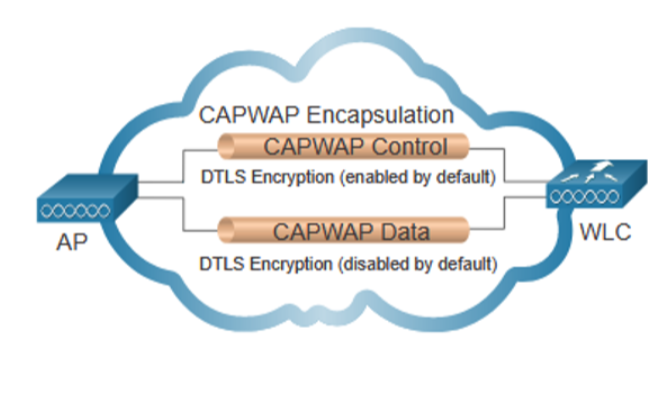)
- **DTLS** secures communication between the AP and the WLC.
- **Enabled by default** to protect the CAPWAP **control channel** and encrypt all **management/control traffic**.
- **Data encryption** is **disabled by default**:
  - Requires a **DTLS license** on the WLC  
  - Must be enabled on the AP after licensing

## Flex Connect APs (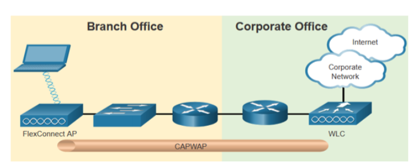)
- **Flex Connect** allows AP configuration and control over a WAN link.
- Two operation modes:

| Mode             | Description                                                                                       |
|-----------------|---------------------------------------------------------------------------------------------------|
| **Connected**    | WLC is reachable. FlexConnect AP has CAPWAP connectivity; WLC performs all CAPWAP functions.      |
| **Standalone**   | WLC is unreachable. AP handles some WLC functions locally, such as switching client traffic and performing client authentication. |


# 12.5 Channel Management

## Frequency Channel Saturation
- High demand on a wireless channel can cause **oversaturation**, reducing communication quality.
- Techniques to use channels more efficiently:

### Direct-Sequence Spread Spectrum (DSSS)
- Spreads a signal over a larger frequency band
- Used by **802.11b** to avoid interference on 2.4 GHz

### Frequency-Hopping Spread Spectrum (FHSS)
- Rapidly switches the carrier among many frequency channels
- Sender and receiver must be synchronized
- Used by the **original 802.11 standard**

### Orthogonal Frequency-Division Multiplexing (OFDM)
- Divides a single channel into multiple sub-channels on adjacent frequencies
- Reduces interference and increases efficiency
- Used by **802.11a/g/n/ac**

## Channel Selection (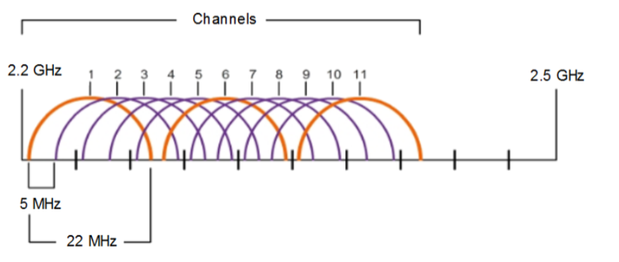) (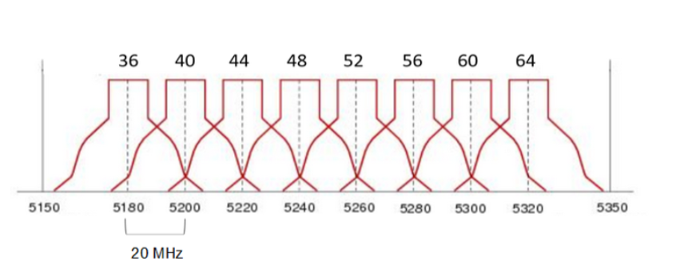)

### 2.4 GHz Band
- Multiple channels, each **22 MHz wide**, separated by **5 MHz**
- Best practice for multiple APs: use **non-overlapping channels** such as **1, 6, 11**

### 5 GHz Band
- 24 channels, each separated by **20 MHz**
- **Non-overlapping channels:** 36, 48, 60

## Plan a WLAN Deployment (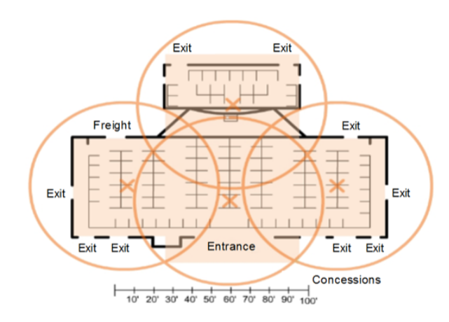)
- User support depends on:
  - **Facility layout**
  - **Number of people and devices**
  - **Expected data rates**
  - **Use of non-overlapping channels** and **AP transmit power settings**
- Consider **circular coverage area** when placing APs


# 12.6 WLAN Threats

## Wireless Security Overview
- WLANs are **open to anyone within range** of an AP with proper credentials.
- Attacks can come from:
  - **Outsiders**
  - **Disgruntled employees**
  - **Unintentional employee actions**
- Common threats include:
  - **Interception of data**
  - **Wireless intruders**
  - **Denial of Service (DoS) attacks**
  - **Rogue APs**

## DoS Attacks
- Wireless **Denial of Service (DoS) attacks** can result from:
  - **Improperly configured devices**
  - **Malicious users** interfering intentionally
  - **Accidental interference**
- **Mitigation strategies:**
  - Harden all devices  
  - Keep passwords secure  
  - Create backups  
  - Apply configuration changes during off-hours

## Rogue Access Points
- A **rogue AP** is an AP or router connected **without authorization**, violating corporate policy.
- Threats from rogue APs:
  - Capture **MAC addresses**  
  - Capture **data packets**  
  - Gain access to **network resources**  
  - Launch **man-in-the-middle attacks**
- Personal hotspots can also act as rogue APs.
- **Prevention strategies:**
  - Configure **WLCs** with rogue AP policies  
  - Use **monitoring software** to detect unauthorized APs

## Man-in-the-Middle (MITM) Attack
- In a **MITM attack**, the attacker sits **between two legitimate entities** to read or modify data.
- Common example: **"evil twin AP"**
  - Rogue AP uses the **same SSID** as a legitimate AP
- **Defense strategies:**
  - Identify all **legitimate devices** on the WLAN  
  - Ensure all users are **authenticated**  
  - Monitor for **abnormal devices or traffic**

# 12.7 Secure WLANs

## SSID Cloaking and MAC Address Filtering
- Early security features to protect WLANs:

### SSID Cloaking
- APs or routers can **disable the SSID beacon frame**
- Clients must **manually configure** the SSID to connect

### MAC Address Filtering
- Administrators can **allow or deny clients** based on their **MAC address**
- Only permitted devices can join the WLAN

## 802.11 Original Authentication Methods
- WLAN security uses **authentication** and **encryption**
- Two original 802.11 methods:

### Open System Authentication
- **No password** required  
- Used for **public Wi-Fi** (cafes, airports, hotels)  
- Security responsibility falls on the **client** (e.g., VPN)

### Shared Key Authentication
- Uses **WEP, WPA, WPA2, WPA3** to authenticate and encrypt data  
- Requires a **pre-shared password** between client and AP

## Shared Key Authentication Methods
| Authentication Method | Description |
|-----------------------|-------------|
| **WEP** | Original 802.11 security using **RC4 encryption** with static key. **Not recommended**. |
| **WPA** | Uses **TKIP** to encrypt Layer 2 payload; supports legacy WLAN devices. |
| **WPA2** | Uses **AES** encryption; considered the **strongest widely used encryption**. |
| **WPA3** | Next-gen security; uses latest methods, disallows outdated protocols, requires **PMF**. |

## Authenticating a Home User
- Routers typically support **WPA** and **WPA2**, with WPA2 having two modes:

### Personal
- For **home/small office networks**  
- Authenticate using a **pre-shared key (PSK)**  
- No special server required

### Enterprise
- For **enterprise networks**  
- Requires a **RADIUS server**  
- Devices authenticated by **RADIUS**  
- Users authenticate via **802.1X/EAP**

## Encryption Methods
- WPA and WPA2 use:

### TKIP
- Used by **WPA**  
- Encrypts Layer 2 payload  
- Supports **legacy WLAN devices**

### AES
- Used by **WPA2**  
- Uses **CCMP** to ensure encrypted or unencrypted data integrity

## Authentication in the Enterprise
- Enterprise WLANs require a **RADIUS server** for **AAA**:

1. **RADIUS Server IP Address** – IP of the server  
2. **UDP Port Numbers** –  
   - 1812 for Authentication, 1813 for Accounting  
   - Can also use 1645/1646  
3. **Shared Key** – Authenticates **AP with RADIUS server**

- **Note:** 802.1X handles user authentication and authorization centrally

## WPA3
- Recommended over WPA2 for stronger security

### WPA3 — Personal
- Protects against **brute force attacks**  
- Uses **SAE** (Simultaneous Authentication of Equals)

### WPA3 — Enterprise
- Uses **802.1X/EAP**  
- Requires **192-bit cryptography**  
- Prevents mixing older security protocols

### Open Networks
- No authentication required  
- Uses **OWE** to encrypt wireless traffic

### IoT Onboarding
- Uses **DPP** to quickly onboard IoT devices


# 13.1 Remote Site WLAN Configuration

## The Wireless Router ()
- Used by **remote workers, small branch offices, and home networks**  
- Small office/home routers are often **integrated devices** with:
  - **Switch** for wired clients  
  - **WAN port** for Internet connection  
  - **Wireless components** for WLAN client access
- Typical features:
  - **WLAN security**  
  - **DHCP services**  
  - **Network Address Translation (NAT)**  
  - **Quality of Service (QoS)**  
  - Other model-specific features
- **Note:** Cable or DSL modem setup is usually done by the **service provider**, either on-site or remotely

## Log in to the Wireless Router
- Most routers are **preconfigured** for network connection  
- Default **IP addresses, usernames, and passwords** are publicly available online  
- **Security best practice:** Change default credentials immediately

### Steps to Access Router GUI
1. Open a **web browser**  
2. Enter the router's **default IP address** (found in documentation or online)  
3. Use the default credentials (commonly `admin` / `admin`) to log in

## Basic Network Setup
1. **Log in** to the router from a web browser  
2. **Change the default administrative password**  
3. **Log in** with the new password  
4. **Change the default DHCP IPv4 addresses**  
5. **Renew the IP address**  
6. **Log in** using the new IP address

## Basic Wireless Setup
1. **View WLAN defaults**  
2. **Change network mode** – select the 802.11 standard  
3. **Configure SSID** – set the network name  
4. **Configure channel** – avoid overlapping channels  
5. **Configure security mode** – Open, WPA, WPA2 Personal/Enterprise, etc.  
6. **Configure passphrase** – password for the selected security mode

## Configure a Wireless Mesh Network
- Single router may cover **small office/home**  
- To **extend range** beyond ~45m indoors or ~90m outdoors, use a **wireless mesh network (WMN)**  
- Steps:
  1. Add **additional access points (APs)**  
  2. Use **same WLAN settings** for all APs  
  3. Use **different channels** to avoid interference
- Many modern routers allow mesh setup via **smartphone apps**

## NAT for IPv4
- Routers have:
  - **Public IP** from ISP  
  - **Private IPs** for LAN devices
- **Network Address Translation (NAT)**:
  - Converts **private IPv4** to **public IPv4**  
  - Reverses translation for incoming packets  
- Enables **sharing a single public IPv4 address** by tracking session ports  
- With **IPv6**, each device gets a **unique IPv6 address**

## Quality of Service (QoS)
- **Prioritizes time-sensitive traffic**:
  - **High priority:** Voice, Video  
  - **Low priority:** Email, Web browsing  
- Some routers allow **port-specific prioritization**

## Port Forwarding
- Routers **block TCP/UDP ports** by default  
- Sometimes **specific ports must be opened** for apps to work

### Port Forwarding
- **Rule-based** method to direct traffic between networks

### Port Triggering
- Temporarily forwards inbound traffic to a device  
- Activates only when a **designated outbound port range** is used

# 13.2 Configure a Basic WLAN on the WLC

## WLC Topology ()
The topology and addressing scheme used for this topic are shown in the figure and table.

- The **Access Point (AP)** is a **controller-based AP** (not autonomous) and requires **no initial configuration**.
- Controller-based APs are often called **Lightweight APs (LAPs)**.
- LAPs use the **Lightweight Access Point Protocol (LWAPP)** to communicate with a **WLAN Controller (WLC)**.
- Controller-based APs are useful when **many APs are required**.
- As more APs are added, each AP is **automatically configured and managed by the WLC**.

## Device Addressing Table

| Device           | Interface    | VLAN/Type    | NIC | IP Address       | DHCP | Subnet Mask      |
|------------------|-------------|-------------|-----|----------------|------|----------------|
| RI               | F0/0        |             | NIC | 192.168.200.A   | No   | 255.255.255.0  |
| RI               | F0/1        |             | NIC | DHCP            | Yes  | 255.255.255.0  |
| WLC              | VLAN 1      | Management  | NIC | 192.168.200.254 | No   | 255.255.255.0  |
| API              |             |             | NIC | 192.168.200.3   | No   | 255.255.255.0  |
| PC-A             | Wired       |             | NIC | 172.16.A.254    | No   | 255.255.255.0  |
| PC-B             | Wired       |             | NIC | DHCP            | Yes  | 255.255.255.0  |
| Wireless Laptop  | Wireless    |             | NIC | DHCP            | Yes  | 255.255.255.0  |

---

## 1. Log in to the WLC
- Configuring a **Wireless LAN Controller (WLC)** is similar to configuring a wireless router.
- The WLC **controls APs** and provides **additional services and management capabilities**.
- Users log in using **credentials configured during initial setup**.

## 2. Network Summary Page
- The **Network Summary page** acts as a **dashboard** providing a quick overview of:
  - Configured wireless networks
  - Associated APs
  - Active clients
- Also shows:
  - Number of **rogue access points**
  - Number of **rogue clients**

---

## 3. View AP Information
- Click **Access Points** from the left menu to see the AP's **system information** and **performance**.
- AP in this setup uses **IP 192.168.200.3**.
- With **Cisco Discovery Protocol (CDP)** active, WLC knows the AP is connected to **FastEthernet 0/1** on the switch.
- The AP used is a **Cisco Aironet 1815i**, which supports:
  - Access via **CLI**
  - Limited familiar **IOS commands**

---

## 4. Advanced Settings
- Most WLCs come with **basic settings and menus** for common configurations.
- Network administrators typically access **advanced settings**.
- On a **Cisco 3504 WLC**:
  - Click **Advanced** in the upper right to access the **Advanced Summary page**.
  - From there, all features of the WLC are accessible.

---

## 5. Configure a WLAN
- **WLCs** have **Layer 2 switch ports** and **virtual interfaces**, similar to VLAN interfaces.
- Each **physical port** can support **many APs and WLANs**.
- WLC ports act as **trunk ports**, carrying traffic from **multiple VLANs** to switches for AP distribution.
- Each AP can support **multiple WLANs**.

### Basic WLAN Configuration Steps
1. **Create the WLAN**  
2. **Apply and Enable the WLAN**  
3. **Select the Interface**  
4. **Secure the WLAN**  
5. **Verify the WLAN is Operational**  
6. **Monitor the WLAN**  
7. **View Wireless Client Information**

---

### 1. Create the WLAN
- Create a new WLAN with **SSID name**: `Wireless LAN`.

### 2. Apply and Enable the WLAN
- **Enable the WLAN** after creation.
- Configure required **WLAN settings**.

### 3. Select the Interface
- Choose the **interface** that will carry WLAN traffic.

### 4. Secure the WLAN
- Use the **Security tab** to access options for **securing the WLAN**.

### 5. Verify the WLAN is Operational
- Use the **WLANs menu** to view the newly configured WLAN and its settings.

### 6. Monitor the WLAN
- Use the **Monitor tab** to access the **Advanced Summary page**.
- Confirm that the WLAN has **at least one client** connected.

### 7. View Wireless Client Details
- Click **Clients** in the left menu to view detailed information about **connected clients**.


# 13.3 Configure a WPA2 Enterprise WLAN on the WLC

## SNMP and RADIUS ()

- **PC-A** runs **SNMP** and **RADIUS** server software.
- **Network goals**:
  - Forward **SNMP traps** from the WLC to the SNMP server.
  - Use **RADIUS server** for **AAA (authentication, authorization, accounting)**.
- **User authentication**: verified via RADIUS using username and password.
- **Requirement**: RADIUS server is needed for WLANs using **WPA2 Enterprise**.

> Note: SNMP and RADIUS server setup is outside the module scope.

---

## VLAN 5 Interface ()

- Each WLAN requires its **own virtual interface**.
- WLC supports multiple WLANs on multiple physical ports.
- VLAN 5 network: `192.168.5.0/24`
- VLAN 5 interface IP: `192.168.5.254/24`
- Default gateway: `192.168.5.1`
- Primary DHCP server: `192.168.5.1`

---

## DHCP Scope

- Scope name: **Wireless_Management**
- Address pool: `192.168.200.240` – `192.168.200.249`
- Default gateway: `192.168.200.1`
- Scope enables allocation of IPs to clients on the WLAN.

---

## WPA2 Enterprise WLAN

- **Security**: WPA2 with **AES encryption**
- **Key management**: 802.1X using RADIUS
- WLAN uses **interface VLAN 5**
- **RADIUS server** authenticates WLAN clients
- WLAN is verified to be **enabled and active**


# 13.4 Troubleshoot WLAN Issues

## Troubleshooting Approaches

- Network problems can be **simple or complex**, caused by **hardware, software, or connectivity issues**.
- Troubleshooting requires analyzing the **root cause** before resolving the issue.
- Follow a **systematic approach**, often based on the **scientific method**.

### Six-Step Troubleshooting Methodology

| Step | Title | Key Points |
|------|-------|------------|
| 1 | Identify the Problem | Determine the issue; user input and tools are helpful. |
| 2 | Establish a Theory of Probable Causes | List possible causes; there may be multiple. |
| 3 | Test the Theory | Check which probable cause is the actual issue. |
| 4 | Plan and Implement Solution | Develop and execute a resolution plan. |
| 5 | Verify System and Preventive Measures | Ensure full functionality and apply preventive steps. |
| 6 | Document Findings | Record steps, actions, and outcomes for future reference. |

## Wireless Client Not Connecting

### Connectivity Checks

- **No connectivity**:
  - Verify PC network configuration (`ipconfig`).
  - Confirm wired network connectivity (ping known IPs).
  - Reload drivers or try a different **wireless NIC**.
  - Check **security mode** and **encryption settings**.

- **Poor wireless performance**:
  - Check if the PC is **outside the coverage area (BSA)**.
  - Verify **channel settings** on the client.
  - Look for **2.4 GHz interference**.

### Physical and Device Checks

- Ensure **all devices are in place** and powered on.
- Check for **physical security issues**.
- Inspect **cables and connectors** for damage or missing connections.

### Wired LAN Verification

- Ping wired LAN devices including the **AP**.
- If connectivity fails, the issue may be the **AP or its configuration**.

### Access Point Checks

- Verify **AP performance** once PC and physical setup are confirmed.
- Check **AP power status**.

## Troubleshooting When the Network Is Slow

### Performance Optimization

- **Upgrade Wireless Clients**
  - Older 802.11b/g/n devices can slow WLAN.
  - Best performance if all devices support the **same highest standard**.

- **Split Traffic Between Bands**
  - Use **2.4 GHz** for basic traffic; may share bandwidth with nearby WLANs.
  - Use **5 GHz** for multimedia streaming; less crowded and more channels.

### Additional Optimization

- **Network Segmentation**
  - Rename SSIDs to separate 2.4 GHz and 5 GHz traffic if needed.

- **Wireless Range Improvement**
  - Ensure router/AP locations are **free of obstructions**.
  - Consider **Wi-Fi Range Extenders** or **Powerline wireless technology** if needed.

## Updating Firmware

- Wireless routers and APs offer **upgradable firmware**; check periodically.
- On a **WLC**, firmware can be upgraded for **all managed APs**.
- Ensure the **latest firmware image** is downloaded.
- Cisco 3504 WLC supports **AP Image Pre-download** for efficient updates.


# 14.1 Path Determination

## Two Functions of a Router

- Routers determine how to **forward IP packets** to their destination.  
  - The outgoing interface may lead directly to the **destination** or to another **router/network** along the path.
- Each network usually requires a **separate interface**, but exceptions exist.

### Primary Functions

1. **Determine the best path** to forward packets using the **routing table**  
2. **Forward packets** toward the **destination network**

---

## Router Functions Example ()

- Routers use their **IP routing table** to select a **path (route)**.  
- Example:  
  - **RI** and **R2** each use their **routing tables** to:  
    1. Find the **best path**  
    2. Forward the packet along that path

---

## Best Path Equals Longest Match

- **Best path** = **longest match** in the routing table
- Routing table entries include:
  - **Prefix (network address)**
  - **Prefix length**
- To match a route with a packet's IP:
  - Minimum number of **far-left bits** must match  
  - **Prefix length** determines required matching bits
- **Longest match**:
  - Has the **most far-left matching bits**  
  - **Always preferred**
- **Note:** Prefix length refers to the **network portion** of IPv4 or IPv6 addresses

---

## IPv4 Longest Match Example

- **Destination IP:** `172.16.0.10`

| Route Entry | Prefix Length | Binary Representation               | Match Bits |
|------------|---------------|------------------------------------|-----------|
| 172.16.0.0 | /12           | 10101100.00010000.00000000.00000000 | 12        |
| 172.16.0.0 | /18           | 10101100.00010000.00000000.00000000 | 18        |
| 172.16.0.0 | /26           | 10101100.00010000.00000000.00000000 | 26        |

- **Selected Route:** `172.16.0.0/26` (longest match, preferred route)

---

## IPv6 Longest Match Example

- **Destination IPv6:** `2001::`

| Route Entry | Prefix Length | Matching Bits | Match?             |
|------------|---------------|---------------|------------------|
| 2001::/40  | /40           | 40            | ✅ Match          |
| 2001::/48  | /48           | 48            | ✅ Longest Match  |
| 2001::/64  | /64           | <64           | ❌ No Match       |

- **Selected Route:** `2001::/48` (longest match, preferred route)

---

## Build the Routing Table

### 1. Directly Connected Networks
- Added when:
  - Local interface is configured with **IP address** and **subnet mask**  
  - Interface is **active (up/up)**
- Example: `Gig0/0` with `192.168.1.1/24`

### 2. Remote Networks
- Not directly connected; learned via:
  1. **Static routes** – manually configured  
  2. **Dynamic routing protocols** – learned automatically (e.g., **RIP, OSPF, EIGRP**)

### 3. Default Route
- Used when no specific route matches destination IP
- Can be **static** or **dynamic**
- Prefix:
  - `0.0.0.0/0` for IPv4  
  - `::/0` for IPv6
- No bits need to match
- Known as the **gateway of last resort**

# 14.2 Packet Forwarding

## Packet Forwarding Decision Process ()

1. A **data link frame** carrying an **IP packet** arrives on the **ingress interface**.
2. The router checks the **destination IP address** in the packet header against its **IP routing table**.
3. The router finds the **longest matching prefix** in the routing table.
4. The router **encapsulates the packet** in a new **data link frame** and sends it out the **egress interface**.
   - Destination may be:
     - A device on the network
     - A next-hop router
5. If **no route matches** and **no default route** exists, the packet is **dropped**.

---

## Forwarding to a Directly Connected Device

- If the **egress interface** is a **directly connected network**, the router sends the packet **directly to the destination device**.
- The router determines the **destination MAC address** for the **IP address**.
- Process differs for **IPv4** vs **IPv6**.

---

## Dropping Packets

- If the destination IP **does not match any route** and **no default route** exists:
  - The packet is **dropped**.

---

## End-to-End Packet Forwarding

- Responsible for **encapsulating packets** in the correct **data link frame** for the outgoing interface.
- Examples of frame types:
  - **Serial links:** PPP, HDLC, or other Layer 2 protocols

---

## Packet Forwarding Mechanisms () () ()

- **Goal:** Encapsulate packets efficiently for fast forwarding.
- **Three main mechanisms:**
  1. **Process switching**
  2. **Fast switching**
  3. **Cisco Express Forwarding (CEF)**

---

### 1. Process Switching

- **Older mechanism** on Cisco routers.
- **Steps:**
  1. Packet arrives on an interface.
  2. Sent to **control plane**.
  3. CPU matches **destination IP** in routing table.
  4. Determines **egress interface** and forwards packet.
- **Note:** Done **per packet**, even if multiple packets share the same destination.

---

### 2. Fast Switching

- **Successor to process switching**.
- Uses a **fast-switching cache** to store **next-hop info**.
- **Steps:**
  1. Packet arrives.
  2. CPU checks cache:
     - **Cache hit:** Packet forwarded using cached info (no CPU needed)
     - **Cache miss:** Packet is process-switched; cache is updated.
- **Benefit:** Subsequent packets to the same destination are forwarded **faster**.

---

### 3. Cisco Express Forwarding (CEF)

- **Current default mechanism** in Cisco IOS.
- Builds:
  - **Forwarding Information Base (FIB)**
  - **Adjacency table**
- **Mechanism:**
  - Tables are **change-triggered**, updated when network topology changes.
  - Not **packet-triggered** like fast switching.
- **Benefit:** Efficient, scalable forwarding without per-packet CPU intervention.

# 14.3 Basic Router Configuration Review ()

## Topology
- The example topology will be used for:
  - **Router configuration examples**
  - **Verification examples**
  - Reviewing the **IP routing table** in the next topic

## Filter Command Output
- **Purpose:** Quickly view specific parts of command output.
- **Syntax:** Use a **pipe (`|`)** after a `show` command, followed by a **filter type** and **expression**.

### Filter Types
- `section` – Displays the **entire section** starting from the matching line.
- `include` – Shows only lines that **match** the expression.
- `exclude` – Hides lines that **match** the expression.
- `begin` – Displays all lines **starting from** the matching line.

> Note: Filters can be combined with **any `show` command** for easier output analysis.

# 14.4 IP Routing Table

## Route Sources
A routing table lists routes to known networks (prefixes and prefix lengths). The source of this information comes from:

- Directly connected networks
- Static routes
- Dynamic routing protocols

## Route Codes
| Code | Meaning                                                                 |
|------|-------------------------------------------------------------------------|
| L    | Address assigned to a router interface                                  |
| C    | Directly connected network                                              |
| S    | Static route to a specific network                                      |
| O    | Route learned via OSPF from another router                              |
| *    | Candidate for a default route                                           |

---

## Routing Table Principles
Routing tables follow three main principles, addressed by proper configuration of static or dynamic routing:

| Principle | Explanation | Example |
|-----------|------------|---------|
| Each router makes its decision alone | Router forwards packets based only on its **own routing table** | R1 can only forward packets using its own routing table |
| Routing tables may differ | One router's table may differ from another's | R1 does not know the routes in R2's table |
| Routing info is not bidirectional | Path info does not provide return routing | R1 knows a route to a network via R2, but R2 may not know the return path. |

---

## Routing Table Entries ()
Each routing table entry contains key information used to forward packets:

| Entry Component | Description |
|-----------------|------------|
| **Route source** | How the route was learned (direct, static, dynamic) |
| **Destination network (prefix/length)** | Address of the remote network; prefix length = minimum number of matching left-most bits |
| **Administrative distance** | Trustworthiness of the route; lower values preferred |
| **Metric** | Value to reach the remote network; lower is preferred |
| **Next-hop** | IP of the next router to forward the packet |
| **Route timestamp** | Time since the route was learned |
| **Exit interface** | Egress interface for outgoing packets |

---

## Directly Connected Networks
Routers must have at least one active interface with an IP and subnet mask. This creates a **directly connected route**.

### Key Points
- Added when an interface is **configured and activated**
- **Status codes:**

| Code | Description |
|------|------------|
| C    | Directly connected network |
| L    | Local route for directly connected network |

- **Local route prefix lengths:**  
  - IPv4: /32  
  - IPv6: /128  
- Purpose: quickly determine if a packet is for the router or needs forwarding.

---

## Static Routes
Static routes are **manually configured paths** between devices and are not automatically updated.  

### Primary Uses
1. **Simplified routing** in small networks  
2. **Default routes** to reach networks without a specific match  
3. **Stub networks** accessed by a single route (one neighbor)

---

## Static Routes in the Routing Table ()
- Example: R1 has one LAN attached and static routes to R2 networks:  
  - IPv4: 10.0.4.0/24  
  - IPv6: 2001:db8:acad:4::/64

---

## Dynamic Routing Protocols ()
Dynamic routing protocols allow routers to **automatically share reachability and status information**.

- Key activities:
  - **Network discovery**
  - **Maintaining routing tables** with updated paths

---

## Dynamic Routes in the Routing Table
- Example: Using **OSPF**, R1 dynamically learns networks from R2.  
- Routing table entries include:
  - **Status code:** `O` (OSPF learned)
  - **Next-hop IP** (IPv6 uses link-local address)

> **Note:** OSPF configuration is beyond this course's scope.

---

## Default Route ()
- Specifies the **next-hop router** when no specific route exists.  
- Can be **static** or **dynamic**.  
- Route entries:
  - IPv4: `0.0.0.0/0`  
  - IPv6: `::/0`  
- Meaning: zero bits must match to use this route.

---

## Structure of an IPv4 Routing Table
- Based on **classful addressing**, though modern lookups are classless.
- **Parent route:** classful network, less indented, no source code  
- **Child route:** subnet of a classful network, indented, includes route source and next-hop  
- Directly connected networks are always **child routes** (/32)

---

## Structure of an IPv6 Routing Table
- IPv6 has **no classful addressing**
- Routes are **formatted and aligned consistently**
- No parent/child distinction

---

## Administrative Distance (AD)
- Each network entry appears **once**; may be learned from multiple sources  
- Cisco IOS uses **AD** to determine which route to install  
- **Lower AD = more trustworthy**

### Common AD Values
| Route Source           | AD  |
|------------------------|-----|
| Directly connected     | 1   |
| Static route           | 5   |
| EIGRP summary route    | 20  |
| External BGP           | 90  |
| Internal EIGRP         | 110 |
| OSPF                   | 115 |
| IS-IS                  | 120 |
| External EIGRP         | 170 |
| Internal BGP           | 200 |

# 14.5 Static and Dynamic Routing ()

## Static or Dynamic?
Static and dynamic routing are **not mutually exclusive**. Most networks use a combination of both.

### Common Uses of Static Routes
- **Default route**: Forward packets to a service provider  
- **External routes**: For networks outside the routing domain not learned dynamically  
- **Explicit paths**: When the administrator wants to define a specific path  
- **Stub networks**: Routing between networks with only one neighbor  

### Benefits of Static Routes
- Ideal for **smaller networks** with a single path to external networks  
- Provides **security and control** for specific traffic in larger networks  

---

## Dynamic Routing
Dynamic routing protocols are used in networks with **more than a few routers**. They are **scalable** and can automatically adjust routes when the network topology changes.

### Common Uses of Dynamic Routing
- Networks with multiple routers  
- Automatically determine new paths if topology changes  
- Scalable: automatically learns about newly added networks  

---

## Static vs Dynamic Routing Comparison

| Feature                  | Dynamic Routing                                         | Static Routing                                     |
|--------------------------|--------------------------------------------------------|--------------------------------------------------|
| Configuration Complexity | Independent of network size                             | Increases with network size                      |
| Topology Changes         | Automatically adapts to changes                        | Requires administrator intervention              |
| Scalability              | Suitable for simple to complex topologies             | Suitable for simple topologies                   |
| Security                 | Must be configured                                      | Inherent                                         |
| Resource Usage           | Uses CPU, memory, and link bandwidth                   | No additional resources needed                   |
| Path Predictability       | Depends on topology and routing protocol               | Explicitly defined by the administrator         |

---

## Dynamic Routing Protocol Concepts
A **routing protocol** is a set of processes, algorithms, and messages used to exchange routing information and populate the routing table with the best paths.

### Purpose of Dynamic Routing Protocols
- **Discover remote networks**  
- **Maintain up-to-date routing information**  
- **Choose the best path** to destination networks  
- **Automatically find a new path** if the current path fails  

---

## Main Components of Dynamic Routing Protocols
1. **Data Structures**  
   - Tables or databases stored in **RAM**  

2. **Routing Protocol Messages**  
   - Used to:
     - Discover neighboring routers  
     - Exchange routing information  
     - Maintain accurate network info  

3. **Algorithms**  
   - Step-by-step processes to determine the **best path**  

- The best path is offered to the routing table and installed if **no other route with lower AD exists**.

---

## Best Path
- Selected based on a **metric**, which measures distance to a network  
- **Lowest metric** = best path  

### Common Routing Protocols and Metrics

| Routing Protocol                        | Metric Description |
|----------------------------------------|------------------|
| **RIP**  | Hop count: each router adds 1 hop; max 15 hops |
| **OSPF** | Cost: based on cumulative bandwidth; faster links = lower cost |
| **EIGRP** | Composite metric: slowest bandwidth + delay; can include load & reliability |

---

## Load Balancing
- Occurs when a router has **two or more paths** to a destination with the **same metric**  
- Packets are forwarded using **all equal-cost paths**

### Key Points
- Routing table shows **one destination network** but can list **multiple exit interfaces**  
- Improves **network performance and efficiency** if configured correctly  
- **Dynamic routing protocols** implement equal-cost load balancing automatically  
- **Static routes** can use load balancing if multiple static routes exist to the same destination  
- **Note:** Only **EIGRP** supports **unequal cost load balancing**


# 15.1 Static Routes

## Types of Static Routes
Static routes are used to manually define paths in a network, even when a dynamic routing protocol is running.  
They can be configured for **IPv4** and **IPv6**.

**Types of static routes:**
- **Standard static route**  
- **Default static route**  
- **Floating static route**  
- **Summary static route**

**Configuration commands:**
- IPv4: `ip route`  
- IPv6: `ipv6 route`

---

## Next-Hop Options
A static route’s **next hop** can be defined using:

- **IP address**  
- **Exit interface**  
- **Both IP address and exit interface**

**Types based on next-hop specification:**
- **Next-hop route:** only next-hop IP is specified  
- **Directly connected static route:** only exit interface is specified  
- **Fully specified static route:** both next-hop IP and exit interface are specified

---

## IPv4 Static Route Command
To configure an IPv4 static route:
```
Router(config)# ip route network-address subnet-mask {ip-address | exit-intf | ip-address exit-intf} [distance]
```

> **Note:** You must configure either the **ip-address**, **exit-intf**, or **both**.

---

## IPv6 Static Route Command
To configure an IPv6 static route:
```
Router(config)# ipv6 route ipv6-prefix/prefix-length {ipv6-address | exit-intf [ipv6-address]} [distance]
```

Most parameters are the same as the IPv4 command.

---

## Dual-Stack Topology (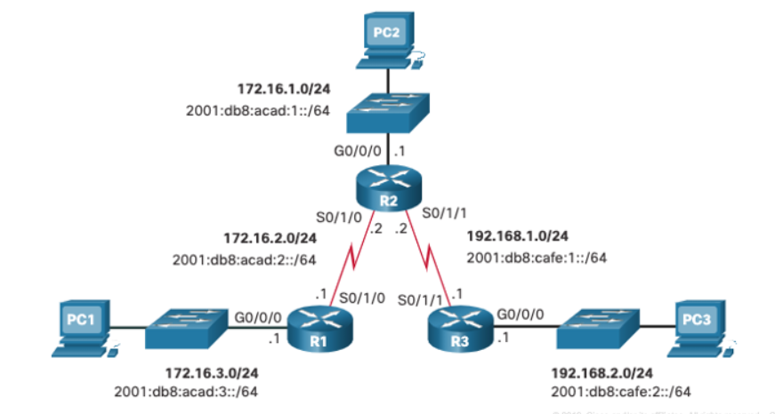)
A **dual-stack topology** runs both **IPv4** and **IPv6**.  
Initially, no static routes are configured for either protocol.

---

## IPv4 Starting Routing Tables
At the start, routers only have routes for **directly connected networks** and local addresses.

- **R1 → R2:** reachable (direct connection)  
- **R1 → R3 LAN:** unreachable (no static route configured)

---

## IPv6 Starting Routing Tables
Similar to IPv4, routers initially only have routes for **directly connected networks** and local addresses.

- **R1 → R2:** reachable (direct connection)  
- **R1 → R3 LAN:** unreachable (no static route configured)


# 15.2 Configure IP Static Routes

## IPv4 Next-Hop Static Route
- Specifies only the **next-hop IP address**; exit interface is determined automatically.  
- Used when the next hop is known and directly reachable.

**Example:** Three next-hop IPv4 static routes on **R1**:
```
R1(config)# ip route 172.16.1.0 255.255.255.0 172.16.2.2
R1(config)# ip route 192.168.1.0 255.255.255.0 172.16.2.2
R1(config)# ip route 192.168.2.0 255.255.255.0 172.16.2.2
```

---

## IPv6 Next-Hop Static Route
- Specifies only the **next-hop IPv6 address**.  
- Requires enabling **IPv6 unicast routing**.

**Example:** Three IPv6 next-hop static routes on **R1**:
```
R1(config)# ipv6 unicast-routing
R1(config)# ipv6 route 2001:db8:acad:1::/64 2001:db8:acad:2::2
R1(config)# ipv6 route 2001:db8:cafe:1::/64 2001:db8:acad:2::2
R1(config)# ipv6 route 2001:db8:cafe:2::/64 2001:db8:acad:2::2
```

- **R1's routing table** now contains routes to the three remote IPv6 networks.

---

## IPv4 Directly Connected Static Route
- Specifies only the **exit interface** instead of the next-hop IP.  
- Typically used for **point-to-point serial interfaces**.  

**Example:** Three directly connected IPv4 static routes on **R1**:
```
R1(config)# ip route 172.16.1.0 255.255.255.0 s0/1/0
R1(config)# ip route 192.168.1.0 255.255.255.0 s0/1/0
R1(config)# ip route 192.168.2.0 255.255.255.0 s0/1/0
```

> **Note:** Using a **next-hop IP address** is generally recommended.

---

## IPv6 Directly Connected Static Route
- Specifies only the **exit interface**.  
- Used mainly for **point-to-point serial interfaces**.  

**Example:** Three directly connected IPv6 static routes on **R1**:
```
R1(config)# ipv6 route 2001:db8:acad:1::/64 s0/1/0
R1(config)# ipv6 route 2001:db8:cafe:1::/64 s0/1/0
R1(config)# ipv6 route 2001:db8:cafe:2::/64 s0/1/0
```

> **Note:** Using a **next-hop IPv6 address** is generally recommended.

---

## IPv4 Fully Specified Static Route
- Specifies **both exit interface and next-hop IP address**.  
- Needed for **multi-access interfaces** to explicitly identify the next hop.  
- Next-hop IP must be **directly connected** to the exit interface.  
- Recommended for **Ethernet networks**.

---

## IPv6 Fully Specified Static Route (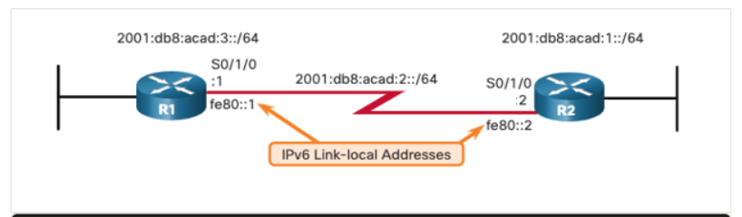)
- Specifies **both exit interface and next-hop IPv6 address**.  
- Required when the next-hop address is an **IPv6 link-local address**.  
- Ensures the router knows which interface to use.

**Reason:**  
- Link-local addresses are **not in the IPv6 routing table**.  
- They are **only unique per link**, so the same address may appear on multiple interfaces.  
- Including the **exit interface** avoids ambiguity.

**Example:** IPv6 routing table entry showing both **next-hop link-local address** and **exit interface**.

---

## Verify a Static Route
**Basic commands:**
- `show ip route` / `show ipv6 route`  
- `ping`  
- `traceroute`

**Static route-specific commands:**
- `show ip route static`  
- `show ip route [network]`  
- `show running-config | section ip route`

> **Note:** Replace `ip` with `ipv6` for IPv6 versions.


# 15.3 Configure IP Default Static Routes

## Default Static Route (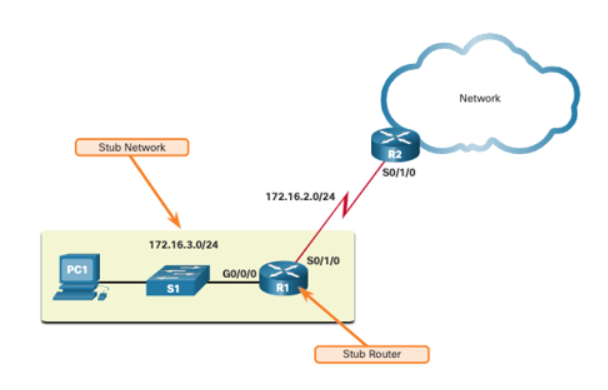)
A **default route** is a static route that **matches all packets** not found in the routing table.  
It serves as the **Gateway of Last Resort**.

**Key points:**
- Represents any network **not in the routing table**  
- Can be **configured locally** or **learned from another router**  
- Commonly used for:
  - **Edge routers** connecting to a service provider  
  - **Stub routers** with only one upstream neighbor  

**Example scenario:** Typical default static route setup.

---

## IPv4 Default Static Route
- Network address: **0.0.0.0**, Subnet mask: **0.0.0.0**  
- Matches **any IPv4 network**  
- Often called a **quad-zero route**

**Command syntax:**
```
Router(config)# ip route 0.0.0.0 0.0.0.0 {ip-address | exit-intf}
```

---

## IPv6 Default Static Route
- Prefix: **::/0**, matches **all IPv6 routes**

**Command syntax:**
```
Router(config)# ipv6 route ::/0 {ipv6-address | exit-intf}
```
---

## Configure a Default Static Route

### IPv4 Example
- Forwards packets **not matching a more specific route** to R2 (172.16.2.2)
```
R1(config)# ip route 0.0.0.0 0.0.0.0 172.16.2.2
```

### IPv6 Example
- Works similarly for IPv6: forwards packets **not matching a more specific route**
```
R1(config)# ipv6 route ::/0 {next-hop-ipv6 | exit-intf}
```

---

## Verify a Default Static Route

### IPv4 Verification
- Command: `show ip route static`  
- An **asterisk (*)** next to `S` indicates it is the **candidate default route**  
- Default route uses **/0 mask** → **matches all packets** not matched by a specific route

### IPv6 Verification
- Command: `show ipv6 route static`  
- Default route uses **::/0 prefix** → **matches all packets** not matched by a specific IPv6 route


# 15.4 Configure Floating Static Routes

## Floating Static Routes
A **floating static route** is a **backup route** used only when the primary route (static or dynamic) fails.

**Key points:**
- Only active if the **primary route fails**  
- Configured with a **higher administrative distance (AD)** than the primary route  
- **AD** indicates route trustworthiness; lower AD is preferred  
- Default static routes have **AD = 1**  
- Increasing AD makes the route **less preferred**, allowing it to "float" until needed

---

## Configure IPv4 and IPv6 Floating Static Routes
- Can be configured for **IPv4** and **IPv6**  
- Use a **higher AD** for the floating route

**IPv4 Example:**
```
R1(config)# ip route 0.0.0.0 0.0.0.0 172.16.2.2 # Primary route
R1(config)# ip route 0.0.0.0 0.0.0.0 10.10.10.2 5 # Floating route (AD = 5)
```
**IPv6 Example:**
```
R1(config)# ipv6 route ::/0 2001:db8:acad:2::2 # Primary route
R1(config)# ipv6 route ::/0 2001:db8:cafe:2::2 5 # Floating route (AD = 5)
```

**Verification:**
- `show ip route` / `show ipv6 route`  
- Floating route **does not appear** while primary route is active

---

## Test the Floating Static Routes (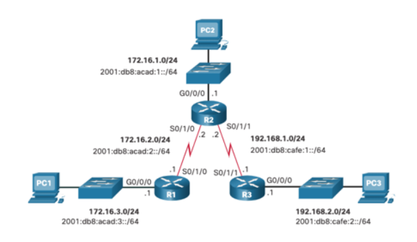)
- **Scenario:** R2 fails (both serial interfaces shut down)  
- **Observation on R1:**
  - Syslog messages show links going down  
  - Floating static route becomes **active automatically**  
  - Routing table now uses the **backup route**


# 15.5 Configure Static Host Routes

## Host Routes
A **host route** is a route to a **specific IP address**:  
- **IPv4:** /32 mask  
- **IPv6:** /128 prefix  

**Ways a host route can be added:**
1. **Automatically installed** when an IP address is assigned to an interface  
2. **Manually configured** as a static host route  
3. **Automatically obtained** through other methods (covered later)

---

## Automatically Installed Host Routes
- Cisco IOS installs a **local host route** automatically when an interface has an IP address  
- Improves **handling of packets addressed to the router itself**  
- Added **along with the connected network route** (marked `C`)  
- Local host routes are marked **L** in the routing table

---

## Static Host Routes (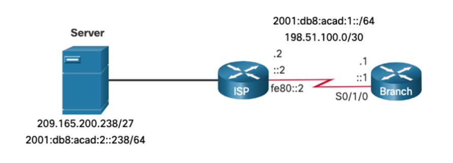)
- **Manually configured** to direct traffic to a **specific device** (e.g., a server)  
- Uses **/32 for IPv4** or **/128 for IPv6**

**Example:**
- IPv4: 192.168.1.100/32  
- IPv6: 2001:db8:acad:1::100/128

---

## Configure Static Host Routes
**Example on Branch router:**

**IPv4:**
```
Branch(config)# ip route 209.165.200.238 255.255.255.255 198.51.100.2
```

**IPv6:**
```
Branch(config)# ipv6 route 2001:db8:acad::238/128 2001:db8:acad::2
```

---

## Configure IPv6 Static Host Route with Link-Local Next-Hop
- IPv6 next-hop can be a **link-local address** of the adjacent router  
- **Must specify the exit interface** when using a link-local next hop

**Steps:**
1. Remove the original IPv6 static host route  
2. Configure a **fully specified route**:
   - IPv6 address of the destination server  
   - IPv6 link-local address of the ISP router  
   - Exit interface


# 16.1 Packet Processing with Static Routes

## Static Routes and Packet Forwarding (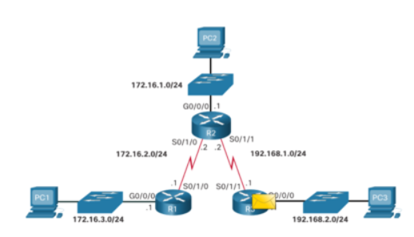) 

- PC1 sends a packet to PC3 via the default gateway.
- When the packet reaches R1's `G0/0/0` interface:
  - R1 decapsulates the packet.
  - Searches the routing table for a matching destination network.

### Destination IP Address Matching

- **Matches a static route:**  
  Use the static route to determine the next-hop IP or exit interface.

- **Does not match a specific route:**  
  Use the default static route (if configured).

- **No matching route:**  
  Drop the packet and send an ICMP message back to PC1.

## Forwarding from R1 to R2

- If R1 finds a route:
  - Encapsulates the packet in a new frame.
  - Sends it out `S0/1/0` towards R2.

- R2 receives the packet on `S0/1/0`:
  - Decapsulates it.
  - Searches its routing table for a match.
  - If a match is found, sends the packet out `S0/1/1` towards R3.

## Forwarding from R3 to PC3

- R3 receives the packet:
  - Decapsulates it.
  - Checks the routing table.

- Destination IP matches directly connected `G0/0/0` interface:
  - R3 looks up the ARP table for PC3's MAC address.
  - If no entry exists, R3 sends an ARP request out `G0/0/0`.

- PC3 replies with its MAC address.

- R3 encapsulates the packet:
  - **Destination MAC:** PC3 MAC
  - **Source MAC:** R3 `G0/0/0` MAC

- The frame is sent out `G0/0/0` and PC3 receives the packet.

# 16.2 Troubleshoot IPv4 Static and Default Route Configuration

## Network Changes

Networks can fail for several reasons:

- An interface can fail.
- A service provider may drop a connection.
- Links can become oversaturated.
- An administrator may enter an incorrect configuration.

**Responsibility:** Network administrators must identify and resolve these issues.  

**Tip:** Be familiar with troubleshooting tools to quickly isolate routing problems.

## Common Troubleshooting Commands

| Command                  | Description                                                                 |
|--------------------------|-----------------------------------------------------------------------------|
| `ping`                   | Verify Layer 3 connectivity to a destination. Extended pings provide extra options. |
| `traceroute`             | Verify the path to a destination network using ICMP echo reply messages for each hop. |
| `show ip route`          | Display the routing table. Used to check route entries for destination IPs. |
| `show ip interface brief`| Display interface status. Verify operational status and IP addresses. |
| `show cdp neighbors`     | Display directly connected Cisco devices. Validate Layer 1 and Layer 2 connectivity. |

## Solving a Connectivity Problem

**Scenario:** Connectivity from PC1 to PC3 fails.

**Observations:**

- Extended pings from R1 `G0/0/0` to PC3 fail.
- Pings from R1 `S0/1/0` to R2 succeed.
- Pings from R1 `S0/1/0` to R3 succeed.

**Troubleshooting Steps:**

- Check R2's routing table.
- Identify and remove the incorrect static route.

**Solution:**

- Add the correct static route:

```
ip route 172.16.3.0 255.255.255.0 172.16.2.1
```