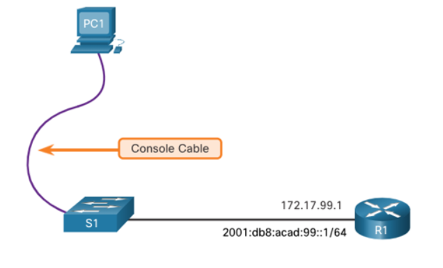
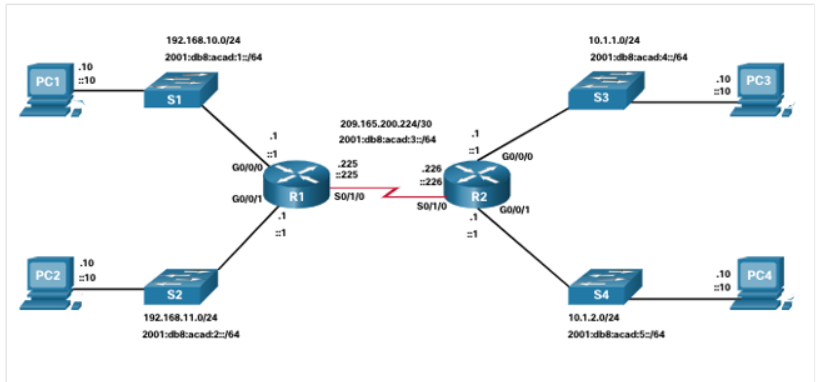

# 1.1 Configure a Switch with Initial Settings

## Switch Boot Sequence
When a Cisco switch powers on, it follows these steps:

1.  **POST (ROM):** Runs Power-On Self-Test. Checks **CPU**, **DRAM**, and **Flash** integrity.
2.  **Boot Loader (ROM):** Runs immediately after POST.
3.  **CPU Init:** Sets up memory mapping and CPU registers.
4.  **Flash Init:** Mounts the Flash file system.
5.  **Load IOS:** The boot loader loads the IOS (operating system) into **RAM**. The switch becomes **operational**.

---

## Boot System Command

* **Default Boot:** The switch uses the file specified in the **`BOOT` environment variable**.
* **Fallback:** If the `BOOT` variable is missing, the switch loads the **first executable file** it finds in Flash.
* **Startup Config:** The saved configuration file is named **`config.text`** and is stored in Flash.
* **Set BOOT File:** Manually set the file to load using the command: `boot system flash: <path>/<IOS file>`
* **Check BOOT File:** Use the command: `show boot`

---

## Switch LED Indicators

LEDs indicate the status of the switch and its ports. The **Mode button** cycles the per-port LED function between these modes:

| LED Name | Mode Button Function | Status Meaning |
| :--- | :--- | :--- |
| **SYST** | N/A | Power/system status. |
| **RPS** | N/A | Redundant Power Supply status. |
| **STAT** | **Port Status** (Default) | **Green:** Link active. **Off:** No link. **Blinking:** Activity. |
| **DUPLX** | **Duplex Mode** | **Green:** Full-duplex. **Off/Amber:** Half-duplex. |
| **SPEED** | **Speed Mode** | Green indicates the speed (e.g., solid = 100 Mbps, specific pattern = 1000 Mbps). |
| **PoE** | **Power over Ethernet** | **Green:** Power on. **Amber/Alternating:** Fault or power denied. |

### Recovering from a System Crash (Password Recovery)

The **Boot Loader** is used if the IOS is missing, damaged, or to **recover passwords**.

**Basic Recovery Steps:**
1.  Connect a PC to the **console port**.
2.  Unplug the switch.
3.  Plug the switch back in, and immediately press and hold the **Mode** button.
4.  Wait for the System LED to turn solid green, then release the button.
5.  The `switch:` prompt (boot loader mode) appears.
6.  From this prompt, you can format Flash, reinstall IOS, or manually edit files (to bypass password checks).

---

## Switch Management Access (SVI Configuration) ()

Switches are managed via a **Switched Virtual Interface (SVI)**—a Layer 3 interface bound to a VLAN.

* **Requirements:** An **IP address** + **subnet mask** (for local access) and a **default gateway** (for remote access) are needed.
* **Best Practice:** Do **not** use the default **VLAN 1** for management. Use a dedicated management VLAN (e.g., VLAN 99).

### SVI Configuration Steps

1.  Enter interface configuration mode for the management VLAN.
2.  Assign the IPv4 and/or IPv6 address.
3.  Bring the SVI up with `no shutdown`.
    * *Note:* The SVI will only show **up/up** if the VLAN exists and at least one physical port assigned to that VLAN is active.

**Example Commands (VLAN 99 SVI)**
```cli
S1# configure terminal
S1(config)# interface vlan 99
S1(config-if)# ip address 172.17.99.11 255.255.255.0
S1(config-if)# ipv6 address 2001:db8:acad:99::1/64
S1(config-if)# no shutdown
S1(config-if)# end
S1# copy running-config startup-config
```

# 1.2 Configure Switch Ports

## Duplex Communication ()

| Duplex Mode | Characteristics | Performance | Requirement |
| :--- | :--- | :--- | :--- |
| **Full-Duplex** | Sends and receives data **simultaneously**. | **Doubles bandwidth** (100% efficiency). **No collisions**. | Requires **microsegmentation** (1 device per port). Required for Gigabit and 10 Gb NICs. |
| **Half-Duplex** | Sends or receives data **one way at a time**. | Reduces performance. **Can cause collisions**. | Typically used in older shared-media environments (hubs). |

---

## Configure Switch Ports at Physical Layer

### Speed and Duplex Settings

* **Default:** Cisco 2960/3560 ports use **autonegotiation** (`duplex auto`, `speed auto`).
    * 10/100 Mbps links can negotiate half or full-duplex.
    * 1000 Mbps (Gigabit) links require **full-duplex only**.
* **Autonegotiation:** Automatically sets the fastest speed and best duplex mode between two connecting devices.
* **Best Practice:** Manually set **speed and duplex** for critical devices like servers, workstations, and network devices to prevent speed/duplex mismatches, which cause severe performance issues.
* **Fiber Ports (e.g., 1000BASE-SX):** Often fixed speed and **full-duplex** only.

**Example: Set Duplex and Speed**
```cli
S1# configure terminal
S1(config)# interface FastEthernet0/1
S1(config-if)# duplex full
S1(config-if)# speed 100
S1(config-if)# end
S1# copy running-config startup-config
```

# 1.3 Secure Remote Access

## Telnet (Insecure)

* **Port:** TCP 23
* **Security Risk:** Sends username, password, and data in **plaintext** (unencrypted). Credentials can be easily captured (e.g., using Wireshark).
* **Recommendation:** **Avoid Telnet**. Use SSH instead for secure remote access.

---

## SSH (Secure Shell)

* **Port:** TCP 22
* **Security Benefit:** **Encrypts** username, password, and all data. While an attacker can see the IP, they **cannot read the credentials** or data.
* **Recommendation:** **Always use SSH** for remote management.

### Verify SSH Support

* The switch must run an IOS with **cryptographic features**.
* Use the `show version` command to check the IOS file.
* An IOS filename including **k9** (e.g., `C2960-LANBASEK9-M`) supports SSH.
* **Prerequisite:** Ensure the switch has a **unique hostname** and **network connectivity** before configuring SSH.

---

## Configure SSH Steps

| Step | Command / Mode | Purpose |
| :--- | :--- | :--- |
| **1. Verify Status** | `show ip ssh` | Checks the current SSH status. |
| **2. Set Domain Name** | `ip domain-name <domain-name>` | Required for key generation (e.g., `ip domain-name cisco.com`). |
| **3. Generate RSA Keys** | `crypto key generate rsa` | **Enables SSH** by creating the encryption key pair. |
| **4. Create Local User** | `username <username> secret <password>` | Creates a local account for authentication (e.g., `username admin secret ccna`). |
| **5. Configure VTY Lines** | `line vty 0 15`<br>`login local`<br>`transport input ssh` | Restricts remote access to only use SSH (not Telnet) and forces authentication using local accounts. |
| **6. Enable SSHv2** | `ip ssh version 2` | Ensures the most secure SSH protocol version is used. |

**Disable SSH / Delete Keys:** Use the command `crypto key zeroize rsa`.

---

## Verify SSH Connectivity

* **Goal:** Access the switch CLI securely from a PC using an SSH client (like PuTTY).
* **Process:**
    1.  Open the SSH client on the PC.
    2.  Connect to the Switch's SVI IP address (e.g., `172.17.99.11`).
    3.  The client prompts for the local **username** and **password** (`admin` / `ccna`).
    4.  The connection is established, and all subsequent data is **encrypted**.

**Note:** SSH encrypts both the login credentials and all subsequent data transmitted, providing superior security compared to Telnet.

# 1.4 Basic Router Configuration

## Basic Router Setup

* Cisco routers and switches are similar in OS, commands, and configuration steps.
* Always perform initial configuration to **name the device** and **set passwords**.

### Steps to Configure a Router

| Step | Command Sequence | Purpose |
| :--- | :--- | :--- |
| **1. Access Config** | `Router> enable`<br>`Router# configure terminal` | Enters **Global Configuration Mode**. |
| **2. Hostname** | `Router(config)# hostname R1` | Sets the router's name. |
| **3. Enable Secret** | `R1(config)# enable secret class` | Configures the **most secure password** for Privileged EXEC Mode (`#`). |
| **4. Console Password** | `R1(config)# line console 0`<br>`password cisco`<br>`login`<br>`exit` | Secures the **direct console connection**. |
| **5. VTY Password** | `R1(config)# line vty 0 4`<br>`password cisco`<br>`login`<br>`exit` | Secures **remote access** (Telnet/SSH) for VTY lines 0 through 4. |
| **6. Encrypt Passwords**| `R1(config)# service password-encryption` | Encrypts all **plain-text** passwords in the running configuration. |
| **7. Exit Config** | `R1(config)# end` | Exits configuration mode (or use **`CTRL+Z`**). |
| **8. Save Config** | `R1# copy running-config startup-config` | Saves the active configuration to NVRAM to persist after reboot. |

**Notes:**
* Setting passwords and hostname ensures security and easy identification.
* Use `CTRL+Z` to exit configuration mode quickly.

---

## Basic Router Configuration (Cont.)

### Configure a Banner

* A **banner** displays a legal or security message when someone accesses the router.
* **Example command:** `R1(config)# banner motd $ Authorized Access Only $`

### Save Configuration

* Always save changes to **startup configuration** (`startup-config`) to retain settings after a reboot.
* **Command:** `R1# copy running-config startup-config`

**Notes:**
* `banner motd` can use any delimiter (here `$`) to enclose the message.
* Saving the configuration ensures all changes persist after reboot.

---

## Dual Stack Topology ()

* **Routers vs Switches:** Routers support **both IPv4 and IPv6** interfaces, while Switches (Layer 2) primarily handle LANs.
* **Dual Stack Topology:** Demonstrates configuration of **IPv4 and IPv6** on router interfaces simultaneously.
* **Key Point:** Useful for networks transitioning from IPv4 to IPv6, leveraging the router's inter-network routing capability.

---

## Configure Router Interfaces – Example

The interface configuration involves assigning both IPv4 and IPv6 addresses (Dual Stack) and enabling the port.

### Interface Details

| Interface | IPv4 Address/Mask | IPv6 Address/Prefix | Description |
| :--- | :--- | :--- | :--- |
| **G0/0/0** | `192.168.10.1 255.255.255.0` | `2001:db8:acad:1::1/64` | Link to LAN 1 |
| **G0/0/1** | `192.168.11.1 255.255.255.0` | `2001:db8:acad:2::1/64` | Link to LAN 2 |
| **S0/0/0** | `209.165.200.225 255.255.255.252` | `2001:db8:acad:12::1/64` | Link to R2 |

**Commands Example (Interface G0/0/0)**
```cli
R1(config)# interface gigabitethernet 0/0/0
R1(config-if)# ip address 192.168.10.1 255.255.255.0
R1(config-if)# ipv6 address 2001:db8:acad:1::1/64
R1(config-if)# description Link to LAN 1
R1(config-if)# no shutdown
R1(config-if)# exit
```


## Interface Verification Commands

Use these `show` commands to quickly check interface status and configuration:

* **`show ip interface brief`** / **`show ipv6 interface brief`**: Shows a summary of all interfaces, including their **IPv4 or IPv6 address** and **operational status** (Up/Down).
* **`show running-config interface [interface-id]`**: Displays **only the configuration** commands applied to the specific interface you name.
* **`show ip route`** / **`show ipv6 route`**: Displays the **routing table** in RAM.
    * **Modern IOS (15+):** Active interfaces appear with two entries: **'C' (Connected)** and **'L' (Local)**.
    * **Older IOS:** Only a single **'C' (Connected)** entry appears.


## Verify Interface Status

The **`show ip interface brief`** and **`show ipv6 interface brief`** commands quickly reveal the operational status of all interfaces.

### Status Interpretation

To verify that an interface is **active and operational**, check the last two columns:

| Column | Desired State | Meaning |
| :--- | :--- | :--- |
| **Status (Layer 1)** | **`up`** | The interface is physically active (link detected/carrier present). |
| **Protocol (Layer 2)** | **`up`** | The data link layer protocol is active (keepalives are exchanging successfully). |

**Operational Interface Example:**
* **`up/up`** (or `up`, `up` in the columns) indicates the interface is **fully functional**.

### Common Issues

| Status Output | Indication |
| :--- | :--- |
| **`up/down`** | **Layer 2 problem** (e.g., encapsulation mismatch, remote side administratively down, cabling issue). |
| **`down/down`** | **Layer 1 problem** (e.g., cable disconnected, power off, or hardware fault). |
| **`administratively down/down`** | The **`shutdown`** command was applied to the interface. |

## Verify IPv6 Link-Local and Multicast Addresses

### Link-Local Addresses

* **Identification:** The address beginning with **FE80** is the **link-local unicast address**.
* **Assignment:** It's **automatically added** to an interface whenever a **global unicast address** is manually configured.
* **Requirement:** An IPv6 interface **must** have a link-local address, but it **doesn't necessarily need** a global unicast address.
* **Visibility:** You can see the link-local address using **`show ipv6 interface brief`**.

### Multicast Addresses

* Use the command **`show ipv6 interface [interface-id]`** (e.g., `show ipv6 interface gigabitethernet 0/0/0`) to see *all* IPv6 addresses and statistics for that interface.
* **Joined Group Addresses:** The output lists **multicast addresses** assigned to the interface, which begin with the prefix **FF02** (the link-local multicast prefix).


## Verify Interface Configuration

The **`show running-config interface [interface-id]`** command is used to confirm the **specific configuration commands** currently applied to an interface.

### Detailed Verification Commands

These commands are used to gather detailed operational and configuration information:

* **`show interfaces`**: Displays comprehensive interface information, including the **interface status, link type, speed, duplex**, and **packet flow/error counts** for all ports on the device.
* **`show ip interface`** / **`show ipv6 interface`**: Displays all **IPv4 and IPv6 specific details** for all interfaces, such as assigned addresses, helper addresses, and protocol status.


## Verify Routes

The **`show ip route`** and **`show ipv6 route`** commands display the router's routing table, which includes entries for directly connected networks.

### Routing Table Entries

When an interface is active, two entries appear in the routing table:

1.  **Connected Network Route (Code 'C'):** Represents the entire network subnet directly attached to the interface (e.g., `192.168.10.0/24`).
2.  **Local Host Route (Code 'L'):** Represents the **exact IP address** of the interface itself (e.g., `192.168.10.1/32`).

### Local Host Route Details

* **Purpose:** The local route is used by the router to efficiently process packets that are **destined to its own IP address**.
* **Administrative Distance:** The local route always has an Administrative Distance of **0** (meaning it's the most trusted source).
* **Mask:** It uses a host-specific mask:
    * **IPv4:** **/32** mask
    * **IPv6:** **/128** mask


  ## Verify Routes (Cont.)

### Connected Routes

* **Indicator:** A **'C'** next to a route in the routing table means it's a **directly connected network**.
* **IPv6 Connection:** When an IPv6 interface is configured with a **global unicast address** and is in the **"up/up"** state, its network prefix and prefix length are added to the routing table as a **connected route**.

### Local Routes

* **Local Route Entry:** The router's **own IP address** (both IPv4 and IPv6) is installed in the routing table as a **local route**.
* **IPv6 Prefix:** The IPv6 local route uses a **/128** prefix.
* **Purpose:** Local routes allow the router's routing process to **efficiently process packets** that have the router's interface address as their final destination.


# 1.5 Verify Directly Connected Networks (Router Verification)

## Interface Verification Commands

Use these commands to quickly check configuration and status:

| Command | Purpose |
| :--- | :--- |
| **`show ip interface brief`** / **`show ipv6 interface brief`** | Shows a **summary** of all interfaces, including their **IP address** and **operational status** (`up/down`). |
| **`show running-config interface [id]`** | Displays **only the configuration** commands applied to the specified interface. |
| **`show interfaces`** | Shows **comprehensive details** including link type, speed, duplex, and **packet flow/error counts**. |
| **`show ip route`** / **`show ipv6 route`** | Displays the **routing table** in RAM, including connected networks. |

---

## Verify Interface Operational Status

The **`show ip interface brief`** command is used to confirm the interface's two main status indicators:

### Status Interpretation

To be **fully operational** (`up/up`), both the Status and Protocol columns must be `up`.

| Status Output | Interpretation | Indication/Layer |
| :--- | :--- | :--- |
| **`up/up`** | **Fully functional.** | Layer 1 and Layer 2 are active. |
| **`up/down`** | **Layer 2 Problem.** | Physical link is up, but protocol (e.g., keepalives) failed (e.g., encapsulation mismatch). |
| **`down/down`** | **Layer 1 Problem.** | Cable disconnected, power off, or hardware fault. |
| **`administratively down/down`**| **Manual Shutdown.** | The interface has the **`shutdown`** command applied. |

---

## Verify IPv6 Addresses

Use **`show ipv6 interface [id]`** for detailed IPv6 information.

### Link-Local Addresses (FE80)

* **Identification:** Starts with **FE80** (e.g., `FE80::...`).
* **Requirement:** An IPv6 interface **must** have a link-local address.
* **Assignment:** It's **automatically added** when a global unicast address is manually configured.
* **Visibility:** You can see it quickly using **`show ipv6 interface brief`**.

### Multicast Addresses (FF02)

* **Identification:** Starts with **FF02** (the link-local multicast prefix).
* **Visibility:** Listed under "Joined group address(es)" in the detailed output of **`show ipv6 interface [id]`**.

---

## Verify Routes (Routing Table Entries)

The **`show ip route`** / **`show ipv6 route`** output includes two key entries for every active, directly connected network:

| Route Type | Code | Purpose | Mask/Prefix |
| :--- | :--- | :--- | :--- |
| **Connected Network** | **'C'** | Represents the **entire subnet** directly attached to the interface. | Uses the network subnet mask (e.g., `/24`). |
| **Local Host** | **'L'** | Represents the router's **own IP address** on that interface. | **IPv4:** **/32**. **IPv6:** **/128**. |

### Local Host Route Details

* **Purpose:** Allows the router to **efficiently process packets** that are specifically destined *to* its own interface IP address.
* **Administrative Distance (AD):** Local routes are the most trusted, having an AD of **0**.

*Note: In modern Cisco IOS (15+), both the 'C' and 'L' entries appear. Older IOS versions typically only show the 'C' entry.*