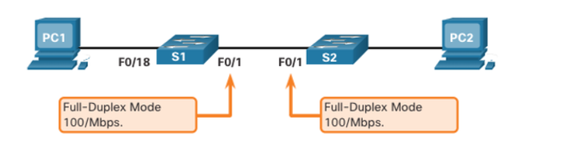

# 1.1 Configure a Switch with Initial Settings

---

## Switch Boot Sequence

When a Cisco switch powers on, it follows this order:

1. **POST (ROM):** Power-On Self-Test checks CPU, RAM, and Flash.  
2. **Boot Loader (ROM):** Runs after POST.  
3. **CPU Init:** Sets up memory and CPU registers.  
4. **Flash Init:** Mounts the Flash file system.  
5. **Load IOS:** Loads the operating system (IOS) into RAM → switch is operational.  

---

## Boot System Command

* **Default Boot:** Uses the file in the **`BOOT` environment variable**.  
* **Fallback:** If none set, loads the **first IOS file in Flash**.  
* **Config File:** Saved config is **`config.text`** in Flash.  
* **Manually Set:** `boot system flash:<path>/<IOS file>`  
* **Check Boot File:** `show boot`  

---

## Switch LED Indicators

Switch LEDs + Mode button help monitor status:

| LED | Mode | Meaning |
|-----|------|---------|
| **SYST** | N/A | Power/system status. |
| **RPS** | N/A | Redundant Power Supply status. |
| **STAT** | Default (Port Status) | **Green:** Link active. **Off:** No link. **Blinking:** Activity. |
| **DUPLX** | Duplex Mode | **Green:** Full-duplex. **Amber/Off:** Half-duplex. |
| **SPEED** | Speed Mode | Shows port speed (green patterns). |
| **PoE** | PoE Mode | **Green:** Power OK. **Amber/Alt:** Fault or denied. |

---

## Recovery from System Crash (Password Recovery)

The **Boot Loader** is used if IOS is missing/damaged or for **password recovery**.  

**Steps:**
1. Connect PC to **console port**.  
2. Power off switch.  
3. Power on + hold **Mode** button.  
4. Release when **System LED = solid green**.  
5. You get the `switch:` prompt.  
6. From here you can format Flash, reinstall IOS, or bypass password.  

---

## Switch Management Access (SVI) 

A **Switched Virtual Interface (SVI)** provides management (Layer 3) access.  

* Needs **IP address + subnet mask** (local access).  
* Needs a **default gateway** (remote access).  
* Best practice: Use a **dedicated VLAN** (not VLAN 1).  

---

### SVI Configuration Steps

1. Enter management VLAN interface config.  
2. Assign IP (IPv4/IPv6).  
3. Enable with `no shutdown`.  
   * VLAN must exist + have at least one active port.  

**Example (VLAN 99 SVI):**
```cli
S1# configure terminal
S1(config)# interface vlan 99
S1(config-if)# ip address 172.17.99.11 255.255.255.0
S1(config-if)# ipv6 address 2001:db8:acad:99::1/64
S1(config-if)# no shutdown
S1(config-if)# end
S1# copy running-config startup-config
```

# 1.2 Configure Switch Ports

---

## Duplex Communication 

| Duplex Mode | Characteristics | Performance | Requirement |
|-------------|-----------------|-------------|-------------|
| **Full-Duplex** | Can **send & receive** at the same time. | **Doubles bandwidth** (no collisions). 100% efficiency. | Needs **microsegmentation** (1 device per port). Required for Gigabit/10 Gb NICs. |
| **Half-Duplex** | Can **send OR receive**, not both. | Lower performance. **Collisions possible**. | Old tech, mainly with **hubs**. |

---

## Configure Switch Ports (Physical Layer)

### Speed & Duplex Settings

* **Default (2960/3560):**  
  * `duplex auto` + `speed auto`  
  * Auto-negotiates the best settings.  
* **10/100 Mbps links:** Support **half or full-duplex**.  
* **1000 Mbps (Gigabit):** **Full-duplex only**.  
* **Best Practice:** Manually set **speed & duplex** for important devices (servers, PCs, routers, switches) → avoids mismatches.  
* **Fiber Ports (1000BASE-SX etc.):** Usually fixed **full-duplex**.  

---

### Example: Set Duplex and Speed
```cli
S1# configure terminal
S1(config)# interface FastEthernet0/1
S1(config-if)# duplex full
S1(config-if)# speed 100
S1(config-if)# end
S1# copy running-config startup-config
```

# 1.3 Secure Remote Access

## Telnet (Insecure)

* **Port:** TCP 23  
* **Security Risk:** Sends username, password, and data in **plaintext** (unencrypted). Credentials can be easily captured (e.g., using Wireshark).  
* **Recommendation:** **Avoid Telnet**. Use SSH instead for secure remote access.  

---

## SSH (Secure Shell)

* **Port:** TCP 22  
* **Security Benefit:** **Encrypts** username, password, and all data. While an attacker can see the IP, they **cannot read the credentials** or data.  
* **Recommendation:** **Always use SSH** for remote management.  

### Verify SSH Support

* The switch must run an IOS with **cryptographic features**.  
* Use the `show version` command to check the IOS file.  
* An IOS filename including **k9** (e.g., `C2960-LANBASEK9-M`) supports SSH.  
* **Prerequisite:** Ensure the switch has a **unique hostname** and **network connectivity** before configuring SSH.  

---

## Configure SSH Steps

| Step | Command / Mode | Purpose |
| :--- | :--- | :--- |
| **1. Verify Status** | `show ip ssh` | Checks the current SSH status. |
| **2. Set Domain Name** | `ip domain-name <domain-name>` | Required for key generation (e.g., `ip domain-name cisco.com`). |
| **3. Generate RSA Keys** | `crypto key generate rsa` | **Enables SSH** by creating the encryption key pair. |
| **4. Create Local User** | `username <username> secret <password>` | Creates a local account for authentication (e.g., `username admin secret ccna`). |
| **5. Configure VTY Lines** | `line vty 0 15`<br>`login local`<br>`transport input ssh` | Restricts remote access to only use SSH (not Telnet) and forces authentication using local accounts. |
| **6. Enable SSHv2** | `ip ssh version 2` | Ensures the most secure SSH protocol version is used. |

**Disable SSH / Delete Keys:**  
```cli
crypto key zeroize rsa
```
## Verify SSH Connectivity

**Goal:** Access the switch CLI securely from a PC using an SSH client (like PuTTY).

**Process:**
1. Open the SSH client on the PC.
2. Connect to the Switch's SVI IP address (e.g., `172.17.99.11`).
3. The client prompts for the local **username** and **password** (`admin` / `ccna`).
4. The connection is established, and all subsequent data is **encrypted**.

**Note:** SSH encrypts both the login credentials and all subsequent data transmitted, providing superior security compared to Telnet.


# 1.4 Basic Router Configuration

## Basic Router Setup

* Cisco routers and switches are similar in OS, commands, and configuration steps.
* Always perform initial configuration to **name the device** and **set passwords**.

### Steps to Configure a Router

| Step | Command Sequence | Purpose |
| :--- | :--- | :--- |
| **1. Access Config** | `Router> enable`<br>`Router# configure terminal` | Enters **Global Configuration Mode**. |
| **2. Hostname** | `Router(config)# hostname R1` | Sets the router's name. |
| **3. Enable Secret** | `R1(config)# enable secret class` | Configures the **most secure password** for Privileged EXEC Mode (`#`). |
| **4. Console Password** | `R1(config)# line console 0`<br>`password cisco`<br>`login`<br>`exit` | Secures the **direct console connection**. |
| **5. VTY Password** | `R1(config)# line vty 0 4`<br>`password cisco`<br>`login`<br>`exit` | Secures **remote access** (Telnet/SSH) for VTY lines 0 through 4. |
| **6. Encrypt Passwords**| `R1(config)# service password-encryption` | Encrypts all **plain-text** passwords in the running configuration. |
| **7. Exit Config** | `R1(config)# end` | Exits configuration mode (or use **`CTRL+Z`**). |
| **8. Save Config** | `R1# copy running-config startup-config` | Saves the active configuration to NVRAM to persist after reboot. |

**Notes:**
* Setting passwords and hostname ensures security and easy identification.
* Use `CTRL+Z` to exit configuration mode quickly.

---

## Basic Router Configuration (Cont.)

### Configure a Banner

* A **banner** displays a legal or security message when someone accesses the router.
* **Example command:** `R1(config)# banner motd $ Authorized Access Only $`

### Save Configuration

* Always save changes to **startup configuration** (`startup-config`) to retain settings after a reboot.
* **Command:** `R1# copy running-config startup-config`

**Notes:**
* `banner motd` can use any delimiter (here `$`) to enclose the message.
* Saving the configuration ensures all changes persist after reboot.

---

## Dual Stack Topology ()

* **Routers vs Switches:** Routers support **both IPv4 and IPv6** interfaces, while Switches (Layer 2) primarily handle LANs.
* **Dual Stack Topology:** Demonstrates configuration of **IPv4 and IPv6** on router interfaces simultaneously.
* **Key Point:** Useful for networks transitioning from IPv4 to IPv6, leveraging the router's inter-network routing capability.

---

## Configure Router Interfaces – Example

The interface configuration involves assigning both IPv4 and IPv6 addresses (Dual Stack) and enabling the port.

### Interface Details

| Interface | IPv4 Address/Mask | IPv6 Address/Prefix | Description |
| :--- | :--- | :--- | :--- |
| **G0/0/0** | `192.168.10.1 255.255.255.0` | `2001:db8:acad:1::1/64` | Link to LAN 1 |
| **G0/0/1** | `192.168.11.1 255.255.255.0` | `2001:db8:acad:2::1/64` | Link to LAN 2 |
| **S0/0/0** | `209.165.200.225 255.255.255.252` | `2001:db8:acad:12::1/64` | Link to R2 |

**Commands Example (Interface G0/0/0)**
```cli
R1(config)# interface gigabitethernet 0/0/0
R1(config-if)# ip address 192.168.10.1 255.255.255.0
R1(config-if)# ipv6 address 2001:db8:acad:1::1/64
R1(config-if)# description Link to LAN 1
R1(config-if)# no shutdown
R1(config-if)# exit
```

## Interface Verification Commands

## Show Interface Summaries

* **`show ip interface brief` / `show ipv6 interface brief`**: Summary of all interfaces with **IP addresses** and **operational status**.
* **`show running-config interface [interface-id]`**: Displays configuration applied to a specific interface.
* **`show ip route` / `show ipv6 route`**: Displays the **routing table** in RAM.

**Notes:**
* **Modern IOS (15+)**: Active interfaces show **'C' (Connected)** and **'L' (Local)** entries.
* **Older IOS**: Only a single **'C' (Connected)** entry appears.

---

## Verify Interface Status

| Column | Desired State | Meaning |
| :--- | :--- | :--- |
| **Status (Layer 1)** | up | Interface is physically active. |
| **Protocol (Layer 2)** | up | Data link layer is operational. |

**Operational Example:** `up/up` indicates fully functional interface.

### Common Issues

| Status Output | Indication |
| :--- | :--- |
| up/down | Layer 2 problem (e.g., encapsulation mismatch). |
| down/down | Layer 1 problem (e.g., cable disconnected). |
| administratively down/down | Interface was shutdown. |

---

## Verify IPv6 Link-Local and Multicast Addresses

### Link-Local Addresses

* Starts with **FE80**, automatically added when a global address is configured.
* Required for all IPv6 interfaces.
* Check with **`show ipv6 interface brief`**.

### Multicast Addresses

* Use **`show ipv6 interface [interface-id]`** to view all assigned multicast addresses, starting with **FF02**.

---

## Verify Interface Configuration

* **`show running-config interface [interface-id]`**: Confirm applied configuration.
* **`show interfaces`**: Comprehensive interface info (status, link type, speed, duplex, errors).
* **`show ip interface` / `show ipv6 interface`**: IPv4/IPv6 details for all interfaces.

---

## Verify Routes

* **`show ip route` / `show ipv6 route`**: Displays routing table.
* Active interfaces produce:
  1. **Connected Network Route (C)** – subnet of interface.
  2. **Local Host Route (L)** – exact interface IP.

### Connected Routes

* **'C'** indicates a directly connected network.
* IPv6 connected route is added when interface has **global unicast** and is **up/up**.

### Local Routes

* Router's own IP (IPv4/IPv6) appears as **local route**.
* IPv6 local route uses **/128** prefix.
* Local routes allow the router to **process packets destined to its own IP efficiently**.


# 1.5 Verify Directly Connected Networks (Router Verification)

## Interface Verification Commands

Use these commands to quickly check configuration and status:

| Command | Purpose |
| :--- | :--- |
| **`show ip interface brief`** / **`show ipv6 interface brief`** | Shows a **summary** of all interfaces, including their **IP address** and **operational status** (`up/down`). |
| **`show running-config interface [id]`** | Displays **only the configuration** commands applied to the specified interface. |
| **`show interfaces`** | Shows **comprehensive details** including link type, speed, duplex, and **packet flow/error counts**. |
| **`show ip route`** / **`show ipv6 route`** | Displays the **routing table** in RAM, including connected networks. |

---

## Verify Interface Operational Status

The **`show ip interface brief`** command is used to confirm the interface's two main status indicators.

### Status Interpretation

To be **fully operational** (`up/up`), both the Status and Protocol columns must be `up`.

| Status Output | Interpretation | Indication/Layer |
| :--- | :--- | :--- |
| **`up/up`** | **Fully functional.** | Layer 1 and Layer 2 are active. |
| **`up/down`** | **Layer 2 Problem.** | Physical link is up, but protocol (e.g., keepalives) failed (e.g., encapsulation mismatch). |
| **`down/down`** | **Layer 1 Problem.** | Cable disconnected, power off, or hardware fault. |
| **`administratively down/down`**| **Manual Shutdown.** | The interface has the **`shutdown`** command applied. |

---

## Verify IPv6 Addresses

Use **`show ipv6 interface [id]`** for detailed IPv6 information.

### Link-Local Addresses (FE80)

* **Identification:** Starts with **FE80** (e.g., `FE80::...`).
* **Requirement:** An IPv6 interface **must** have a link-local address.
* **Assignment:** Automatically added when a global unicast address is configured.
* **Visibility:** Check with **`show ipv6 interface brief`**.

### Multicast Addresses (FF02)

* **Identification:** Starts with **FF02** (link-local multicast prefix).
* **Visibility:** Listed under "Joined group address(es)" in the detailed output of **`show ipv6 interface [id]`**.

---

## Verify Routes (Routing Table Entries)

The **`show ip route`** / **`show ipv6 route`** output includes two key entries for every active, directly connected network:

| Route Type | Code | Purpose | Mask/Prefix |
| :--- | :--- | :--- | :--- |
| **Connected Network** | **'C'** | Represents the **entire subnet** directly attached to the interface. | Network subnet mask (e.g., `/24`). |
| **Local Host** | **'L'** | Represents the router's **own IP address** on that interface. | **IPv4:** /32, **IPv6:** /128. |

### Local Host Route Details

* **Purpose:** Allows the router to **efficiently process packets** destined to its own interface IP.
* **Administrative Distance (AD):** Local routes have AD **0**, the most trusted.

*Note: Modern Cisco IOS (15+) shows both 'C' and 'L' entries. Older IOS typically shows only 'C'.*