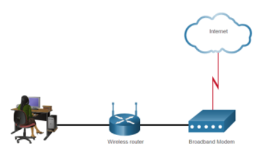
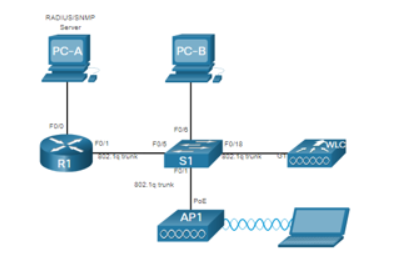
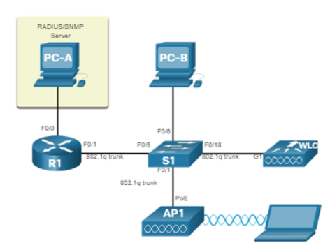
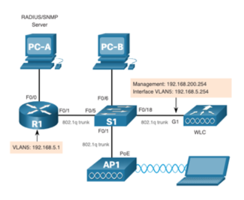

# 13.1 Remote Site WLAN Configuration

## The Wireless Router ()
- Used by **remote workers, small branch offices, and home networks**  
- Small office/home routers are often **integrated devices** with:
  - **Switch** for wired clients  
  - **WAN port** for Internet connection  
  - **Wireless components** for WLAN client access
- Typical features:
  - **WLAN security**  
  - **DHCP services**  
  - **Network Address Translation (NAT)**  
  - **Quality of Service (QoS)**  
  - Other model-specific features
- **Note:** Cable or DSL modem setup is usually done by the **service provider**, either on-site or remotely

## Log in to the Wireless Router
- Most routers are **preconfigured** for network connection  
- Default **IP addresses, usernames, and passwords** are publicly available online  
- **Security best practice:** Change default credentials immediately

### Steps to Access Router GUI
1. Open a **web browser**  
2. Enter the router's **default IP address** (found in documentation or online)  
3. Use the default credentials (commonly `admin` / `admin`) to log in

## Basic Network Setup
1. **Log in** to the router from a web browser  
2. **Change the default administrative password**  
3. **Log in** with the new password  
4. **Change the default DHCP IPv4 addresses**  
5. **Renew the IP address**  
6. **Log in** using the new IP address

## Basic Wireless Setup
1. **View WLAN defaults**  
2. **Change network mode** – select the 802.11 standard  
3. **Configure SSID** – set the network name  
4. **Configure channel** – avoid overlapping channels  
5. **Configure security mode** – Open, WPA, WPA2 Personal/Enterprise, etc.  
6. **Configure passphrase** – password for the selected security mode

## Configure a Wireless Mesh Network
- Single router may cover **small office/home**  
- To **extend range** beyond ~45m indoors or ~90m outdoors, use a **wireless mesh network (WMN)**  
- Steps:
  1. Add **additional access points (APs)**  
  2. Use **same WLAN settings** for all APs  
  3. Use **different channels** to avoid interference
- Many modern routers allow mesh setup via **smartphone apps**

## NAT for IPv4
- Routers have:
  - **Public IP** from ISP  
  - **Private IPs** for LAN devices
- **Network Address Translation (NAT)**:
  - Converts **private IPv4** to **public IPv4**  
  - Reverses translation for incoming packets  
- Enables **sharing a single public IPv4 address** by tracking session ports  
- With **IPv6**, each device gets a **unique IPv6 address**

## Quality of Service (QoS)
- **Prioritizes time-sensitive traffic**:
  - **High priority:** Voice, Video  
  - **Low priority:** Email, Web browsing  
- Some routers allow **port-specific prioritization**

## Port Forwarding
- Routers **block TCP/UDP ports** by default  
- Sometimes **specific ports must be opened** for apps to work

### Port Forwarding
- **Rule-based** method to direct traffic between networks

### Port Triggering
- Temporarily forwards inbound traffic to a device  
- Activates only when a **designated outbound port range** is used

# 13.2 Configure a Basic WLAN on the WLC

## WLC Topology ()
The topology and addressing scheme used for this topic are shown in the figure and table.

- The **Access Point (AP)** is a **controller-based AP** (not autonomous) and requires **no initial configuration**.
- Controller-based APs are often called **Lightweight APs (LAPs)**.
- LAPs use the **Lightweight Access Point Protocol (LWAPP)** to communicate with a **WLAN Controller (WLC)**.
- Controller-based APs are useful when **many APs are required**.
- As more APs are added, each AP is **automatically configured and managed by the WLC**.

## Device Addressing Table

| Device           | Interface    | VLAN/Type    | NIC | IP Address       | DHCP | Subnet Mask      |
|------------------|-------------|-------------|-----|----------------|------|----------------|
| RI               | F0/0        |             | NIC | 192.168.200.A   | No   | 255.255.255.0  |
| RI               | F0/1        |             | NIC | DHCP            | Yes  | 255.255.255.0  |
| WLC              | VLAN 1      | Management  | NIC | 192.168.200.254 | No   | 255.255.255.0  |
| API              |             |             | NIC | 192.168.200.3   | No   | 255.255.255.0  |
| PC-A             | Wired       |             | NIC | 172.16.A.254    | No   | 255.255.255.0  |
| PC-B             | Wired       |             | NIC | DHCP            | Yes  | 255.255.255.0  |
| Wireless Laptop  | Wireless    |             | NIC | DHCP            | Yes  | 255.255.255.0  |

---

## 1. Log in to the WLC
- Configuring a **Wireless LAN Controller (WLC)** is similar to configuring a wireless router.
- The WLC **controls APs** and provides **additional services and management capabilities**.
- Users log in using **credentials configured during initial setup**.

## 2. Network Summary Page
- The **Network Summary page** acts as a **dashboard** providing a quick overview of:
  - Configured wireless networks
  - Associated APs
  - Active clients
- Also shows:
  - Number of **rogue access points**
  - Number of **rogue clients**

---

## 3. View AP Information
- Click **Access Points** from the left menu to see the AP's **system information** and **performance**.
- AP in this setup uses **IP 192.168.200.3**.
- With **Cisco Discovery Protocol (CDP)** active, WLC knows the AP is connected to **FastEthernet 0/1** on the switch.
- The AP used is a **Cisco Aironet 1815i**, which supports:
  - Access via **CLI**
  - Limited familiar **IOS commands**

---

## 4. Advanced Settings
- Most WLCs come with **basic settings and menus** for common configurations.
- Network administrators typically access **advanced settings**.
- On a **Cisco 3504 WLC**:
  - Click **Advanced** in the upper right to access the **Advanced Summary page**.
  - From there, all features of the WLC are accessible.

---

## 5. Configure a WLAN
- **WLCs** have **Layer 2 switch ports** and **virtual interfaces**, similar to VLAN interfaces.
- Each **physical port** can support **many APs and WLANs**.
- WLC ports act as **trunk ports**, carrying traffic from **multiple VLANs** to switches for AP distribution.
- Each AP can support **multiple WLANs**.

### Basic WLAN Configuration Steps
1. **Create the WLAN**  
2. **Apply and Enable the WLAN**  
3. **Select the Interface**  
4. **Secure the WLAN**  
5. **Verify the WLAN is Operational**  
6. **Monitor the WLAN**  
7. **View Wireless Client Information**

---

### 1. Create the WLAN
- Create a new WLAN with **SSID name**: `Wireless LAN`.

### 2. Apply and Enable the WLAN
- **Enable the WLAN** after creation.
- Configure required **WLAN settings**.

### 3. Select the Interface
- Choose the **interface** that will carry WLAN traffic.

### 4. Secure the WLAN
- Use the **Security tab** to access options for **securing the WLAN**.

### 5. Verify the WLAN is Operational
- Use the **WLANs menu** to view the newly configured WLAN and its settings.

### 6. Monitor the WLAN
- Use the **Monitor tab** to access the **Advanced Summary page**.
- Confirm that the WLAN has **at least one client** connected.

### 7. View Wireless Client Details
- Click **Clients** in the left menu to view detailed information about **connected clients**.

# 13.3 Configure a WPA2 Enterprise WLAN on the WLC

## SNMP and RADIUS ()

- **PC-A** runs **SNMP** and **RADIUS** server software.
- **Network goals**:
  - Forward **SNMP traps** from the WLC to the SNMP server.
  - Use **RADIUS server** for **AAA (authentication, authorization, accounting)**.
- **User authentication**: verified via RADIUS using username and password.
- **Requirement**: RADIUS server is needed for WLANs using **WPA2 Enterprise**.

> Note: SNMP and RADIUS server setup is outside the module scope.

---

## VLAN 5 Interface ()

- Each WLAN requires its **own virtual interface**.
- WLC supports multiple WLANs on multiple physical ports.
- VLAN 5 network: `192.168.5.0/24`
- VLAN 5 interface IP: `192.168.5.254/24`
- Default gateway: `192.168.5.1`
- Primary DHCP server: `192.168.5.1`

---

## DHCP Scope

- Scope name: **Wireless_Management**
- Address pool: `192.168.200.240` – `192.168.200.249`
- Default gateway: `192.168.200.1`
- Scope enables allocation of IPs to clients on the WLAN.

---

## WPA2 Enterprise WLAN

- **Security**: WPA2 with **AES encryption**
- **Key management**: 802.1X using RADIUS
- WLAN uses **interface VLAN 5**
- **RADIUS server** authenticates WLAN clients
- WLAN is verified to be **enabled and active**

# 13.4 Troubleshoot WLAN Issues

## Troubleshooting Approaches

- Network problems can be **simple or complex**, caused by **hardware, software, or connectivity issues**.
- Troubleshooting requires analyzing the **root cause** before resolving the issue.
- Follow a **systematic approach**, often based on the **scientific method**.

### Six-Step Troubleshooting Methodology

| Step | Title | Key Points |
|------|-------|------------|
| 1 | Identify the Problem | Determine the issue; user input and tools are helpful. |
| 2 | Establish a Theory of Probable Causes | List possible causes; there may be multiple. |
| 3 | Test the Theory | Check which probable cause is the actual issue. |
| 4 | Plan and Implement Solution | Develop and execute a resolution plan. |
| 5 | Verify System and Preventive Measures | Ensure full functionality and apply preventive steps. |
| 6 | Document Findings | Record steps, actions, and outcomes for future reference. |

## Wireless Client Not Connecting

### Connectivity Checks

- **No connectivity**:
  - Verify PC network configuration (`ipconfig`).
  - Confirm wired network connectivity (ping known IPs).
  - Reload drivers or try a different **wireless NIC**.
  - Check **security mode** and **encryption settings**.

- **Poor wireless performance**:
  - Check if the PC is **outside the coverage area (BSA)**.
  - Verify **channel settings** on the client.
  - Look for **2.4 GHz interference**.

### Physical and Device Checks

- Ensure **all devices are in place** and powered on.
- Check for **physical security issues**.
- Inspect **cables and connectors** for damage or missing connections.

### Wired LAN Verification

- Ping wired LAN devices including the **AP**.
- If connectivity fails, the issue may be the **AP or its configuration**.

### Access Point Checks

- Verify **AP performance** once PC and physical setup are confirmed.
- Check **AP power status**.

## Troubleshooting When the Network Is Slow

### Performance Optimization

- **Upgrade Wireless Clients**
  - Older 802.11b/g/n devices can slow WLAN.
  - Best performance if all devices support the **same highest standard**.

- **Split Traffic Between Bands**
  - Use **2.4 GHz** for basic traffic; may share bandwidth with nearby WLANs.
  - Use **5 GHz** for multimedia streaming; less crowded and more channels.

### Additional Optimization

- **Network Segmentation**
  - Rename SSIDs to separate 2.4 GHz and 5 GHz traffic if needed.

- **Wireless Range Improvement**
  - Ensure router/AP locations are **free of obstructions**.
  - Consider **Wi-Fi Range Extenders** or **Powerline wireless technology** if needed.

## Updating Firmware

- Wireless routers and APs offer **upgradable firmware**; check periodically.
- On a **WLC**, firmware can be upgraded for **all managed APs**.
- Ensure the **latest firmware image** is downloaded.
- Cisco 3504 WLC supports **AP Image Pre-download** for efficient updates.
