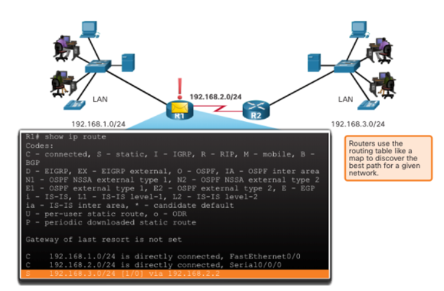
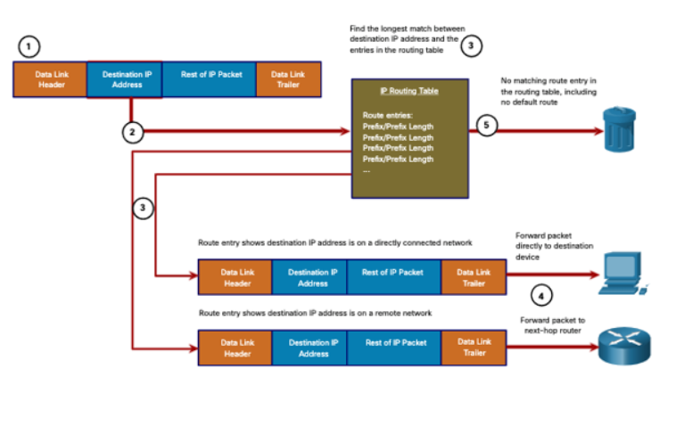
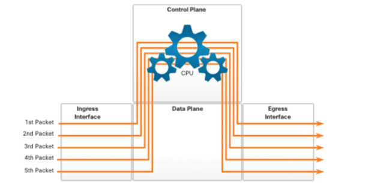
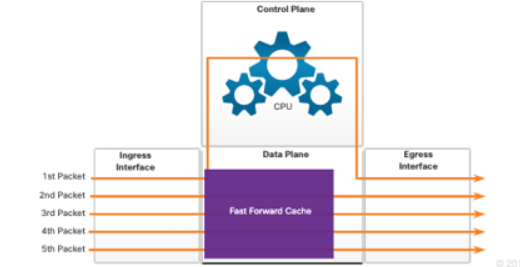
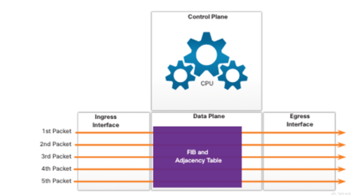
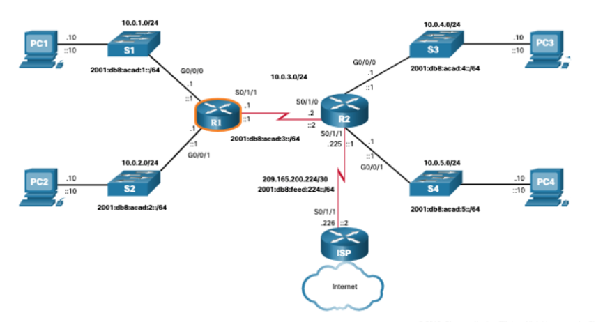
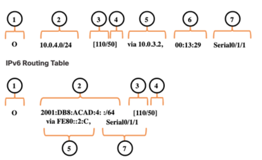
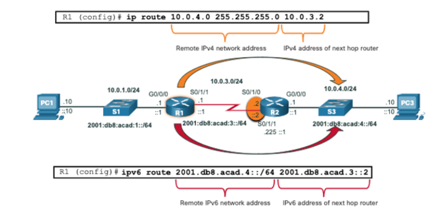
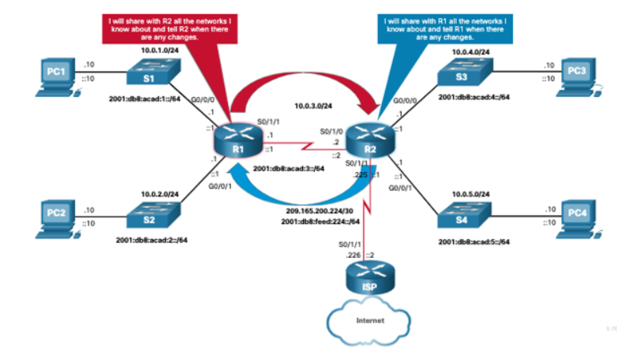
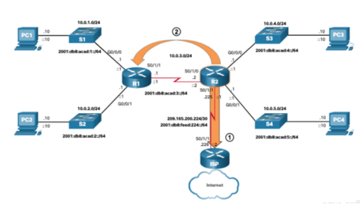

# 14.1 Path Determination

## Two Functions of a Router

- Routers determine how to **forward IP packets** to their destination.  
  - The outgoing interface may lead directly to the **destination** or to another **router/network** along the path.
- Each network usually requires a **separate interface**, but exceptions exist.

### Primary Functions

1. **Determine the best path** to forward packets using the **routing table**  
2. **Forward packets** toward the **destination network**

---

## Router Functions Example ()

- Routers use their **IP routing table** to select a **path (route)**.  
- Example:  
  - **RI** and **R2** each use their **routing tables** to:  
    1. Find the **best path**  
    2. Forward the packet along that path

---

## Best Path Equals Longest Match

- **Best path** = **longest match** in the routing table
- Routing table entries include:
  - **Prefix (network address)**
  - **Prefix length**
- To match a route with a packet's IP:
  - Minimum number of **far-left bits** must match  
  - **Prefix length** determines required matching bits
- **Longest match**:
  - Has the **most far-left matching bits**  
  - **Always preferred**
- **Note:** Prefix length refers to the **network portion** of IPv4 or IPv6 addresses

---

## IPv4 Longest Match Example

- **Destination IP:** `172.16.0.10`

| Route Entry | Prefix Length | Binary Representation               | Match Bits |
|------------|---------------|------------------------------------|-----------|
| 172.16.0.0 | /12           | 10101100.00010000.00000000.00000000 | 12        |
| 172.16.0.0 | /18           | 10101100.00010000.00000000.00000000 | 18        |
| 172.16.0.0 | /26           | 10101100.00010000.00000000.00000000 | 26        |

- **Selected Route:** `172.16.0.0/26` (longest match, preferred route)

---

## IPv6 Longest Match Example

- **Destination IPv6:** `2001::`

| Route Entry | Prefix Length | Matching Bits | Match?             |
|------------|---------------|---------------|------------------|
| 2001::/40  | /40           | 40            | ✅ Match          |
| 2001::/48  | /48           | 48            | ✅ Longest Match  |
| 2001::/64  | /64           | <64           | ❌ No Match       |

- **Selected Route:** `2001::/48` (longest match, preferred route)

---

## Build the Routing Table

### 1. Directly Connected Networks
- Added when:
  - Local interface is configured with **IP address** and **subnet mask**  
  - Interface is **active (up/up)**
- Example: `Gig0/0` with `192.168.1.1/24`

### 2. Remote Networks
- Not directly connected; learned via:
  1. **Static routes** – manually configured  
  2. **Dynamic routing protocols** – learned automatically (e.g., **RIP, OSPF, EIGRP**)

### 3. Default Route
- Used when no specific route matches destination IP
- Can be **static** or **dynamic**
- Prefix:
  - `0.0.0.0/0` for IPv4  
  - `::/0` for IPv6
- No bits need to match
- Known as the **gateway of last resort**

# 14.2 Packet Forwarding

## Packet Forwarding Decision Process ()

1. A **data link frame** carrying an **IP packet** arrives on the **ingress interface**.
2. The router checks the **destination IP address** in the packet header against its **IP routing table**.
3. The router finds the **longest matching prefix** in the routing table.
4. The router **encapsulates the packet** in a new **data link frame** and sends it out the **egress interface**.
   - Destination may be:
     - A device on the network
     - A next-hop router
5. If **no route matches** and **no default route** exists, the packet is **dropped**.

---

## Forwarding to a Directly Connected Device

- If the **egress interface** is a **directly connected network**, the router sends the packet **directly to the destination device**.
- The router determines the **destination MAC address** for the **IP address**.
- Process differs for **IPv4** vs **IPv6**.

---

## Dropping Packets

- If the destination IP **does not match any route** and **no default route** exists:
  - The packet is **dropped**.

---

## End-to-End Packet Forwarding

- Responsible for **encapsulating packets** in the correct **data link frame** for the outgoing interface.
- Examples of frame types:
  - **Serial links:** PPP, HDLC, or other Layer 2 protocols

---

## Packet Forwarding Mechanisms () () ()

- **Goal:** Encapsulate packets efficiently for fast forwarding.
- **Three main mechanisms:**
  1. **Process switching**
  2. **Fast switching**
  3. **Cisco Express Forwarding (CEF)**

---

### 1. Process Switching

- **Older mechanism** on Cisco routers.
- **Steps:**
  1. Packet arrives on an interface.
  2. Sent to **control plane**.
  3. CPU matches **destination IP** in routing table.
  4. Determines **egress interface** and forwards packet.
- **Note:** Done **per packet**, even if multiple packets share the same destination.

---

### 2. Fast Switching

- **Successor to process switching**.
- Uses a **fast-switching cache** to store **next-hop info**.
- **Steps:**
  1. Packet arrives.
  2. CPU checks cache:
     - **Cache hit:** Packet forwarded using cached info (no CPU needed)
     - **Cache miss:** Packet is process-switched; cache is updated.
- **Benefit:** Subsequent packets to the same destination are forwarded **faster**.

---

### 3. Cisco Express Forwarding (CEF)

- **Current default mechanism** in Cisco IOS.
- Builds:
  - **Forwarding Information Base (FIB)**
  - **Adjacency table**
- **Mechanism:**
  - Tables are **change-triggered**, updated when network topology changes.
  - Not **packet-triggered** like fast switching.
- **Benefit:** Efficient, scalable forwarding without per-packet CPU intervention.

# 14.3 Basic Router Configuration Review ()

## Topology
- The example topology will be used for:
  - **Router configuration examples**
  - **Verification examples**
  - Reviewing the **IP routing table** in the next topic

## Filter Command Output
- **Purpose:** Quickly view specific parts of command output.
- **Syntax:** Use a **pipe (`|`)** after a `show` command, followed by a **filter type** and **expression**.

### Filter Types
- `section` – Displays the **entire section** starting from the matching line.
- `include` – Shows only lines that **match** the expression.
- `exclude` – Hides lines that **match** the expression.
- `begin` – Displays all lines **starting from** the matching line.

> Note: Filters can be combined with **any `show` command** for easier output analysis.

# 14.4 IP Routing Table

## Route Sources
A routing table lists routes to known networks (prefixes and prefix lengths). The source of this information comes from:

- Directly connected networks
- Static routes
- Dynamic routing protocols

## Route Codes
| Code | Meaning                                                                 |
|------|-------------------------------------------------------------------------|
| L    | Address assigned to a router interface                                  |
| C    | Directly connected network                                              |
| S    | Static route to a specific network                                      |
| O    | Route learned via OSPF from another router                              |
| *    | Candidate for a default route                                           |

---

## Routing Table Principles
Routing tables follow three main principles, addressed by proper configuration of static or dynamic routing:

| Principle | Explanation | Example |
|-----------|------------|---------|
| Each router makes its decision alone | Router forwards packets based only on its **own routing table** | R1 can only forward packets using its own routing table |
| Routing tables may differ | One router's table may differ from another's | R1 does not know the routes in R2's table |
| Routing info is not bidirectional | Path info does not provide return routing | R1 knows a route to a network via R2, but R2 may not know the return path. |

---

## Routing Table Entries ()
Each routing table entry contains key information used to forward packets:

| Entry Component | Description |
|-----------------|------------|
| **Route source** | How the route was learned (direct, static, dynamic) |
| **Destination network (prefix/length)** | Address of the remote network; prefix length = minimum number of matching left-most bits |
| **Administrative distance** | Trustworthiness of the route; lower values preferred |
| **Metric** | Value to reach the remote network; lower is preferred |
| **Next-hop** | IP of the next router to forward the packet |
| **Route timestamp** | Time since the route was learned |
| **Exit interface** | Egress interface for outgoing packets |

---

## Directly Connected Networks
Routers must have at least one active interface with an IP and subnet mask. This creates a **directly connected route**.

### Key Points
- Added when an interface is **configured and activated**
- **Status codes:**

| Code | Description |
|------|------------|
| C    | Directly connected network |
| L    | Local route for directly connected network |

- **Local route prefix lengths:**  
  - IPv4: /32  
  - IPv6: /128  
- Purpose: quickly determine if a packet is for the router or needs forwarding.

---

## Static Routes
Static routes are **manually configured paths** between devices and are not automatically updated.  

### Primary Uses
1. **Simplified routing** in small networks  
2. **Default routes** to reach networks without a specific match  
3. **Stub networks** accessed by a single route (one neighbor)

---

## Static Routes in the Routing Table ()
- Example: R1 has one LAN attached and static routes to R2 networks:  
  - IPv4: 10.0.4.0/24  
  - IPv6: 2001:db8:acad:4::/64

---

## Dynamic Routing Protocols ()
Dynamic routing protocols allow routers to **automatically share reachability and status information**.

- Key activities:
  - **Network discovery**
  - **Maintaining routing tables** with updated paths

---

## Dynamic Routes in the Routing Table
- Example: Using **OSPF**, R1 dynamically learns networks from R2.  
- Routing table entries include:
  - **Status code:** `O` (OSPF learned)
  - **Next-hop IP** (IPv6 uses link-local address)

> **Note:** OSPF configuration is beyond this course's scope.

---

## Default Route ()
- Specifies the **next-hop router** when no specific route exists.  
- Can be **static** or **dynamic**.  
- Route entries:
  - IPv4: `0.0.0.0/0`  
  - IPv6: `::/0`  
- Meaning: zero bits must match to use this route.

---

## Structure of an IPv4 Routing Table
- Based on **classful addressing**, though modern lookups are classless.
- **Parent route:** classful network, less indented, no source code  
- **Child route:** subnet of a classful network, indented, includes route source and next-hop  
- Directly connected networks are always **child routes** (/32)

---

## Structure of an IPv6 Routing Table
- IPv6 has **no classful addressing**
- Routes are **formatted and aligned consistently**
- No parent/child distinction

---

## Administrative Distance (AD)
- Each network entry appears **once**; may be learned from multiple sources  
- Cisco IOS uses **AD** to determine which route to install  
- **Lower AD = more trustworthy**

### Common AD Values
| Route Source           | AD  |
|------------------------|-----|
| Directly connected     | 1   |
| Static route           | 5   |
| EIGRP summary route    | 20  |
| External BGP           | 90  |
| Internal EIGRP         | 110 |
| OSPF                   | 115 |
| IS-IS                  | 120 |
| External EIGRP         | 170 |
| Internal BGP           | 200 |

# 14.5 Static and Dynamic Routing ()

## Static or Dynamic?
Static and dynamic routing are **not mutually exclusive**. Most networks use a combination of both.

### Common Uses of Static Routes
- **Default route**: Forward packets to a service provider  
- **External routes**: For networks outside the routing domain not learned dynamically  
- **Explicit paths**: When the administrator wants to define a specific path  
- **Stub networks**: Routing between networks with only one neighbor  

### Benefits of Static Routes
- Ideal for **smaller networks** with a single path to external networks  
- Provides **security and control** for specific traffic in larger networks  

---

## Dynamic Routing
Dynamic routing protocols are used in networks with **more than a few routers**. They are **scalable** and can automatically adjust routes when the network topology changes.

### Common Uses of Dynamic Routing
- Networks with multiple routers  
- Automatically determine new paths if topology changes  
- Scalable: automatically learns about newly added networks  

---

## Static vs Dynamic Routing Comparison

| Feature                  | Dynamic Routing                                         | Static Routing                                     |
|--------------------------|--------------------------------------------------------|--------------------------------------------------|
| Configuration Complexity | Independent of network size                             | Increases with network size                      |
| Topology Changes         | Automatically adapts to changes                        | Requires administrator intervention              |
| Scalability              | Suitable for simple to complex topologies             | Suitable for simple topologies                   |
| Security                 | Must be configured                                      | Inherent                                         |
| Resource Usage           | Uses CPU, memory, and link bandwidth                   | No additional resources needed                   |
| Path Predictability       | Depends on topology and routing protocol               | Explicitly defined by the administrator         |

---

## Dynamic Routing Protocol Concepts
A **routing protocol** is a set of processes, algorithms, and messages used to exchange routing information and populate the routing table with the best paths.

### Purpose of Dynamic Routing Protocols
- **Discover remote networks**  
- **Maintain up-to-date routing information**  
- **Choose the best path** to destination networks  
- **Automatically find a new path** if the current path fails  

---

## Main Components of Dynamic Routing Protocols
1. **Data Structures**  
   - Tables or databases stored in **RAM**  

2. **Routing Protocol Messages**  
   - Used to:
     - Discover neighboring routers  
     - Exchange routing information  
     - Maintain accurate network info  

3. **Algorithms**  
   - Step-by-step processes to determine the **best path**  

- The best path is offered to the routing table and installed if **no other route with lower AD exists**.

---

## Best Path
- Selected based on a **metric**, which measures distance to a network  
- **Lowest metric** = best path  

### Common Routing Protocols and Metrics

| Routing Protocol                        | Metric Description |
|----------------------------------------|------------------|
| **RIP**  | Hop count: each router adds 1 hop; max 15 hops |
| **OSPF** | Cost: based on cumulative bandwidth; faster links = lower cost |
| **EIGRP** | Composite metric: slowest bandwidth + delay; can include load & reliability |

---

## Load Balancing
- Occurs when a router has **two or more paths** to a destination with the **same metric**  
- Packets are forwarded using **all equal-cost paths**

### Key Points
- Routing table shows **one destination network** but can list **multiple exit interfaces**  
- Improves **network performance and efficiency** if configured correctly  
- **Dynamic routing protocols** implement equal-cost load balancing automatically  
- **Static routes** can use load balancing if multiple static routes exist to the same destination  
- **Note:** Only **EIGRP** supports **unequal cost load balancing**
