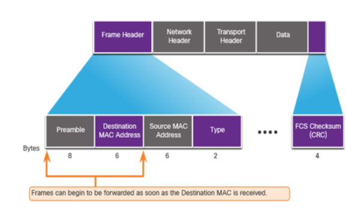
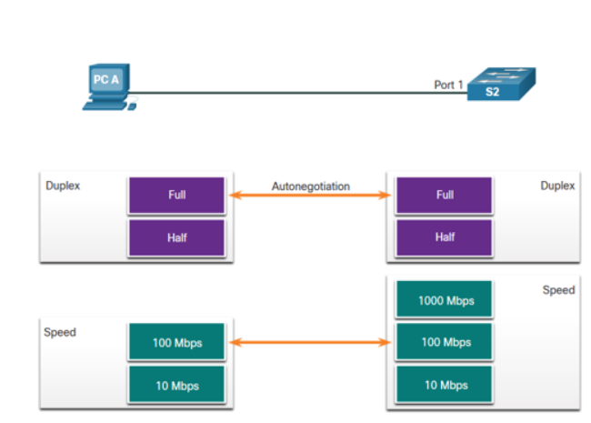

# 2.1 Frame Forwarding

## Switching in Networking ()
* **Ingress:** Frame **entering** a switch.
* **Egress:** Frame **exiting** a switch.
* Forwarding is based on: **Ingress interface** and **Destination MAC address**.
* Uses the **MAC address table** (**CAM table**) to find the egress interface.
* **Key Rule:** Never forward a frame out the same interface it was received on.

***

## The Switch MAC Address Table
* Switch uses **destination MAC address** to find **egress interface**.
* Switch must first **learn** device locations.
* Table is built by recording for every incoming frame:
    * **Source MAC address**.
    * **Ingress Port**.

***

## The Switch Learn and Forward Method
Switches use a simple **two-step process**:

### Step 1: Learn (Examine Source Address)
* **New Address:** Add MAC address + ingress port to the table.
* **Existing Address:** Update/reset the **aging time** (typically **5 minutes**).

### Step 2: Forward (Examine Destination Address)
* **Known Destination (Unicast):** Forward out the **specified egress port**.
* **Unknown Destination (Unicast), Broadcast, or Multicast:** **Flood** out **all interfaces** except the ingress port.

***

## Video: MAC Address Tables on Connected Switches
* **Table Construction:** Switches dynamically **build their MAC address tables** by examining **source MAC addresses**.
* **Frame Forwarding:** Switches use the table to make forwarding decisions based on **destination MAC addresses**.

***

## Switch Forwarding Methods
Uses **ASICs** for decisions. Two methods:

### 1. Store-and-Forward Switching (Cisco's Preferred Method) ()
* **Receives entire frame** before deciding.
* Checks for errors (ensures frame is **valid**).
* **Slower**, guarantees **error-free** transfer.

### 2. Cut-Through Switching (Low Latency) ()
* **Forwards immediately** after reading the **destination MAC address**.
* Starts forwarding **before** the entire frame is received.
* **Faster** (lower latency), but may forward corrupted frames.

***

## Store-and-Forward Switching (Cisco's Preferred Method)
Key features for reliability:

1.  **Error Checking (FCS):** Checks the **Frame Check Sequence (FCS)**. Discards frame if **CRC error** is detected.
2.  **Buffering:** Uses **ingress port buffer** to store frame during error check and handle **port speed differences**.

***

## Cut-Through Switching
Prioritizes speed (low latency).

### Key Characteristics
* **Forwarding Point:** Forwards **immediately** after determining **destination MAC address** and egress port.
* **Latency:** Appropriate for latency **under 10 microseconds**.
* **Error Propagation:** **Does not check FCS**. **Can propagate corrupted frames**.
* **Speed Constraint:** **Cannot support ports with differing speeds** (ports must be same speed).

### Fragment Free Method (Modified Cut-Through)
* Checks destination address and ensures frame is at least **64 bytes long**.
* Purpose: **Eliminate "runts"** (frames under 64 bytes, usually from collisions).

***

# 2.2 Switching Domains

## Collision Domains ()
* **Switches' Role:** **Eliminate collision domains** and **reduce network congestion**.
* **Elimination:** Occurs when link is in **full-duplex** mode. **Each port** in full-duplex is its own collision domain.
* **Existence:** Occurs if link is in **half-duplex**, causing **contention** and possible **collisions**.
* **Duplex Default:** Most modern devices use **auto-negotiation**.

***

## Broadcast Domains ()
* **Definition:** **All devices** on a LAN that receive the same broadcast traffic.
* **Scope:** Extends across **Layer 1 (hubs)** and **Layer 2 (switches)**.
* **Boundary:** Only a **Layer 3 device (router)** will stop or "break" a broadcast domain.
* **Switch Behavior:** Receives a broadcast frame and **floods** it out **all interfaces** except ingress.
* **Performance Risk:** Too many devices cause excessive broadcasts, leading to **congestion** and **poor performance**.

***

## Alleviated Network Congestion
Switches reduce congestion using the **MAC address table** and **full-duplex** operation.

| Feature | Function / Benefit |
| :--- | :--- |
| **Fast Port Speeds** | Supports high speeds (up to 100 Gbps). |
| **Fast Internal Switching** | Uses fast internal bus/shared memory for rapid data transfer. |
| **Large Frame Buffers** | Stores frames temporarily, crucial for high data volume/speed mismatches. |
| **High Port Density** | Keeps traffic local; reduces congestion on uplinks. |