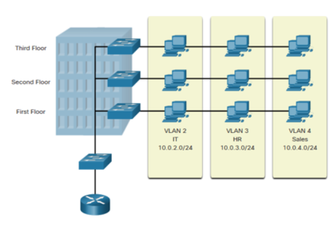
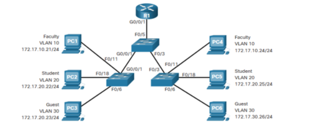
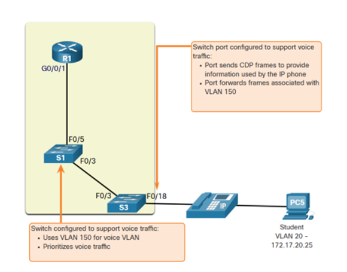
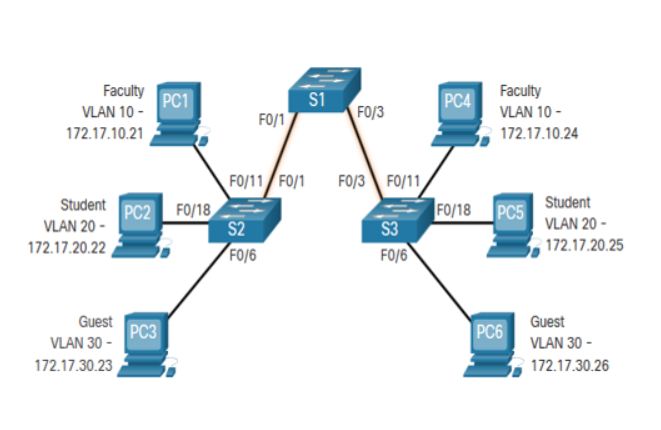
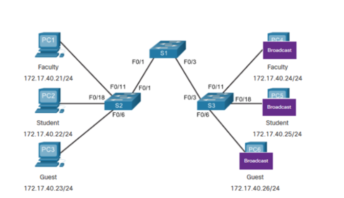
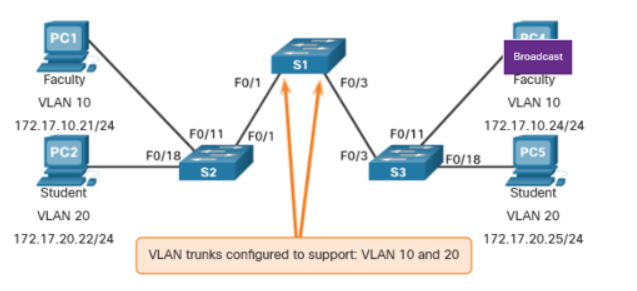
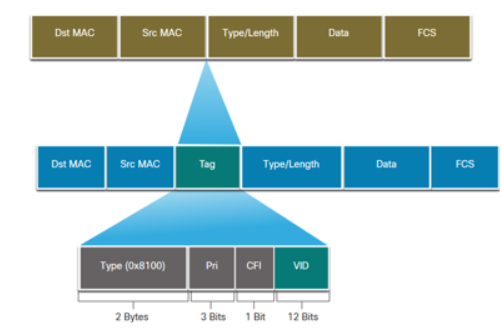
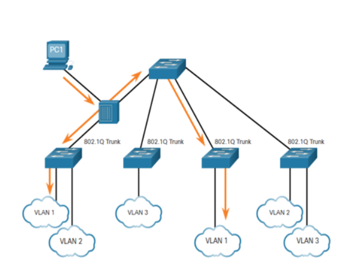
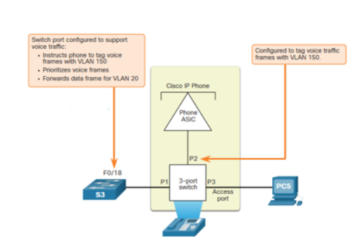

# 3.1 Overview of VLANs

**VLANs (Virtual Local Area Networks)** are **logical groups** of devices (PCs, servers, phones, etc.) that communicate as if they are on the same network, even if they are in different physical locations.

---

## VLAN Definitions ()

VLANs divide devices into smaller groups and provide these benefits:

* **Segmentation & Isolation:** Traffic stays inside its VLAN. To reach other VLANs, a **Layer 3 device** (router or SVI) is required.  
* **IP Addressing:** Each VLAN has its own **unique subnet** (IP address range).  
* **Broadcast Domains:** Each VLAN is its own broadcast domain, which reduces network congestion.  
* **Organization:** Devices are easier to group, manage, and administer.  

---

## Benefits of a VLAN Design ()

VLANs improve traditional flat networks:

| Benefit | Explanation |
|---------|-------------|
| **Smaller Broadcast Domains** | Less unnecessary broadcast traffic. |
| **Improved Security** | Devices in different VLANs are isolated by default. |
| **Improved IT Efficiency** | Devices with similar needs can be grouped together (easier to apply rules). |
| **Reduced Cost** | One physical switch can support multiple VLANs. |
| **Better Performance** | Less broadcast traffic = more bandwidth. |
| **Simpler Management** | Easier to monitor and troubleshoot devices. |

---

## Types of VLANs ()

### Default VLAN

**VLAN 1** is a permanent VLAN on all Cisco switches and cannot be deleted or renamed.  

Roles of VLAN 1:  
* **Default Membership:** All switch ports are in VLAN 1 until reassigned.  
* **Default Native VLAN:** Handles untagged traffic on trunk links.  
* **Default Management VLAN:** Used for managing the switch (e.g., assigning an IP address).  
* **Permanent:** VLAN 1 cannot be removed.  

> **Best Practice:** Do not use VLAN 1 for Native or Management VLAN. Use a different VLAN (for example, VLAN 99).  

---

### Data VLAN
* **Purpose:** Carries normal user traffic (web, email, file transfers).  
* **Default:** VLAN 1 is the default Data VLAN.  

---

### Native VLAN
* **Purpose:** Used only on trunk links (802.1Q).  
* **Function:** The only traffic that crosses the trunk untagged. All other VLANs are tagged.  

---

### Management VLAN
* **Purpose:** Used for remote management of switches (SSH/Telnet).  
* **Configuration:** This VLAN hosts the switch’s **SVI (Switched Virtual Interface)** with an IP address.  
* **Security Note:** Keep it separate from normal user traffic.  

---

### Voice VLAN
* **Purpose:** Dedicated for IP phones and voice traffic.  
* **Requirements:**  
  - **High QoS Priority:** Voice traffic must be prioritized over data.  
  - **Low Delay:** End-to-end delay must be less than 150 ms.  
  - **Assured Bandwidth:** Enough capacity to avoid dropped calls.  
* **Note:** The entire network must be configured to support QoS and bandwidth for Voice VLAN.  

# 3.2 VLANs in a Multi-Switched Environment

---

## Defining VLAN Trunks ()

A **trunk** is a high-bandwidth **point-to-point link** between two network devices (usually switches, or a switch and a router).

Functions of a Cisco trunk:  
* **Allow Multiple VLANs:** A trunk lets traffic from more than one VLAN cross a single physical link.  
* **Extend VLANs:** A VLAN can span multiple interconnected switches.  
* **Default Behavior:** By default, a trunk carries traffic for all VLANs.  
* **Protocol:** Trunks use the **802.1Q protocol** for VLAN tagging.  

---

## Networks without VLANs ()

In a **flat network** (no VLANs):  
* All devices are in one large **broadcast domain**.  
* Every device receives all unicast, multicast, and broadcast traffic.  
* This creates unnecessary traffic, reduces bandwidth, and lowers performance.  

---

## Networks with VLANs ()

In a network **with VLANs**:  
* **Traffic Confinement:** Traffic (unicast, multicast, broadcast) is limited to its VLAN.  
* **No Direct Communication:** Devices in different VLANs cannot talk to each other directly.  
* **Inter-VLAN Routing:** A **Layer 3 device** (router or SVI) is required for communication between VLANs.  

---

## VLAN Identification with a Tag ()

VLAN tagging follows the **IEEE 802.1Q standard** to show which VLAN a frame belongs to across a trunk link.

* **802.1Q Tag:** Inserted into the Ethernet frame header, 4 bytes long.  
* **FCS Recalculation:** Adding/removing the tag requires recalculating the Frame Check Sequence (FCS).  
* **Tag Removal:** The tag is removed before reaching the end device, restoring the original FCS.  

---

### 802.1Q VLAN Tag Field Breakdown

| Field | Function | Size |
|-------|----------|------|
| **Type (TPID)** | Tag Protocol Identifier. Marks the frame as 802.1Q tagged (value = **0x8100**). | 2 bytes |
| **User Priority** | A 3-bit field used for **QoS prioritization**. | 3 bits |
| **Canonical Format Identifier (CFI)** | 1-bit field, originally for token ring support. | 1 bit |
| **VLAN ID (VID)** | VLAN Identifier. 12-bit value supporting up to **4096 VLANs** ($2^{12}$). | 12 bits |

---

## Native VLANs and 802.1Q Tagging ()

### 802.1Q Trunk Basics
* **Tagging Default:** Frames for most VLANs are tagged with 802.1Q headers.  
* **Native VLAN Purpose:** Supports older devices that cannot handle tags.  
* **Default:** Native VLAN = VLAN 1 (unless changed).  
* **Requirement:** Both ends of a trunk must use the same Native VLAN ID to avoid errors and security issues.  
* **Per-Trunk Setting:** Different trunk links can use different Native VLANs.  

---

## Voice VLAN Tagging ()

Voice traffic requires a dedicated VLAN and prioritization (QoS).  

### VoIP Phone as a 3-Port Switch
A VoIP phone functions like a mini 3-port switch:  
1. One port connects to the wall (switch).  
2. One port connects to the PC.  
3. One internal port is for the phone.  

Key points:  
* **VLAN Discovery:** The switch tells the phone which VLAN ID to use for voice traffic using **CDP (Cisco Discovery Protocol)**.  
* **Voice Traffic:** The phone **tags its own traffic** with the Voice VLAN ID and a **CoS (Class of Service)** priority.  
* **PC Traffic:** The phone may pass PC traffic either **tagged** or **untagged**, depending on configuration.  

---

### Traffic Handling on the Phone Port

| Traffic Type | Destination VLAN | Tagging Function |
|--------------|------------------|------------------|
| **Voice** | Voice VLAN | Tagged with VLAN ID + CoS (priority). |
| **Data (from PC)** | Access VLAN | Tagged with VLAN ID + optional CoS. |
| **Data (from PC)** | Access VLAN | Sent untagged (no VLAN ID or CoS). |

---

## Voice VLAN Verification Example

Command to check Data VLAN and Voice VLAN configuration on an interface:

# 3.3 VLAN Configuration ()

---

## VLAN Ranges on Catalyst Switches

Cisco Catalyst switches (like the 2960 and 3650) can support over **4000 VLANs**. These are divided into two ranges:

| Feature | Normal Range VLANs | Extended Range VLANs |
|---------|------------------|--------------------|
| **VLAN IDs** | 1 to 1005 | 1006 to 4095 |
| **Typical Use** | Small to medium-sized businesses | Large enterprises and Service Providers |
| **Storage** | Stored in the **`vlan.dat`** file in Flash memory | Stored in the **`running-config`** file |
| **Reserved IDs** | 1002 - 1005 reserved for legacy networks (Token Ring/FDDI) | None |
| **Deletion Status** | 1 and 1002-1005 are auto-created and cannot be deleted | Can be created and deleted |
| **VTP Support** | Fully supported. **VTP** (VLAN Trunking Protocol) can synchronize these VLANs between switches | Requires specific VTP settings (VTP V3) and supports fewer VLAN features |

---

## VLAN Creation Commands

VLAN details are stored in the **`vlan.dat`** file in Flash memory. VLANs are created in **Global Configuration Mode**.

| Task | IOS Command Sequence | Notes |
|------|--------------------|-------|
| Enter Global Configuration Mode | `Switch# configure terminal` | Starts configuration session |
| Create VLAN | `Switch(config)# vlan [vlan-id]` | Creates VLAN (e.g., `vlan 20`) and enters VLAN Configuration Mode |
| Specify Name | `Switch(config-vlan)# name [vlan-name]` | Assigns a descriptive name (e.g., `name Faculty`) |
| Return to Privileged EXEC Mode | `Switch(config-vlan)# end` | Exit configuration mode |

---

## LAN Port Assignment Commands

Once a VLAN is created, assign it to specific switch interfaces (**access ports**) for end devices.

| Task | IOS Command | Purpose |
|------|------------|--------|
| Enter Global Configuration Mode | `Switch# configure terminal` | Start configuration |
| Enter Interface Configuration Mode | `Switch(config)# interface [interface-id]` | Select port (e.g., `fa0/1`) |
| Set Port Mode | `Switch(config-if)# switchport mode access` | Make port an access port |
| Assign Port to VLAN | `Switch(config-if)# switchport access vlan [vlan-id]` | Assign to Data VLAN (e.g., VLAN 20) |
| Return to Privileged EXEC Mode | `Switch(config-if)# end` | Exit configuration mode |

---

## VLAN Port Assignment Example

Assign access port **FastEthernet 0/18** to **VLAN 20**:

| Prompt | Command | Purpose |
|--------|---------|--------|
| `S1#` | `configure terminal` | Enter Global Configuration mode |
| `S1(config)#` | `interface fa0/18` | Select interface |
| `S1(config-if)#` | `switchport mode access` | Set port as access port |
| `S1(config-if)#` | `switchport access vlan 20` | Assign port to VLAN 20 |
| `S1(config-if)#` | `end` | Exit to privileged EXEC mode |

> **Note:** End device must use an IP address in VLAN 20’s subnet (e.g., `172.17.20.x`).

---

## Data and Voice VLANs ()

* An access port can have **only one Data VLAN**.  
* The same port can also have **one Voice VLAN** for IP phones.  
* This is used when a **PC and an IP phone** share the same port (PC plugs into the phone).  
* The switch treats the port as a **trunk**, carrying:  
  - Tagged **Voice VLAN** traffic  
  - Untagged **Data VLAN** traffic

---

## Data and Voice VLAN Example

Steps to configure a port for both a PC (Data) and an IP phone (Voice):

1. Create and name both **Data VLAN** and **Voice VLAN** (if not already present).  
2. Assign the port to the **Data VLAN**.  
3. Assign the **Voice VLAN** explicitly.  
4. Enable **QoS trust** for voice frames to ensure low latency.

### Example Commands (Conceptual)

| Task | IOS Command | Notes |
|------|------------|-------|
| Assign Voice VLAN | `Switch(config-if)# switchport voice vlan [vlan-id]` | Dedicated Voice VLAN |
| Enable QoS Trust | `Switch(config-if)# mls qos trust [option]` | Trust CoS markings from phone |

> *(Note: Full `mls qos` details are beyond basic CCNA scope.)*

---

## Verify VLAN Information

Command: `show vlan`  

**Syntax:**  
show vlan [brief | id vlan-id | name vlan-name | summary]

| Task | Option | Purpose |
|------|--------|--------|
| Display basic status | `brief` | Shows VLAN name, status, and associated ports |
| Filter by VLAN ID | `id [vlan-id]` | Displays info for specific VLAN ID |
| Filter by VLAN Name | `name [vlan-name]` | Displays info for specific VLAN name |
| Display summary | `summary` | Shows active VLAN count and total VLANs configured |

---

## Change VLAN Port Membership

Two methods to change the Data VLAN of an access port:

1. **Reassign VLAN:**  
switchport access vlan [new-vlan-id]

Example: Move port from VLAN 20 → VLAN 30

2. **Return to Default VLAN (VLAN 1):**  
no switchport access vlan

Removes current VLAN assignment, returning to default VLAN 1.

### Verification Commands
* `show vlan brief`  
* `show interface [interface-id] switchport`

---

## Delete VLANs

### Deleting Specific VLANs
* Command: `no vlan [vlan-id]` (Global Config Mode)  
* **Caution:** Reassign all member ports before deletion to prevent them from going inactive.

### Deleting All VLANs (Restoring Defaults)
* Command: `delete flash:vlan.dat` or `delete vlan.dat`  
* Deletes all **Normal Range VLANs** (2-1001)  
* Must **reload switch** (`reload`) for changes to take effect

#### Factory Reset Steps
1. Unplug all data cables  
2. Erase startup configuration: `erase startup-config`  
3. Delete `vlan.dat` file  
4. Reload the switch: `reload`

# 3.4 VLAN Trunks

---

## Trunk Configuration Commands

Trunks are **Layer 2 links** designed to carry traffic for **multiple VLANs** over a single cable.

| Task | IOS Command | Purpose |
|------|------------|--------|
| Enter Global Configuration Mode | `Switch# configure terminal` | Start configuration session |
| Enter Interface Configuration Mode | `Switch(config)# interface [interface-id]` | Select the port to be configured as a trunk |
| Set Trunk Mode | `Switch(config-if)# switchport mode trunk` | Permanently enable the link as an 802.1Q trunk |
| Set Native VLAN | `Switch(config-if)# switchport trunk native vlan [vlan-id]` | Set Native VLAN to a number other than VLAN 1 (best practice) |
| Filter Allowed VLANs | `Switch(config-if)# switchport trunk allowed vlan [vlan-list]` | Security measure: Specify which VLANs can traverse the trunk |
| Return to Privileged EXEC Mode | `Switch(config-if)# end` | Save and exit configuration mode |

---

## Trunk Configuration Example ()

This example configures port **Fa0/1** on switch S1 as a trunk link using 802.1Q tagging.

**VLAN Subnets:**
* VLAN 10: Faculty/Staff - 172.17.10.0/24  
* VLAN 20: Students - 172.17.20.0/24  
* VLAN 30: Guests - 172.17.30.0/24  
* VLAN 99: Native - 172.17.99.0/24  

| Prompt | Command | Purpose |
|--------|---------|--------|
| `S1(config)#` | `interface fa0/1` | Select FastEthernet 0/1 interface |
| `S1(config-if)#` | `switchport mode trunk` | Set port as trunk (802.1Q) |
| `S1(config-if)#` | `switchport trunk native vlan 99` | Set VLAN 99 as Native VLAN (untagged traffic) |
| `S1(config-if)#` | `switchport trunk allowed vlan 10,20,30,99` | Filter trunk to allow only these VLANs |
| `S1(config-if)#` | `end` | Exit and apply configuration |

> **Note:** On Layer 3 switches, the command `switchport trunk encapsulation dot1q` may be required.

---

## Verify Trunk Configuration

Primary command:  
show interfaces [interface-id] switchport

Checks:

* **Trunk Status:**
  * Port is **trunk administratively** (configured).  
  * Port is **trunk operationally** (functioning).  
* **Encapsulation:** Confirmed as **dot1q (802.1Q)**.  
* **Native VLAN:** Correctly set (e.g., VLAN 99).  
* **VLAN Allowed List:** By default, all VLANs are allowed unless filtered with `switchport trunk allowed vlan`.

---

## Reset the Trunk to the Default State

Restore trunk settings to factory defaults using the `no` form of the commands.

| Default Setting | Result |
|----------------|--------|
| Allowed VLANs | All VLANs on the switch are allowed to pass traffic |
| Native VLAN | Reverts to VLAN 1 |

### Verification

Use:
show interfaces [interface-id] switchport

Example: `sh int fa0/1 switchport`  

* Confirms **Native VLAN = 1**  
* Confirms **Allowed VLANs = 1-4094**

---

## Change Trunk Back to Access Port

To convert a trunk port to a standard access port:

* **Command:** `switchport mode access` (interface configuration mode)  
* **Result:**
  * Port is **access interface administratively**.  
  * Port is **access interface operationally**.  
* **Verification:** Use `show interfaces [interface-id] switchport` to confirm both modes show `access`.

# 3.5 Introduction to DTP

**Dynamic Trunking Protocol (DTP)** is a Cisco-proprietary protocol used to automatically negotiate the trunking state of a link.

---

## DTP Characteristics

* **Default Status:** DTP is **on by default** on Cisco Catalyst switches (like the 2960/2950).  
* **Default Mode:** Interface default mode is **`dynamic auto`**.  
* **Disabling DTP:** Use `switchport nonegotiate` in interface configuration mode to turn DTP off.  
* **Re-enabling DTP:** Set interface mode to **`switchport mode dynamic auto`**.  
* **Avoiding Negotiation Issues:** Use **static mode** (`switchport mode trunk` or `switchport mode access`) for stability.

| Command | Purpose |
|---------|--------|
| `switchport mode trunk` | Forces port into permanent trunk mode (static trunk) |
| `switchport nonegotiate` | Disables DTP; stops sending negotiation frames |
| `switchport mode dynamic auto` | Passively waits for remote side to initiate trunking (DTP enabled) |

---

## Negotiated Interface Modes

The `switchport mode` command determines an interface’s behavior for trunk negotiation via **DTP**.

| Mode Option | Description | Resulting Link State |
|-------------|------------|-------------------|
| **access** | Forces port into **permanent access mode**; tries to negotiate neighbor into access | **Access** (No Trunk) |
| **dynamic auto** | Default DTP state; **passively** waits for remote port to initiate trunk | **Trunk** if remote is `trunk` or `desirable`; else **Access** |
| **dynamic desirable** | **Actively** tries to form a trunk by sending DTP frames | **Trunk** if remote is `trunk`, `desirable`, or `auto`; else **Access** |
| **trunk** | Forces port into **permanent trunk mode**; tries to negotiate neighbor into trunk | **Trunk** (Always) |

> **Tip:** Use `switchport nonegotiate` to turn off DTP for a predictable, static link.

---

## Results of a DTP Configuration

This table shows the resulting link state (Trunk or Access) when two Cisco switch ports running **DTP** are connected.

| Local Mode | Remote Access | Remote Dynamic Auto | Remote Dynamic Desirable | Remote Trunk |
|------------|----------------|------------------|------------------------|--------------|
| **Access** | Access | Access | Access | Limited Connectivity |
| **Dynamic Auto** | Access | Access | Trunk | Trunk |
| **Dynamic Desirable** | Access | Trunk | Trunk | Trunk |
| **Trunk** | Limited Connectivity | Trunk | Trunk | Trunk |

---

### Key Takeaways

* **Access-to-Trunk:** Connecting a permanent **Access** port to a permanent **Trunk** port results in **Limited Connectivity**.  
* **Dynamic Auto (Passive):** Forms a **Trunk** only if the remote side actively initiates (`dynamic desirable` or `trunk`).  
* **Dynamic Desirable (Active):** Will form a **Trunk** with any remote mode except `access`.  