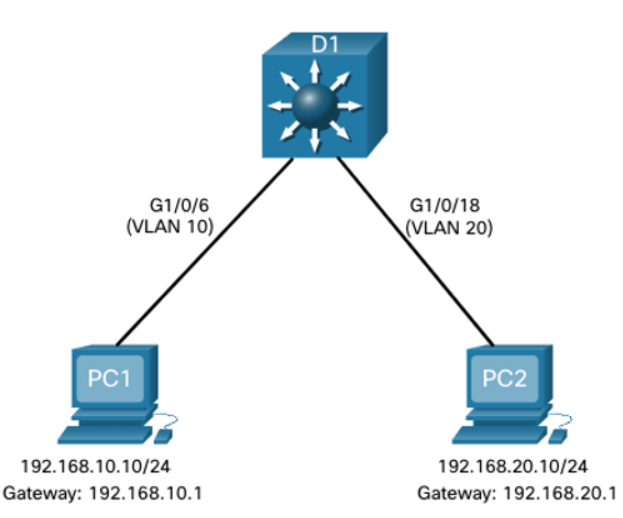

# 4.1 Inter-VLAN Routing Operation ()

---

## What is Inter-VLAN Routing?

* **VLAN Segmentation:** VLANs divide a Layer 2 switched network into separate broadcast domains.  
* **Communication Barrier:** Hosts in one VLAN **cannot communicate** with hosts in another VLAN unless a **router** or **Layer 3 switch** provides routing.  
* **Definition:** **Inter-VLAN routing** is the process of forwarding traffic from one VLAN to another VLAN.

---

## Inter-VLAN Routing Options

There are three main methods for routing between VLANs:

1. **Legacy Inter-VLAN Routing**
   * **Method:** Uses one physical router interface for **each VLAN**.  
   * **Scaling:** Not scalable due to high cost and port usage.

2. **Router-on-a-Stick**
   * **Method:** Uses a **single physical router interface** connected to a switch **trunk port**.  
     The interface is divided into multiple **subinterfaces**, one per VLAN.  
   * **Scaling:** Suitable for **small to medium-sized networks**.

3. **Layer 3 Switch using SVIs**
   * **Method:** Uses a **Layer 3 switch** with Switched Virtual Interfaces (**SVIs**).  
     An SVI is created for each VLAN, providing internal routing.  
   * **Scaling:** Most scalable solution for **medium to large organizations**.

---

## Legacy Inter-VLAN Routing

Legacy Inter-VLAN Routing was the first method used to connect VLANs:

* **Method:** Required a router with **multiple physical Ethernet interfaces**.  
* **Connection:** Each router interface connected to a dedicated **switch port** on a **unique VLAN**.  
* **Function:** The router interface acted as the **default gateway** for hosts on that VLAN's subnet.

---

## Limitation (Why it's Obsolete)

* **Not Scalable:** Requires **one physical router interface per VLAN**.  
* **Interface Exhaustion:** Routers have limited ports, quickly exhausting available interfaces.  

> **Note:** This method is **no longer implemented** in modern switched networks and is included only for historical context.


# 4.2 Router-on-a-Stick Inter-VLAN Routing ()

---

The **Router-on-a-Stick** method is an efficient solution that overcomes the physical port limitation of legacy inter-VLAN routing.

* **Requirement:** Uses only **one physical Ethernet interface** on a router to route traffic for multiple VLANs.  
* **Connection:** The single router interface connects to a **trunk port** on a Layer 2 switch.  
* **Subinterfaces:** The physical interface is logically divided into multiple **subinterfaces**.  
  * Each subinterface is associated with a **single VLAN ID** and configured with an **IP address** that serves as the **default gateway** for that VLAN's subnet.  
  * The command `encapsulation dot1q [vlan-id]` assigns the VLAN tag to the subinterface.

---

## How Traffic is Routed

1. **Ingress:** VLAN-tagged traffic enters the router's physical interface (trunk port).  
2. **Mapping:** Traffic is forwarded to the correct **subinterface** based on the VLAN tag.  
3. **Routing Decision:** The router determines the destination IP address.  
4. **Egress:** If exiting to another subinterface on the same physical link, the router **re-tags** the frame with the destination VLAN ID.

> **Note:** Suitable for small to medium networks, but **does not scale well beyond 50 VLANs** due to CPU overhead.

---


# 4.3 Inter-VLAN Routing on a Layer 3 Switch ()

The modern and scalable method uses **Layer 3 switches** and **Switched Virtual Interfaces (SVIs)**.

---

## Switched Virtual Interface (SVI)

* **Definition:** An SVI is a **virtual interface** on a Layer 3 switch providing Layer 3 processing for a VLAN.  
* **Function:** Acts as the **default gateway** for devices in that VLAN.  
* **Routing:** Traffic is routed internally, without leaving the switch.

---

## Layer 3 Switch ()

* **Terminology:** Also called a **multilayer switch**—operates at **Layer 2** (switching) and **Layer 3** (routing).  
* **Scaling:** Using SVIs is **highly scalable** due to hardware-based routing.

---

## Inter-VLAN Routing on a Layer 3 Switch (Cont.)

* **SVI Function:** Each VLAN requiring routing gets an SVI, which provides Layer 3 functionality similar to a router interface.  
* **Layer 3 Processing:** SVI handles all packets to/from its VLAN ports internally.

---

## Advantages of Layer 3 Inter-VLAN Routing

* **Speed:** Routing is faster, performed in **hardware (ASICs)**.  
* **No External Links:** Eliminates the need for an external router.  
* **Scalability/Bandwidth:** Multiple **EtherChannels** can increase trunk bandwidth.  
* **Low Latency:** Traffic stays inside the switch fabric.  
* **Deployment:** Commonly used in campus LAN cores.

---

## Disadvantage

* **Cost:** Layer 3 switches are generally **more expensive** than Layer 2 switches.

---

# 4.4 Troubleshoot Inter-VLAN Routing

## Common Inter-VLAN Issues

Inter-VLAN connectivity problems are usually related to network **connectivity issues**. Before troubleshooting, always check the **physical layer** to ensure cables are connected to the correct ports.  

If physical connections are correct, the following table summarizes common reasons why inter-VLAN communication may fail and how to fix them.

| Issue Type | How to Fix | How to Verify |
|-----------|------------|---------------|
| **Missing VLANs** | Create or re-create the VLAN if it does not exist. Assign host ports to the correct VLAN. Ensure trunks are configured correctly. | `show vlan [brief]`<br>`show interfaces switchport` |
| **Switch Trunk Port Issues** | Ensure the port is a **trunk port** and enabled. Assign correct VLANs to access ports. | `show interface trunk`<br>`show running-config` |
| **Switch Access Port Issues** | Ensure the port is an **access port** and enabled. Verify host is configured in the correct subnet. | `show interfaces switchport`<br>`ipconfig` |
| **Router Configuration Issues** | Make sure router subinterface is assigned to the correct VLAN and configured with the correct IPv4 address. | `show running-config interface`<br>`show ip interface brief`<br>`ping` |

---

## Tips

* Always start troubleshooting from the **physical layer** and move upward.
* Verify **VLAN assignments** on both switches and hosts.
* Check **router subinterfaces** and IP addressing.
* Use the commands listed in the table to verify configuration and connectivity.


## Troubleshoot Inter-VLAN Routing Scenario ()

Examples of some of these inter-VLAN routing problems will now be covered in more detail.  
This topology will be used for all of these issues.

## Router RI Subinterfaces

| Subinterface   | VLAN | IP Address        |
|----------------|------|-----------------|
| G0/0/0.10      | 10   | 192.168.10.1/24 |
| G0/0/0.20      | 20   | 192.168.20.1/24 |
| G0/0/0.30      | 99   | 192.168.99.1/24 |


## Missing VLANs

An inter-VLAN connectivity issue could be caused by a **missing VLAN**. The VLAN could be missing if:

* It was **not created**.
* It was **accidentally deleted**.
* It is **not allowed on the trunk link**.

**Important:** When a VLAN is deleted, any ports assigned to that VLAN become **inactive**. These ports remain associated with the VLAN (and inactive) until you either:

* Assign them to a **new VLAN**, or  
* **Recreate the missing VLAN**. Recreating the VLAN automatically reassigns the hosts to it.

**Verification:** Use the following command to check VLAN membership of a port:

```bash
show interface [interface-id] switchport
```

## Switch Trunk Port Issues

Another issue for inter-VLAN routing includes **misconfigured switch ports**. 

- In a **legacy inter-VLAN solution**, this could happen if the connecting **router port** is not assigned to the correct VLAN.  
- In a **Router-on-a-Stick solution**, the most common cause is a **misconfigured trunk port**.

**Verification Steps:**

1. Ensure the port connecting to the router is correctly configured as a **trunk link**:

```bash
show interface trunk
show running-config interface [interface-id]
```

## Switch Access Port Issues

- **Problem:** Access port misconfiguration can prevent VLAN connectivity.
- **Symptom:** PC has correct IP, subnet mask, and gateway but cannot ping the gateway.
- **Verification Commands:**
  - `show vlan brief` → check VLANs
  - `show interface [X] switchport` → check port VLAN assignment
  - `show running-config interface [X]` → see port config


## Router Configuration Issues

- **Problem:** Router-on-a-stick subinterfaces may be misconfigured.
- **Verification:**
  - `show ip interface brief` → check subinterface status
  - `show interfaces` → see VLAN assignments  
    *Tip:* Use filters like `| include Gig` or `| include 802.1Q` to reduce output and focus on relevant info.