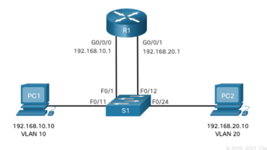
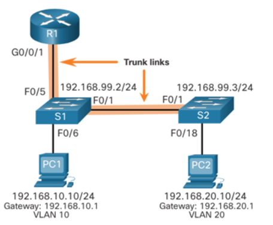
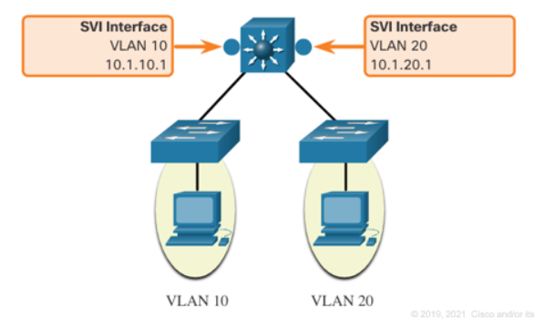
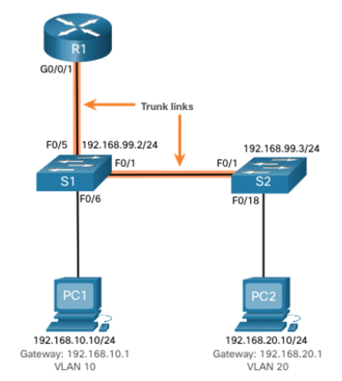

# 4.1 Inter-VLAN Routing Operation ()

---

## What is Inter-VLAN Routing?
- **VLAN Segmentation:** Divides a Layer 2 network into separate broadcast domains  
- **Communication Barrier:** Hosts in different VLANs **cannot communicate directly**  
- **Definition:** Forwarding traffic **between VLANs** using a router or Layer 3 switch

---

## Inter-VLAN Routing Methods

1. **Legacy Inter-VLAN Routing**
   - **Uses:** One physical router interface per VLAN  
   - **Scaling:** Not scalable, uses many ports, high cost

2. **Router-on-a-Stick**
   - **Uses:** Single router interface with **subinterfaces** per VLAN  
   - **Connection:** Router connects to a switch trunk port  
   - **Scaling:** Suitable for small/medium networks

3. **Layer 3 Switch with SVIs**
   - **Uses:** Layer 3 switch with **Switched Virtual Interfaces (SVIs)** per VLAN  
   - **Routing:** Switch routes internally between VLANs  
   - **Scaling:** Best for medium/large networks

---

## Legacy Inter-VLAN Routing Details
- **Method:** Router with multiple physical Ethernet interfaces  
- **Connection:** Each router interface links to one VLAN via switch port  
- **Role:** Acts as **default gateway** for VLAN subnet  

---

## Limitations of Legacy Method
- **Not Scalable:** One interface per VLAN quickly exhausts router ports  
- **Obsolete:** Modern networks prefer **Router-on-a-Stick** or **Layer 3 Switch SVIs**

# 4.2 Router-on-a-Stick Inter-VLAN Routing ()

---

## Overview
- **Router-on-a-Stick:** Routes multiple VLANs using **one physical router interface**  
- **Purpose:** Overcomes port limitations of legacy inter-VLAN routing  
- **Connection:** Router interface → switch **trunk port**  
- **Subinterfaces:** Logical divisions of physical interface, one per VLAN  
  - Each subinterface has **VLAN ID** and **IP address** (default gateway)  
  - Use command: `encapsulation dot1q [vlan-id]` to assign VLAN tag  

---

## How Traffic is Routed
1. **Ingress:** VLAN-tagged frames arrive on router's physical interface  
2. **Mapping:** Router forwards traffic to the correct **subinterface** based on VLAN tag  
3. **Routing Decision:** Router checks **destination IP**  
4. **Egress:** Router **re-tags frame** with destination VLAN ID if sending back to switch  

> **Note:** Efficient for small/medium networks; **high CPU overhead** limits scaling beyond ~50 VLANs

# 4.3 Inter-VLAN Routing on a Layer 3 Switch ()

# 4.4 Troubleshoot Inter-VLAN Routing

## Common Inter-VLAN Issues

Inter-VLAN connectivity problems are usually caused by network **connectivity issues**. Always start troubleshooting by checking the **physical layer** (cables, connections, ports).

If physical connections are correct, check these common issues:

| Issue Type | How to Fix | How to Verify |
|-----------|------------|---------------|
| **Missing VLANs** | Create or recreate the VLAN if it doesn’t exist. Assign host ports to the correct VLAN. Ensure trunk ports allow the VLAN. | `show vlan [brief]`<br>`show interfaces switchport` |
| **Switch Trunk Port Issues** | Make sure the port is a **trunk port** and enabled. Verify allowed VLANs on the trunk. | `show interface trunk`<br>`show running-config` |
| **Switch Access Port Issues** | Ensure the port is an **access port** and enabled. Verify the host is in the correct subnet. | `show interfaces switchport`<br>`ipconfig` |
| **Router Configuration Issues** | Verify router subinterfaces are assigned to correct VLANs with correct IPv4 addresses. | `show running-config interface`<br>`show ip interface brief`<br>`ping` |

---

## Troubleshooting Tips

* Start from the **physical layer** and move upward.
* Verify **VLAN assignments** on switches and hosts.
* Check **router subinterfaces** and IP addresses.
* Use verification commands from the table to confirm configuration and connectivity.

---

## Example Scenario ()

We will use this topology to demonstrate inter-VLAN routing problems.

### Router RI Subinterfaces

| Subinterface   | VLAN | IP Address        |
|----------------|------|-----------------|
| G0/0/0.10      | 10   | 192.168.10.1/24 |
| G0/0/0.20      | 20   | 192.168.20.1/24 |
| G0/0/0.30      | 99   | 192.168.99.1/24 |

---

## Missing VLANs

**Causes:**  

* VLAN not created  
* VLAN accidentally deleted  
* VLAN not allowed on the trunk  

**Important:** Deleted VLANs make associated ports **inactive**. To fix:

* Assign ports to a **new VLAN**, or  
* **Recreate the missing VLAN** (automatically reassigns hosts).

**Verification Command:**

```bash
show interface [interface-id] switchport
```

## Switch Trunk Port Issues

**Problem:** Misconfigured switch ports can prevent inter-VLAN routing.

**Legacy Solution:** Router port may be assigned to the wrong VLAN.

**Router-on-a-Stick:** Trunk port misconfiguration is the most common cause.

**Verification Steps:**

```bash
show interface trunk
show running-config interface [interface-id]
```