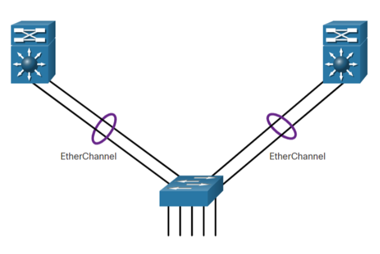
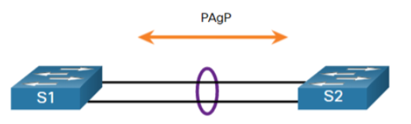
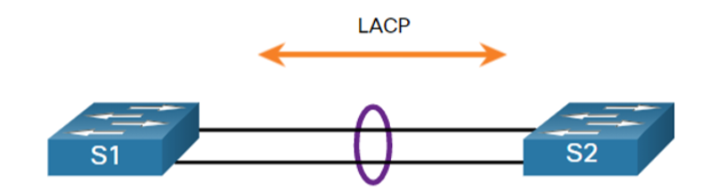

# 6.1 EtherChannel Operation ()

## Link Aggregation
- **Problem:** Single link may not provide enough **bandwidth or redundancy**; STP **blocks redundant links**.
- **Solution:** Use multiple links grouped into **one logical link** with EtherChannel.

## EtherChannel Overview
- Cisco technology for **switch-to-switch LAN connections**.
- Groups multiple **Fast/Gigabit Ethernet ports** into a **port channel** (logical interface).
- **Port channel:** Virtual interface representing bundled physical links.

## Benefits
- **Fault Tolerance:** Backup links remain active if one fails.
- **Load Balancing:** Traffic shared across all links.
- **Increased Bandwidth:** Combined speed of all links.
- **Redundancy:** Prevents STP from blocking needed links.

## Advantages
- **Simplified configuration:** Configure the EtherChannel interface, not each port.
- **Cost-effective:** Uses existing ports, no need for expensive upgrades.
- **Logical aggregation:** STP sees multiple links as one.
- **Topology stability:** Physical link failure does not change logical topology.

## Restrictions
- **No mixed interface types:** Fast Ethernet + Gigabit Ethernet cannot mix.
- **Max 8 ports per channel:** Fast = 800 Mbps, Gigabit = 8 Gbps.
- **Switch limits:** E.g., Cisco Catalyst 2960 supports up to 6 EtherChannels.
- **Consistent configuration:** Speed, duplex, VLAN, and trunking must match.
- **Port channel config overrides member ports:** Direct changes to members may cause issues.

## Negotiation Protocols
- **PAgP:** Cisco proprietary.
- **LACP:** IEEE 802.3ad, multi-vendor compatible.
- **Static EtherChannel:** Can configure manually without negotiation.

## PAgP Overview ()
- **Auto-negotiation protocol** for automatic EtherChannel creation.
- Sends **packets every 30 sec** to manage links.
- Ensures **configuration consistency**.
- **All ports must match:** Speed, duplex, VLAN.

### PAgP Modes
| Mode       | Function |
|------------|---------|
| On         | Forces channel without PAgP; only works if both sides On |
| Desirable  | Actively initiates negotiation |
| Auto       | Passively responds; does not initiate |

### PAgP Mode Compatibility
- **Auto + Desirable** → channel forms  
- **Auto + Auto** → no channel  
- **On + On** → forms without negotiation  
- **No mode/unconfigured** → disabled  

### PAgP Example
| Local | Remote | Channel? |
|-------|--------|----------|
| On    | On     | Yes      |
| Desirable | Desirable | No |
| Auto  | Auto   | No       |
| Desirable | Auto | Yes    |
| Auto  | Desirable | Yes  |
| Desirable | Desirable/Auto | Yes |

## LACP Overview ()
- IEEE standard for bundling physical ports into a **logical channel**.
- Works with **multi-vendor switches**.
- Cisco supports **PAgP and LACP**.

### LACP Modes
| Mode   | Function |
|--------|---------|
| On     | Forces channel without LACP, no packets sent |
| Active | Actively initiates LACP negotiation |
| Passive| Responds to LACP packets but does not initiate |

### LACP Example
| Local | Remote | Channel? |
|-------|--------|----------|
| On    | On     | Yes      |
| Active | Active | Yes      |
| Passive | Passive | Yes    |
| Active | Passive | Yes    |

# 6.2 Configure EtherChannel

## Guidelines

- **EtherChannel Support:** All Ethernet interfaces must support EtherChannel; no need to be physically contiguous.
- **Speed & Duplex:** All member interfaces must have the same speed and duplex mode.
- **VLAN Match:** All interfaces must be in the same VLAN or configured as a trunk.
- **VLAN Range (Trunks):** All ports must allow the same VLAN range; mismatch prevents EtherChannel formation even in auto/desirable mode.

## Port Channel Configuration

- **Port Channel Interface Mode:**  
  - Make changes in port channel interface mode.  
  - Config on port channel **applies to all members**.  
  - Config on individual ports **does not affect** port channel and may cause issues.
- **Port Channel Modes:** Access, Trunk (most common), Routed port.

## LACP Configuration Steps

1. **Specify Interfaces**  
   - Use `interface range` in global config to select multiple interfaces.

2. **Create Port Channel Interface**  
   - Command: `channel-group <identifier> mode active`  
   - `<identifier>` = group number, `mode active` = LACP

3. **Configure Port Channel Settings**  
   - Enter: `interface port-channel <number>`  
   - Configure trunk mode, allowed VLANs, etc.  
   - Changes automatically apply to all member ports.

### Example Commands

```text
interface <type> <number> - <number>
 channel-group 1 mode active
 Creating a port-channel interface 1
 exit
interface port-channel 1
 (configure trunk, allowed VLANs, etc.)
```

# 6.3 Verify & Troubleshoot EtherChannel (Simplified Notes)

## Verification Commands

- `show interfaces port-channel` → General status of port channel
- `show etherchannel summary` → One-line summary per port channel
- `show etherchannel port-channel` → Detailed info for a specific port channel
- `show interfaces etherchannel` → Role of each physical member port

## Common Issues

### Configuration Consistency Required
- All member ports must have:
  - Same **speed and duplex**
  - Same **native/allowed VLANs** on trunks
  - Same **access VLAN** on access ports

### Typical Problems

1. **VLAN Mismatch**  
   - Ports in different VLANs or trunks with different native VLANs  
   - Result: EtherChannel **cannot form**

2. **Trunk Misconfiguration**  
   - Trunking applied to some ports but not all  
   - Solution: Configure trunking **on the EtherChannel**, not individual ports

3. **Allowed VLAN Range Mismatch**  
   - VLAN ranges differ across member ports  
   - EtherChannel fails even if PAgP/LACP = auto/desirable

4. **Incompatible Negotiation Modes**  
   - PAgP/LACP modes not compatible on both ends  
   - EtherChannel **will not form**
