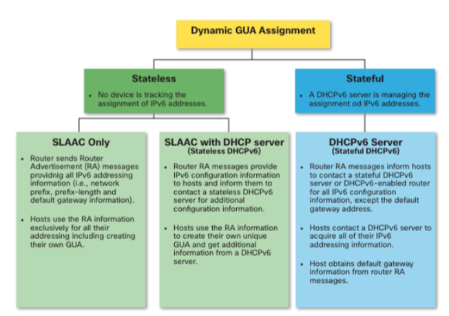
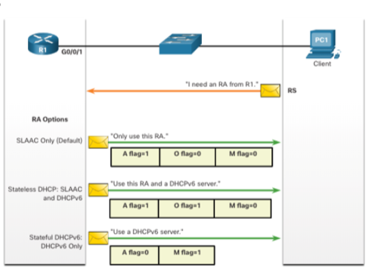
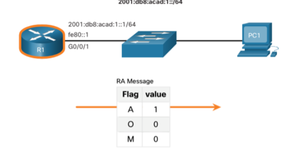
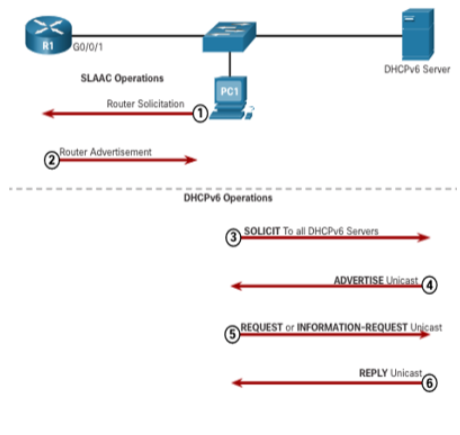
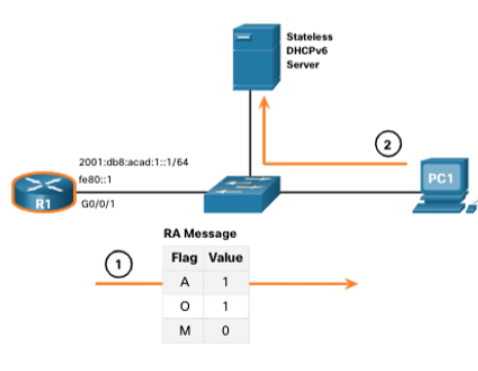
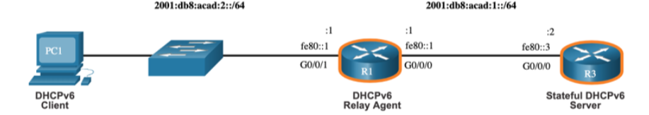

# 8.1 IPv6 GUA Assignment ()

## IPv6 Host Configuration

* **Manual Configuration (Router):** An **IPv6 Global Unicast Address (GUA)** is manually configured on a router interface using:
    ```cli
    ipv6 address ipv6-address/prefix-length
    ```
* **Dynamic Configuration (Host):** Manually configuring a GUA on a host is **time-consuming and error-prone**. Most hosts are configured to **dynamically acquire an IPv6 GUA**.

---

## IPv6 Host Link-Local Address (LLA)

* The **IPv6 Link-Local Address (LLA)** is **automatically created** by the host when the interface is active, even without a GUA.
* The host uses an **ICMPv6 Router Advertisement (RA)** message if **automatic IPv6 addressing** is selected.
* **Note:** The **Zone ID** or **Scope ID** (e.g., "%1") at the end of an LLA is used by the OS to associate the address with a specific interface.
* **DHCPv6** is defined in [RFC 3315](https://www.rfc-editor.org/rfc/rfc3315).

---

## IPv6 GUA Assignment Methods

* An **IPv6-enabled router** periodically sends **ICMPv6 Router Advertisements (RAs)** to suggest dynamic configuration.
* A host can dynamically acquire a **GUA** using **stateless** (SLAAC) or **stateful** (DHCPv6) methods.
* All methods rely on **RA messages** to communicate the configuration options, though the **host ultimately makes the final decision**.

---

## Three RA Message Flags ()

The combination of flags in the **ICMPv6 Router Advertisement (RA) message** determines the host configuration process:

| Flag | Name | Value = 1 Action |
| :---: | :--- | :--- |
| **A flag** | **Address Autoconfiguration** | Use **Stateless Address Autoconfiguration (SLAAC)** to create a GUA. |
| **O flag** | **Other Configuration** | Obtain additional information (e.g., DNS) from a **stateless DHCPv6 server**. |
| **M flag** | **Managed Address Configuration** | Must obtain a GUA and other info from a **stateful DHCPv6 server**. |

---
---

# 8.2 SLAAC

## SLAAC Overview 

**Stateless Address Autoconfiguration (SLAAC)** allows hosts to create their own unique **Global Unicast Address (GUA)** **without a DHCPv6 server**.

* **Stateless:** No server is required to maintain address state information (leases).
* **RA Messages:** Routers send periodic RA messages (default 200 seconds) with the network prefix. Hosts can request an immediate RA using a **Router Solicitation (RS)** message.
* **Deployment:** Can be used as **SLAAC only** or **SLAAC with stateless DHCPv6**.

---

## Enabling SLAAC (Router) ()

* A router (R1) configured with a GUA and LLA automatically begins sending **Router Advertisement (RA) messages** to the **IPv6 all-nodes multicast group (`ff02::1`)**.
* The router also joins the **IPv6 all-routers multicast group (`ff02::2`)**.
* **Verification:** Use the `show ipv6 interface` command to confirm the router has joined the multicast group.

---

## SLAAC-Only Method

* **RA Flags:** `A = 1`, `O = 0`, `M = 0`.
* **Process:** Client uses the IPv6 GUA prefix from the RA and dynamically creates its **Interface ID** via SLAAC.
* **Default Gateway:** The client uses the router's **Link-Local Address (LLA)** as the default gateway.

---

## ICMPv6 Router Solicitation (RS) Messages

1.  **Host Sends RS:** After booting, the host sends an **RS message** to the IPv6 **all-routers multicast address (`ff02::2`)**.
2.  **Router Responds with RA:** The router (R1) immediately generates an **RA message** and sends it to the IPv6 **all-nodes multicast address (`ff02::1`)**.
3.  **Outcome:** The host uses the RA information to create its GUA.

---

## Host Process to Generate Interface ID (SLAAC)

The host acquires the **64-bit prefix** from the RA and generates the remaining **64-bit interface identifier (ID)** using:

1.  **Randomly Generated:**
    * The host OS generates a **random 64-bit ID**.
    * This is the default for modern OSs (**Windows 10/11**) for privacy.
2.  **EUI-64 Method:**
    * The host uses its **48-bit MAC address**, inserting the hex value `fffe` in the middle to create the 64-bit ID.
    * Note: Many OSs avoid EUI-64 by default due to privacy concerns.

---

## Duplicate Address Detection (DAD)

A SLAAC host uses the **Duplicate Address Detection (DAD)** process to ensure its generated IPv6 GUA is unique.

1.  **NS Message:** The host sends an **ICMPv6 Neighbor Solicitation (NS)** message to a **solicited-node multicast address** containing the last 24 bits of its proposed GUA.
2.  **Uniqueness:** If **no Neighbor Advertisement (NA)** messages are received in response, the address is unique. If an **NA is received**, the address is a duplicate, and a new ID must be generated.
3.  **Note:** DAD is technically optional but **IETF recommended**, so most OSs perform DAD for all unicast addresses.

---
---

# 8.3 DHCPv6 Operation Steps ()

When an RA indicates that DHCPv6 should be used (stateful or stateless), the host follows these steps (**Stateless DHCPv6 requires SLAAC; Stateful DHCPv6 does not**):

1.  Host sends a **Router Solicitation (RS)** message.
2.  Router responds with a **Router Advertisement (RA)** message.
3.  Host sends a **DHCPv6 SOLICIT** message to locate DHCPv6 servers.
4.  DHCPv6 server responds with an **ADVERTISE** message.
5.  Host sends a **REQUEST** message to the server.
6.  DHCPv6 server sends a **REPLY** message with configuration information.

* **Note:** DHCPv6 messages use **UDP destination port 546** (server-to-client) and **UDP destination port 547** (client-to-server).

---

## Stateless DHCPv6 Operation ()

* **RA Flags:** `A = 1`, `O = 1`, `M = 0`.
* **Process:** The host uses **SLAAC** (A=1) for its GUA and contacts the **stateless DHCPv6 server** (O=1) for **additional configuration** (like DNS).
* **Note:** Stateless DHCPv6 servers **do not maintain IPv6 address bindings**.
* **Router Command to Enable O flag:**
    ```cli
    R1(config-if)# ipv6 nd other-config-flag
    ```

---

## Stateful DHCPv6 Operation

* **RA Flags:** `A = 0`, `O = 0`, `M = 1`.
* **Process:** The host contacts the **stateful DHCPv6 server** (M=1) for **all configuration information**, including the GUA.
* **Note:** The stateful DHCPv6 server **maintains a list of IPv6 address bindings**.
* **Router Command to Enable M flag:**
    ```cli
    R1(config-if)# ipv6 nd managed-config-flag
    ```

---
---

# 8.4 Configure DHCPv6 Server

## DHCPv6 Router Roles

A Cisco IOS router can function as a:
* **DHCPv6 Server:** Provides stateless or stateful services.
* **DHCPv6 Client:** Acquires an IPv6 configuration on an interface.
* **DHCPv6 Relay Agent:** Forwards messages between clients and servers on different networks.

---

## Configure a Stateless DHCPv6 Server

The stateless server advertises configuration details via RA messages and a DHCPv6 pool.

| Step | Command | Mode | Description |
| :---: | :--- | :--- | :--- |
| **1** | `ipv6 unicast-routing` | Global Config | Enable IPv6 routing. |
| **2** | `ipv6 dhcp pool POOL-NAME` | Global Config | Define the DHCPv6 pool. |
| **3** | `dns-server 2001:db8::1`<br>`domain-name example.com` | DHCPv6 Config | Configure non-address options (DNS, domain name). |
| **4** | `ipv6 dhcp server POOL-NAME` | Interface Config | Bind the interface to the pool. |
| **5** | `ipv6 nd other-config-flag` | Interface Config | Enable the **O flag** (O=1) in RAs, instructing clients to contact the server for non-address options. (A flag is 1 by default). |
| **6** | `ipconfig /all` (on client) | Verification | Verify the host received configuration. |

---

## Configure a Stateful DHCPv6 Server

The stateful server instructs hosts to obtain **all** necessary configuration, including the GUA, from the server.

| Step | Command | Mode | Description |
| :---: | :--- | :--- | :--- |
| **1** | `ipv6 unicast-routing` | Global Config | Enable IPv6 routing. |
| **2** | `ipv6 dhcp pool POOL-NAME` | Global Config | Define the DHCPv6 pool. |
| **3** | Configure pool options (e.g., `address prefix`). | DHCPv6 Config | Configure address prefix and other options. |
| **4** | `ipv6 dhcp server POOL-NAME` | Interface Config | Bind the interface to the pool. |
| **5a** | `ipv6 nd managed-config-flag` | Interface Config | Set the **M flag** to **1** (M=1), instructing clients to use the server for address assignment. |
| **5b** | `ipv6 nd prefix default no-autoconfig` | Interface Config | Set the **O flag** to **0** and disable SLAAC, ensuring full stateful assignment. |
| **6** | `ipconfig /all` (on client) | Verification | Verify the host received its GUA and options from the server. |

---

## Configure a Stateless DHCPv6 Client

A router obtains non-address configuration details from a server while using **SLAAC** for its GUA.

| Step | Command/Action | Mode | Description |
| :---: | :--- | :--- | :--- |
| **1** | `ipv6 unicast-routing` | Global Config | Enables IPv6 routing. |
| **2** | `ipv6 enable` | Interface Config | Creates the LLA on the interface. |
| **3** | `ipv6 address autoconfig` | Interface Config | Enables the client to use **SLAAC** for GUA. |
| **4** | `show ipv6 interface brief` | Verification | Verify the client has been assigned a GUA via SLAAC. |
| **5** | `show ipv6 dhcp interface [interface-id]` | Verification | Verify the client received non-address options (DNS, domain name). |

---

## Configure a Stateful DHCPv6 Client

A router obtains **both** its **GUA** and other configuration details from a stateful server.

| Step | Command/Action | Mode | Description |
| :---: | :--- | :--- | :--- |
| **1** | `ipv6 unicast-routing` | Global Config | Enables IPv6 routing. |
| **2** | `ipv6 enable` | Interface Config | Creates the LLA on the interface. |
| **3** | `ipv6 address dhcp` | Interface Config | **Enables the client to use DHCPv6** for all configuration. |
| **4** | `show ipv6 interface brief` | Verification | Verify the client has been assigned a GUA from the DHCPv6 server. |
| **5** | `show ipv6 dhcp interface [interface-id]` | Verification | Verify the client received its GUA lease and other necessary options. |

---

## Configure a DHCPv6 Relay Agent ()

The router forwards DHCPv6 messages when the server and clients are on different networks.

| Step | Command Syntax | Mode | Description |
| :---: | :--- | :--- | :--- |
| **1** | `ipv6 dhcp relay destination [server-ipv6-address] [egress-interface]` | Interface Config | Configures the relay agent on the interface **facing the clients**. `egress-interface` is only required if the server address is a **LLA**. |

**Example (GUA server address):**
```cli
Router(config-if)# ipv6 dhcp relay destination 2001:DB8:FACE:1::1
```